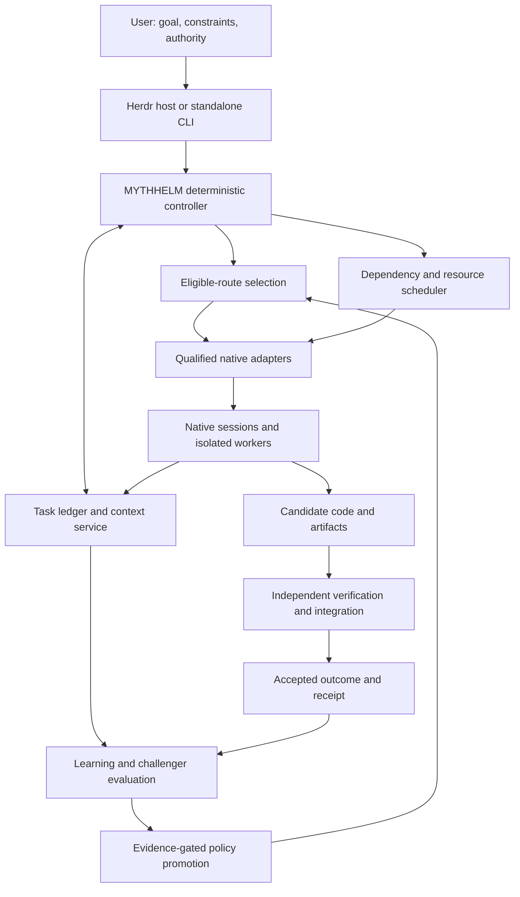

# MYTHHELM: Adaptive Native-Agent Orchestration

## A merge-ready proposal for shared context, verified parallel delivery, and evidence-gated learning

**Status:** Proposed addition to the MYTHHELM vision; not an implemented or benchmarked capability.  
**Version:** 1.0  
**Prepared:** 5 October 2026  
**Audience:** MYTHHELM product, architecture, implementation, and review agents.  
**Decision requested:** Adopt the architecture and invariants below; deliver it through the staged acceptance gates in Section 20 rather than attempting a fully self-optimising agent swarm in the first release.

> **Vision:** MYTHHELM should turn an outcome into verified software by coordinating the user's existing native coding agents, preserving useful work across sessions, parallelising only where it helps, and learning from measured outcomes—without becoming a new model provider, bypassing subscription restrictions, or sacrificing the user's control.

### Scope and merge boundary

This document consolidates and critically revises the proposals discussed for context sharing, native-session continuity, heterogeneous routing, parallel software construction, and continuous improvement. It carries forward the established MYTHHELM requirements: free and open source on GitHub; local-first operation; first-class operation inside Herdr; a plugin/mod architecture; native-harness fidelity; use of the user's supported native subscription entitlements; and no silent paid API fallback or overages.

The original MYTHHELM master specification was not attached or available as a complete file for this review. This is therefore a **standalone, merge-ready proposal**, not a claim that the original document or codebase has been edited. Section 23 provides a semantic merge map. Existing implementation-language, packaging, UI, and licensing decisions should be preserved unless a separately accepted decision changes them.

Throughout this document:

- **MUST / MUST NOT** identify proposed release-blocking requirements.
- **SHOULD** identifies a default that requires a recorded reason to override.
- **Experimental** means disabled for automatic production promotion until evaluated.
- **Evidence** describes what a cited source actually established; **proposal** describes MYTHHELM's intended design. Suggested thresholds and budgets are engineering starting points, not published results or performance promises.

Sources are linked in Section 25. Paper versions are pinned where relevant. Product documentation was checked during this review but remains subject to change; adapter qualification must check the installed version and current provider rules.

---

## Contents

1. [Executive decision](#1-executive-decision)
2. [Critical review and corrections](#2-critical-review-and-corrections)
3. [Evidence assessment](#3-evidence-assessment)
4. [Product boundaries and invariants](#4-product-boundaries-and-invariants)
5. [System architecture and ownership](#5-system-architecture-and-ownership)
6. [Native adapters, authentication, and subscription protection](#6-native-adapters-authentication-and-subscription-protection)
7. [Shared state, provenance, and storage](#7-shared-state-provenance-and-storage)
8. [Context engineering and session continuity](#8-context-engineering-and-session-continuity)
9. [Task decomposition, scheduling, and parallel execution](#9-task-decomposition-scheduling-and-parallel-execution)
10. [Integration, verification, and production delivery](#10-integration-verification-and-production-delivery)
11. [Learning architecture and objective](#11-learning-architecture-and-objective)
12. [New-model onboarding and drift](#12-new-model-onboarding-and-drift)
13. [Experiments, evaluation, and evidence requirements](#13-experiments-evaluation-and-evidence-requirements)
14. [Security, trust, and privacy](#14-security-trust-and-privacy)
15. [Durability, recovery, and cancellation](#15-durability-recovery-and-cancellation)
16. [Herdr and user experience](#16-herdr-and-user-experience)
17. [Interfaces and reference contracts](#17-interfaces-and-reference-contracts)
18. [Operational telemetry and receipts](#18-operational-telemetry-and-receipts)
19. [Worked example: a todo app](#19-worked-example-a-todo-app)
20. [Delivery plan and release gates](#20-delivery-plan-and-release-gates)
21. [Risk register and alternatives](#21-risk-register-and-alternatives)
22. [Acceptance matrix](#22-acceptance-matrix)
23. [Merge instructions for the MYTHHELM vision](#23-merge-instructions-for-the-mythhelm-vision)
24. [Open decisions and final recommendation](#24-open-decisions-and-final-recommendation)
25. [Sources and evidence register](#25-sources-and-evidence-register)

---

## 1. Executive decision

### 1.1 What to build

Build an **adaptive orchestration layer over native coding-agent harnesses**. Its shared unit is not an LLM context window. It is a versioned software task with requirements, dependencies, artifacts, workspace snapshots, evidence, and recoverable native-session references.

MYTHHELM owns goals, task state, execution policy, resource allocation, provenance, integration, and verification. Each selected native harness owns its model interaction loop, supported tools, internal session representation, and native context management. Herdr owns the terminal-host facilities delegated to it. A separate learning subsystem proposes better execution policies; a deterministic promotion mechanism decides whether evidence permits their use.

The recommended operating pattern is:

```text
User outcome + standing permissions + allowance limits
                         |
                 MYTHHELM control plane
                         |
        minimal task contract + versioned dependencies
                         |
          qualified native harness / native session
                         |
             code, artifacts, observable results
                         |
          independent verification + integration
                         |
       accepted delivery + resource/reliability receipt
                         |
        bounded learning -> evaluated policy candidate
```

Use a **single capable agent by default for small or tightly coupled tasks**. Add specialists, reviews, parallel branches, or cross-model handoffs when their expected benefit exceeds the additional context, coordination, integration, and verification costs.

### 1.2 What success means

The product is successful when it delivers more **accepted, maintainable software** within the user's real limits, with less avoidable rediscovery, rework, waiting, and supervision.

It is not successful merely because it launches more agents, merges more pull requests, generates more code, consumes fewer visible prompt tokens, or claims to have learned. The essential comparison is against the best eligible simpler workflow on comparable tasks.

Keep correctness, security, required UX, and policy compliance as constraints. Optimise elapsed delivery time, resource consumption, and human intervention **inside** those constraints. Some tasks will favour speed at higher token use; others will favour one persistent agent at lower coordination cost. Show that trade-off instead of hiding it in a single efficiency score.

### 1.3 What to build first

The first vertical slice should contain qualified Claude Code and Codex adapters, Herdr integration, a durable task store, explicit handoffs, a minimal context service, one writer per workspace, independent tests, recovery, and an honest receipt. Add OpenCode once its exact provider/auth route is qualified.

Start with deterministic routing rules and recorded outcomes. Introduce bounded parallelism next. Introduce learned routing and prompt/context-policy experiments only after the measurement system works. No vector database, reinforcement-learning infrastructure, remote control service, or general-purpose workflow optimiser is required for the first useful release.

---

## 2. Critical review and corrections

The earlier discussion identified useful building blocks but overstated several conclusions. This proposal replaces those statements with narrower, testable ones.

| Earlier idea or implicit assumption | Critical assessment | Improved design |
|---|---|---|
| Context can be shared almost as though agents share a mind. | Cross-harness artifacts are portable; internal model state and private harness state are not generally portable through these interfaces. | Share semantic task state and evidence. Preserve native sessions separately. Never advertise cross-model KV-cache transfer. |
| Resuming a session is automatically token-efficient. | Resume preserves continuity, not free inference. A harness may resend substantial history; caches may miss or expire. | Measure resume versus fresh-session handoff. Use session affinity where useful, but allow deliberate checkpoint-and-reset. [D1] [D4] [D11] [D12] |
| Repository context is essentially free. | Disk storage is inexpensive relative to repeated model input, but reading files into tool responses still consumes context and usually model input tokens. | Minimise unnecessary reads and duplicate results, not merely initial prompt size. Record total observed usage, including tool and orchestration overhead. |
| A 2–4k capsule is an optimal default. | No universal token budget has been established for these harnesses and workloads. | Use a soft starting budget; preserve mandatory constraints and expand when necessary. Evaluate by task class. |
| ACP should always be the preferred transport. | Protocol compatibility does not establish native fidelity, subscription eligibility, feature parity, permission enforcement, or session portability. | Prefer the **best-qualified route**, often a native structured interface. Use ACP where that specific adapter passes qualification. [D1] [D2] [D3] [D4] [D5] [D8] [D9] |
| SDK use necessarily loses native harness benefits. | An SDK can wrap the actual harness. Anthropic describes its Agent SDK as using Claude Code's tools, loop, and context management. Authentication rules remain a separate question. | Qualify execution fidelity and entitlement independently; neither “SDK” nor “CLI” is sufficient evidence. [D2] [D3] |
| More agents and heterogeneous models improve quality. | Coordination can degrade results. Model diversity is not automatically useful diversity. | Require a single-agent and same-model baseline; use role-specific evidence rather than brand stereotypes. [E4] [E5] [E6] [E7] [E8] |
| A shared worktree enables collaboration. | Concurrent mutation produces races; even separate Git worktrees do not isolate ports, databases, credentials, or OS processes. | Separate mutable execution environments; share immutable contracts and accepted artifacts. [D13] |
| A handoff is a reliable source of truth. | It is an agent assertion. A file existing or SQL parsing does not establish completeness or correctness. | Separate assertions, observations, and scoped verification attestations. Verify acceptance criteria against the actual candidate. [E12] |
| All useful context should be pulled on demand. | Excessively lean prompts increase search latency and can omit critical constraints. | Push a small mandatory core and likely dependency facts; pull large or uncertain details. |
| A contextual bandit can learn the entire workflow immediately. | Multi-step work has delayed outcomes, action interactions, changing environments, and sparse local data. A flat bandit over every configuration is impractical. | Begin with rules and a small policy portfolio; learn one bounded decision family at a time. [E8] [E10] |
| A successful shadow run proves what production would have done. | A fresh sandbox run is useful experimental evidence, not the exact unobserved counterfactual of a live trajectory. | Match inputs and environments, repeat trials, record uncertainty, and prohibit side effects in shadows. |
| Self-improvement means the system freely edits itself. | That permits evaluation leakage, reward manipulation, and escalating permissions. | Separate proposer, evaluator, and promoter. Pin policy during an attempt; version and roll back promoted policies. [E9] [E12] |
| Native subscriptions make experimentation free. | They still have limited allowance and may expose paid extra usage or provider-specific restrictions. | Track allowance opportunity cost and explicit learning budgets; unknown billing is not treated as zero. [D2] [D5] [D7] |

### 2.1 Multi-perspective verdict

**Product:** The compelling promise is continuity and dependable delegation, not an impressive-looking swarm. Users should be able to see why a route was chosen and recover work without understanding all the machinery.

**Software architecture:** A small deterministic control plane with pluggable execution adapters is defensible. A second full agent harness, multiple competing state stores, and mandatory distributed infrastructure are not necessary.

**Context and inference:** Selective disclosure is promising, but context relocation is not context elimination. Token savings must include retrieval, summaries, warm-up, review, retries, and learning.

**Distributed systems:** Scheduling, leases, cancellation, stale outputs, and external side effects are fundamental correctness problems, not optional polish. A single-host MVP can implement these without pretending to provide distributed exactly-once execution.

**Machine learning:** Local data will initially be sparse and biased. Task-family estimates with uncertainty are more credible than precise-looking universal capability scores. Architecture design tasks have weaker automatic labels than build/test tasks.

**Security and commercial compatibility:** Native execution and entitlement restrictions must be verified independently. A technically working adapter may still be ineligible for the product's subscription-only mode.

**Developer experience:** Preserve normal project instructions and native harness capabilities. Avoid forcing users to maintain multiple copies of repository knowledge or to understand bespoke protocols just to resume a task.

**Open-source maintainability:** The maintenance burden is adapters, conformance fixtures, and provider changes. Keep that burden explicit, versioned, and independently testable. Do not build an autonomous package installer that silently expands the trusted computing base.

---

## 3. Evidence assessment

### 3.1 Evidence that supports the direction

| Evidence | Finding and relevance | Limit of the inference |
|---|---|---|
| **OpenAI harness-engineering report**, February 2026. [E1] | Describes replacing a large instruction file with a short map into versioned repository knowledge, and using isolated application environments for agent work. | An operational account, not a controlled estimate of context savings or a proof that MYTHHELM will accelerate development. |
| **Evaluating AGENTS.md**, September 2026 v3. [E2] | On SWE-bench Lite and CTXbench, generated context files did not significantly improve success, while average inference costs increased by 20% and 23%. Developer files outperformed generated files, but did not significantly outperform the no-file condition. | Neither “all context hurts” nor “shorter always wins” follows. Its length ablations also caution against token count alone as the optimisation target. |
| **Context as a Tool**, December 2025. [E3] | A trained 32B SWE-Compressor reports 57.6% pass@1 on SWE-bench Verified versus 53.8% for its threshold-compression baseline and 49.8% for its ReAct baseline. | Training and context-management behaviour are part of the intervention. Adding a summariser outside closed native CLIs does not reproduce that result, nor does the solve rate quantify token savings. |
| **Anthropic multi-agent research system**, June 2025. [E4] | Describes artifact references, focused delegation, and parallelism, but also reports roughly 15× chat token use for its multi-agent system and explicitly warns that dependency-heavy coding is less parallelisable than research. | Research-task gains cannot be imported as coding speedups; 15× compares against chat, not a matched coding-agent baseline. |
| **AsynCodeBench**, September 2026. [E5] | Evaluates 19 repository tasks with 52 directed dependencies and executable dependency checks. Finds that coding strength and collaboration strength can diverge. | A small, recent benchmark. Useful for evaluation design, not a universal scheduler or throughput guarantee. |
| **Towards a Science of Scaling Agent Systems**, April 2026 v3. [E6] | Controlled evaluation across 260 configurations finds task-dependent gains and losses, coordination overhead, and error-propagation differences. | Its cross-task findings support conditional orchestration, not fixed thresholds for MYTHHELM's repositories. |
| **Rethinking Mixture-of-Agents**, 2025. [E7] | Finds several settings in which ensembles of one strong model outperform mixtures of different models. | General response/reasoning ensembles are not the same as independent software specialists. Still, it refutes diversity as a sufficient justification. |
| **RouteLLM**, February 2025 revision. [E8] | Demonstrates learned quality/cost routing and transfer when the routed model pair changes. | Primarily request routing, not full multi-step native-harness engineering; useful precedent, not a drop-in learner. |
| **GEPA**, February 2026 revision. [E9] | Demonstrates evaluation-driven prompt evolution using feedback and candidate selection without requiring updates to the task model's weights. | It does not prove unrestricted self-modification works, or that its gains transfer to all native coding workflows. |
| **Agent evaluation guidance**, Anthropic, 2026. [E12] | Separates outcomes from agent claims and combines executable, model-based, and human evaluation; recommends reusable capability/regression suites. | An engineering guide, not an outcome guarantee. MYTHHELM still needs reliable task-specific acceptance evidence. |

**Conclusion:** These sources support the ingredients and the need for measurement. They do **not** establish a measured end-to-end advantage for a Claude Code → Codex → OpenCode pipeline with MYTHHELM's proposed context broker, scheduler, and learner.

### 3.2 Evidence deliberately not promoted into promises

The prior discussion used figures such as a tenfold development-time estimate, a 500% increase in landed pull requests, and very large research-task speedups. OpenAI's harness report and Symphony report are useful production accounts, but they are not controlled evidence that this architecture causes an equivalent gain. Pull-request count and lines of code are not accepted product value. [E1] [E14]

AdaptOrch is relevant exploratory work on task-dependent topology selection. Its reported gains are not used as a MYTHHELM performance target or as justification for building a general topology learner immediately. [E11]

The earlier blanket “roughly 3% worse / 4% better” summary of context-file research is not carried forward. The 29 September 2026 revision distinguishes statistically significant cost increases from non-significant success-rate differences. Treat this as evidence for evaluating context policies, not proof that removing guidance improves quality. [E2]

### 3.3 Testable hypotheses for MYTHHELM

**H1 — Scoped continuity:** For multi-stage tasks, versioned artifacts plus selective context reduce total resource use at non-inferior acceptance compared with full-transcript replay.

**H2 — Session affinity:** Reusing a relevant native session reduces rediscovery enough to outweigh retained-history costs in some task families.

**H3 — Conditional parallelism:** Contract-bounded parallel execution reduces time to accepted integration on eligible tasks without unacceptable increases in rework, resource use, or escaped defects.

**H4 — Adaptive routing:** A calibrated, constrained router improves the local quality/time/allowance frontier relative to fixed routing and a best-single-agent baseline.

**H5 — Bounded learning:** The benefits of adopted policies exceed the resources spent exploring, evaluating, and maintaining those policies over a stated horizon.

Each hypothesis can fail for a task family. The system must be able to turn the relevant feature down or off when it does.

---

## 4. Product boundaries and invariants

### 4.1 Preserved MYTHHELM commitments

**INV-01 — Free and local-first.** Core functionality MUST require no MYTHHELM account, paid tier, mandatory hosted router, or compulsory cloud telemetry. Provider subscriptions and infrastructure are the user's existing external services, not a MYTHHELM charge.

**INV-02 — Native execution.** The selected native harness MUST perform the assigned agent work. MYTHHELM MUST NOT silently substitute direct model API calls or a generic replacement loop.

**INV-03 — Subscription protection.** Under the user's subscription-only policy, every model-using component—including planners, summarisation, reviewers, and experimental challengers—MUST use a qualified, permitted entitlement route. An unavailable route causes a wait, an eligible alternative, or a clear block; never silent paid fallback.

**INV-04 — Herdr first-class.** MYTHHELM MUST work inside Herdr, with explicit terminal/process ownership, reconnect behaviour, and no duplicate execution after restoration.

**INV-05 — One authoritative controller.** Exactly one controller lease owns each run. Agents and plugins submit proposals/results; they do not directly decide canonical completion, billing policy, or release authority.

**INV-06 — Evidence before acceptance.** A success message, clean Git diff, or model judge score alone MUST NOT establish acceptance. Required checks must match the actual candidate and the task's acceptance contract.

**INV-07 — Bounded autonomy.** Every run has a resource envelope, permission envelope, stopping conditions, and a finite retry policy. Within a pre-authorised envelope, agents may execute without repetitive confirmation.

**INV-08 — Isolated concurrent mutation.** Concurrent writers MUST NOT share the same mutable working tree or uncoordinated external state.

**INV-09 — Immutable identity.** Artifacts, contracts, evaluation suites, and execution policies MUST be versioned; results must identify what was actually used.

**INV-10 — Learning cannot grant authority.** A learner MUST NOT change its own permission envelope, billing eligibility, protected acceptance tests, or promotion rules.

**INV-11 — Honest uncertainty.** Missing token counts, unknown model snapshots, uncertain entitlement consumption, and unavailable tests MUST remain unknown—not zero, passed, or verified.

**INV-12 — User control and portability.** The user MUST be able to inspect routes, pause/cancel work, pin policies, disable learning, export useful state, and continue using their native tools outside MYTHHELM.

### 4.2 Explicit non-goals

This proposal does not attempt cross-model transfer of internal attention/KV state; universal import of private native transcripts; fine-tuning closed provider models; perfect prediction of software quality; unbounded autonomous spending; circumvention of provider limits; or automatic production changes outside standing authority.

It does not require a universal agent marketplace, a central fleet-learning service, an embedding index, a distributed workflow engine, or a graphical replacement for Herdr. It does not make every software request multi-agent.

---

## 5. System architecture and ownership

### 5.1 Separate three responsibilities

**Delivery plane:** runs tasks, manages workspaces and resources, routes qualified agents, and integrates artifacts.

**Evidence plane:** records observed actions and independently evaluates candidates against versioned acceptance contracts. It is controlled by MYTHHELM, not by the implementation agent.

**Improvement plane:** learns from eligible evidence, proposes policy changes, evaluates challengers, and submits promotion requests. It has no direct production-release or permission-granting authority.

These are logical boundaries. For a local-first release they can live in one process or package with clear interfaces; they do not require microservices.



### 5.2 Module responsibilities

| Module | Owns | Must not become |
|---|---|---|
| Goal/contract manager | Objective, non-negotiables, acceptance rubric, standing authority, explicit assumptions | An unlimited requirements generator |
| Planner | Proposed tasks, dependency contracts, integration strategy | The unquestioned source of correctness |
| Scheduler | Readiness, critical path, resource reservations, leases, stop conditions | A model issuing arbitrary launch commands |
| Route selector | Eligible candidates and explainable selection | A credential broker or arbitrary cloud fallback |
| Native adapter | Native invocation, events, interruption, session reference, supported metrics | A replacement agent loop hidden under a vendor name |
| Context service | Bounded, version-aware access to authorised state | A giant prompt or a universal truth-by-embedding system |
| Workspace manager | Snapshots, task workspaces, environment leases, integration candidates | A claim that Git alone is a security boundary |
| Verifier | Protected checks, scoped attestations, result validity | A self-certified “all done” response |
| Learning engine | Estimates, experiments, policy candidates | An authority to spend, deploy, or weaken tests |
| Host adapter | Herdr/standalone lifecycle and presentation | A second independent terminal supervisor |

### 5.3 Deterministic orchestration, model-assisted judgement

Use ordinary code for dependency checking, state transitions, adapter eligibility, locking, budget enforcement, hashing, event validation, and permission decisions. Use models for tasks that benefit from reasoning: decomposition proposals, architecture, implementation, debugging, review, and diagnosing recurring failures.

Do not invoke a router LLM for every tool call. Select at task or checkpoint boundaries. A heuristic decision that does not need a model should not spend model allowance.

The core SHOULD reuse MYTHHELM's existing runtime and storage abstractions. The reference technology choices below are defaults only where the base design has not already settled the question.

---

## 6. Native adapters, authentication, and subscription protection

### 6.1 Qualify an execution route, not a product name

The schedulable entity is:

```text
RouteIdentity =
  harness + harness_version + binary_identity
  + transport + adapter_version
  + provider + observed_model_identity
  + auth_mode + entitlement_profile
  + effort/settings + tools/skills/instruction_fingerprint
  + environment_class + permission_profile
```

“OpenCode” is a harness, not a model. “Claude through OpenCode” is not the same execution configuration as Claude Code. User-facing names such as Fable, Sol, or Spark are examples until resolved to actual configured model identifiers; the registry must never guess an endpoint or infer ability from the name.

A route needs separate qualification for protocol compatibility, native-loop fidelity, entitlement eligibility, permission enforcement, session continuity, result observability, and resource accounting. Partial support must be visible.

### 6.2 Recommended qualification priorities

| Candidate | Initial integration direction | Conditions and limitations |
|---|---|---|
| Claude Code | Unmodified installed binary through documented programmatic output, or an interactive native pane where needed | Current documentation supports structured CLI output and continuation. SDK loop fidelity does not itself establish subscription eligibility. Current `--bare` mode explicitly does not use subscription login and is therefore ineligible for the subscription-only profile. [D1] [D2] [D3] |
| Codex | Native app-server interface where qualified; native structured CLI path where more appropriate | App-server documents thread lifecycle and account/auth events. Current documentation distinguishes local/open-source integrations from commercial/hosted app-server authentication. Do not extend local eligibility into a hosted service assumption. [D4] [D5] |
| OpenCode | Native server/CLI or its documented ACP subprocess | Provider/auth route must be independently eligible. Model catalogue availability does not prove entitlement or absence of extra charges. [D6] [D7] [D9] |
| Other intended harnesses: Meta Muse, Kimi Code, Cursor agents, Antigravity | Same adapter qualification contract | Support targets, not compatibility claims. Discover and test actual installed interfaces, permissions, model identity, and entitlement behaviour before declaring support. |

ACP is an interoperability option, not the canonical task store. Its session-loading support is capability-negotiated and relates to that agent's sessions; it does not specify a universal Claude-to-Codex session import. [D8]

MCP is an optional access layer for MYTHHELM context tools. It neither transports a model's internal state nor proves that a tool result is trusted. [D10]

### 6.3 Authentication rules

Provider-owned authentication flows remain provider-owned. MYTHHELM MUST NOT extract, copy, proxy, or store subscription OAuth credentials in its ledger, model registry, logs, or plugin manifests. A native harness may maintain its own credentials normally.

Anthropic's current documentation permits users to authenticate an unmodified Claude Code binary under stated conditions, but separately restricts third-party collection/intermediation of Claude credentials and third-party subscription-login offerings. It also prohibits modifying the binary or restricting its built-in authentication methods in the described product-hosting arrangement. MYTHHELM should enforce its own dispatch policy—not alter the vendor client. Distribution and any future hosted deployment require their own terms review. [D2]

Codex documentation distinguishes ChatGPT subscription access from API-key usage. OpenCode documents multiple provider-specific authentication routes. There is no valid universal rule that an OAuth route, a particular SDK, or a model name always means included allowance. [D4] [D5] [D7]

### 6.4 Subscription-only dispatch policy

Before dispatch, the controller must establish:

1. The selected route is qualified for the intended local use, account type, and installed version.
2. The active provider/auth mode matches the user's subscription-only policy.
3. No configured paid fallback, extra-usage mechanism, or hidden auxiliary-model route contradicts that policy.
4. The current attempt has an allowance/resource reservation and can be stopped or blocked at its boundary.
5. Any uncertainty is represented explicitly and handled according to a strict default.

If the provider cannot expose an enforceable no-overage configuration or reliable eligibility check, MYTHHELM MUST NOT claim a guaranteed no-extra-charge route. That route remains unqualified for strict unattended dispatch until a documented mechanism or account-level restriction establishes the required protection. A user assertion can be recorded as weaker evidence, but cannot be relabelled as machine-verified protection.

The dispatcher may decline a route; it must not disable the vendor's own sign-in choices. Never introduce a paid API path to solve a qualification failure.

### 6.5 Quotas are resources, not just prices

Track per-provider concurrency, available rate-limit signals, reset windows, observed throttling, and resource reservations across all MYTHHELM jobs. Other applications may consume the same subscription, so observations can become stale.

Use conservative backpressure, reserve capacity for verification and repair, and include native subagents where their usage is observable. If native internal fan-out cannot be bounded or measured, expose that limitation and restrict the route's supported automation profile.

Do not benchmark continuously just because marginal cash cost appears to be zero. Learning uses scarce allowance and should yield to delivery work.

---

## 7. Shared state, provenance, and storage

### 7.1 Canonical records

The controller maintains these entities:

| Entity | Essential content |
|---|---|
| `Goal` | User request, accepted interpretation, constraints, acceptance contract, standing authority |
| `Task` | Deliverable, dependency revisions, ownership, permitted write scope, risk class, integration destination |
| `Attempt` | Route identity, session reference, workspace snapshot, policy version, resource reservation, lifecycle |
| `Decision` | Decision, rationale, authority, scope, effective revision, alternatives, superseded-by reference |
| `Artifact` | Immutable content identity, type, source location, producer, scope, sensitivity, dependencies |
| `Observation` | Controller/tool-observed fact with timestamp and environment identity |
| `Attestation` | A named check, check version, exact candidate identity, result, logs, validity scope |
| `Handoff` | Concise claims, references, unresolved issues, failed approaches, next-step recommendation |
| `Experiment` | Hypothesis, variants, eligible population, randomisation, budgets, stopping rule, results |
| `PolicyVersion` | Configuration, provenance, qualification, promotion decision, rollback target |
| `Release` | Accepted artifact/build identity, authority, deployment state, health evidence, rollback disposition |

Prefer **one transactional store with an append-only audit stream**, not independent `state.json`, `events.jsonl`, Markdown files, and vector entries all claiming to be authoritative. JSONL exports and Markdown reports are derived views.

Git owns source history and accepted project artifacts. The operational store owns scheduling and execution state. The two reference one another by immutable identities; neither replaces the other.

### 7.2 Assertions are not attestations

An agent may submit “authentication is complete.” That is an assertion. A controller can observe that relevant files exist. A test runner can attest that a particular authentication test suite passed against a specific commit and environment.

These are different statements. Do not collapse them into a global `verified: true` property. A passing parser check proves parseability, not feature completeness. A passing unit suite does not prove a production deployment exists.

For example:

```text
claim C1: "Persistence is complete"
observation O1: migration file exists at candidate K
attestation V1: migrations apply to empty database at K
attestation V2: upgrade from previous release succeeds at K
attestation V3: CRUD integration suite passes at K
open requirement: restore-from-backup check not yet performed
```

Only the acceptance contract determines whether that evidence is sufficient for this task. A later code or environment change may invalidate some attestations without invalidating all of them.

### 7.3 Version and freshness rules

Each context-bearing artifact should identify its content hash, repository/snapshot identity, producing attempt, validity scope, and any superseded artifact. Use full Git object IDs where applicable and a declared content-hash algorithm for non-Git objects; do not assume every Git repository uses the same object-ID length.

A dependency is satisfied by an accepted **revision**, not by a mutable path such as `docs/latest-architecture.md`.

When a contract changes, the controller identifies affected tasks and invalidates or requests revalidation of their inputs. A resumed agent receives the delta and invalidation notice. An embedding index is rebuilt or invalidated as necessary; it never overrides revision truth.

A task can challenge an accepted decision by proposing a replacement and explaining downstream impact. It cannot silently rewrite the accepted contract while siblings are implementing it.

### 7.4 Reference storage layout

Keep operational records outside agent-writable project files and outside the default Git history:

```text
<MYTHHELM local state root>/
  repositories/<repo-id>/
    control.sqlite
    artifacts/<content-hash>
    attempts/<attempt-id>/
      receipt.json
      logs/                 # bounded, redacted where possible
      handoff.json
    snapshots/
    evaluations/
    policies/
    exports/

<project repository>/
  AGENTS.md / CLAUDE.md      # preserve existing native conventions
  docs/
    architecture/
    decisions/
    contracts/
  <normal source and tests>
```

The actual paths should follow MYTHHELM's established platform conventions. A task worker gets only the scoped material and service credentials it needs. Raw native sessions remain native-owned; MYTHHELM stores references rather than copying every transcript by default.

### 7.5 Minimal implementation

SQLite plus ordinary content-addressed files is a reasonable local default. SQLite's WAL mode supports concurrent readers with one writer, requires same-host access, and needs correct checkpoint/backup handling. Do not put the live WAL database on an SSH mount or shared network filesystem. Use a maintained SQLite build, including the documented WAL-reset fix where applicable, and verify the library actually linked by the chosen runtime. [D17]

Use short transactions and a single controller write path. Record state transitions and their audit events atomically. Use appropriate durability settings for accepted transitions and external-action intents; do not silently trade crash durability for a faster benchmark.

SQLite FTS5 can provide local lexical retrieval without a separate search service. [D18] A vector or symbol index is optional, replaceable, and disposable. Remote execution, when added, should communicate with a controller API rather than share the database file.

---

## 8. Context engineering and session continuity

### 8.1 Four different kinds of reuse

| Reuse layer | Portable across heterogeneous agents? | What it saves, and what it does not |
|---|---|---|
| Native session | Only through supported native mechanisms | Preserves the harness's recorded work; does not promise cached or free inference |
| Semantic task state | Yes, through MYTHHELM contracts | Avoids rediscovering intent, dependencies, and decisions; still requires some input processing |
| Artifacts and workspace snapshots | Yes, subject to access controls | Avoids regenerating work and broadcasting conversations; reading artifacts still costs context |
| Provider prompt cache | Only within the provider's supported matching/configuration scope | May reduce repeated-prefix processing/cost; not cross-model semantic transfer |

Provider caching has matching, lifetime, model, and accounting conditions. MYTHHELM should preserve stable prefixes where it controls them, but native harnesses often own the final request construction. Do not invent cache hits or convert published API discounts into subscription-allowance savings without provider evidence. [D11] [D12]

### 8.2 Push the minimum necessary; retrieve the rest

Every task receives an explicit **mandatory core**:

- The user outcome and non-negotiable constraints.
- This task's deliverable and acceptance conditions.
- Authority and forbidden actions.
- Baseline snapshot and input-contract revisions.
- The smallest essential facts needed to start correctly.
- How to obtain authorised additional context.

Large background documents, logs, prior conversations, and optional details are referenced rather than eagerly copied. However, a critical acceptance rule should not be hidden behind an optional lookup.

This is a hybrid of small upfront context and just-in-time retrieval, not “everything in the prompt” or “nothing but opaque IDs.” Anthropic's context-engineering guidance discusses lightweight references and progressive disclosure; the appropriate balance still requires task-specific evaluation. [E13]

### 8.3 A context capsule is a contract, not a magic token count

A capsule should have stable headings and machine-readable provenance:

```text
GOAL
Deliver the accepted todo-app scope.

TASK
Implement the persistence API against contract api-v3.

MUST PRESERVE
User-owned data isolation; stated offline/online behaviour; no new paid service.

ACCEPTANCE
Named API behaviour and migration tests, plus integration gate.

INPUTS
Baseline: <full Git object ID>
Contract: artifact:<immutable-id>, docs/contracts/todo-api.yaml
Decisions: D-04@2, D-09@1

CURRENT FACTS
Schema migration has passed empty-database application at this baseline.
No production deployment has been authorised for this attempt.

AUTHORITY
Write only the assigned implementation scope. Propose contract changes.

OPEN ISSUES
One unresolved pagination edge case; do not silently choose a breaking default.

MORE CONTEXT
Use scoped lookup/search or the listed repository paths.
```

A soft initial budget around a few thousand tokens may be useful during experiments, but MUST NOT truncate constraints or acceptance conditions to hit an arbitrary target. Measure using the selected tokenizer where available and record estimates otherwise. The native system prompt, loaded skills, and tool schemas are additional overhead, not part of the capsule alone.

### 8.4 Retrieval policy

Prefer the following order, adjusted for the task:

1. Explicit dependency/artifact references and exact named decisions.
2. Relevant files, symbols, tests, and Git diffs at the declared snapshot.
3. Local lexical search over authorised records.
4. Semantic retrieval where ambiguity or scale justifies it.

Return bounded results with source identities, line/symbol ranges where available, revision information, and an explanation of why the result was selected. Never return unrestricted project history because a search query is broad.

Deduplicate identical content within the broker's output. Prefer small relevant excerpts, not entire logs. Retain full source access for authorised follow-up. Excerpting should preserve necessary surrounding semantics; a tiny fragment is not always enough to understand code safely.

All derived indexes must be filtered by repository, task authorisation, provider-disclosure policy, and revision before results reach the model. A globally relevant search result is not necessarily an authorised one.

### 8.5 Efficient native-session reuse

Maintain session affinity for related implementation and repair work. A session identity includes the harness, native session reference, associated workspace, branch/snapshot lineage, policy fingerprint, and last acknowledged context revision.

At resume, send a **delta**:

```text
Since your last checkpoint:
- integration baseline advanced from K1 to K2;
- API contract remains v3;
- review findings F7 and F9 remain open;
- your previous database-test evidence is stale after dependency update U2;
- do not repeat deployment action X4; its outcome is being reconciled.
```

Do not resend the whole ledger. Equally, do not assume the agent's remembered filesystem still matches reality.

Choose a fresh session when the retained history is irrelevant or bloated, trust boundaries change, the native session is missing/corrupt, a major replan invalidates assumptions, or controlled measurements favour a reset. A new session receives the invariant core, relevant handoff, and artifacts.

Resetting context does not erase sensitive information already sent to a provider or retained in native history. Route changes involving sensitive data require a new disclosure decision, not just a smaller prompt.

### 8.6 Handoffs and compression

Create a bounded handoff at meaningful boundaries: completed deliverable, imminent stop, before a cross-harness switch, or before a deliberate reset. Do not request a new LLM summary after every tool call.

A handoff contains achieved and unachieved requirements; artifact references; precise workspace identity; important decisions and assumptions; unsuccessful approaches worth avoiding; outstanding risks; evidence references; and recommended next action. It preserves uncertainty and negative findings.

Extract machine-observable fields deterministically where possible. Ask the native agent for the semantic remainder. Validate structure, cross-check artifact identity, and mark agent assertions as assertions.

Do not repeatedly summarise summaries when the original artifact is available. If a handoff drops a required constraint, rebuild it from authoritative records rather than letting the error propagate. Original user constraints and accepted contracts remain separately retrievable.

CAT motivates context-management experiments, but MYTHHELM must not claim to control or improve opaque native compaction internals that an adapter cannot observe or configure. [E3]

### 8.7 Cache awareness without cache dependence

Keep controlled instruction sections stable within a policy version. Put volatile task progress and timestamps after stable material when the native interface preserves order. Cache optional summary artifacts by their input hashes. Reuse deterministic file analyses only when relevant inputs and tool versions match.

Do not keep idle native sessions alive solely to chase unmeasured cache benefits. A process being alive does not prove a provider cache remains warm. Cold/warm performance should be measured separately; intentional pre-warming or duplicate probes consume the learning or execution budget.

MCP tool definitions can themselves add context overhead. Expose a small useful tool surface, use native lazy discovery only when actually supported, and benchmark MCP against ordinary local file/CLI access. Do not replace effective native repository tools just for uniformity.

### 8.8 What counts as context waste

The broker can observe duplicate content, unnecessarily broad reads, repeated missing-file searches, stale retrieval, and handoff omissions. It cannot directly observe which tokens the model mentally used. A read is not proof of usefulness; absence of a read is not proof that a preloaded item was useless.

Use ablations and outcome comparisons to evaluate relevance. Treat “avoidable duplicate bytes supplied” as a diagnostic proxy, not an exact measure of wasted provider compute.

For illustration only, replacing a 40k-token transcript with a 2k-token capsule and 6k of relevant reads reduces that immediate supplied context. It does **not** establish the same reduction for the full job after summarisation, native history replay, output tokens, review, and rework. Measure the whole lifecycle.

---

## 9. Task decomposition, scheduling, and parallel execution

### 9.1 Decompose for stable boundaries, not for headcount

A task is a unit with an independently meaningful deliverable, specified inputs, a bounded write scope, an acceptance contract, and an integration path. Do not split work merely because several models are available.

Group tightly coupled work that repeatedly needs the same reasoning or files. Split where contracts or independent verification make separate execution worthwhile. Introduce abstraction or documentation only when it helps the product or a measured coordination problem; not every tiny feature needs multiple architecture records.

A planner proposes a graph. The controller validates that every node has acceptance criteria, dependencies resolve to revisions, resource needs are plausible, and there is an integration owner. Missing contracts are explicit blockers, not invitations to guess.

### 9.2 Dynamic graphs, bounded execution

The current executable plan should be a dependency DAG, but the overall workflow may discover new work or need repairs. Model that by revising the plan and creating explicit repair/replan tasks, not by pretending software construction is an immutable one-pass graph.

If tasks mutually depend on one another, either define a stable interface first or collapse the cycle into a jointly owned task. Do not leave two agents waiting on each other's unspecified output.

Graph changes require a new plan revision and downstream invalidation analysis. Limit replan count and require a concrete reason, so replanning does not become an infinite substitute for delivery.

### 9.3 Readiness and ownership

A task may start only when its input revisions are available and valid, its route is eligible, its workspace/environment is ready, resource reservations succeed, and authority permits execution.

Use explicit ownership for high-conflict resources such as package manifests, lockfiles, migration sequencing, shared configuration, public schemas, deployment configuration, and design-system foundations. Frontend/backend file separation does not eliminate semantic coupling.

Assign an integration owner before fan-out. Its job includes reconciling implementation contracts, not merely resolving textual Git conflicts.

### 9.4 Three useful parallel patterns

**Independent analysis:** Multiple read-only investigations or focused reviews against the same immutable candidate. Review scopes must differ meaningfully; more reviewers are not automatically better.

**Contract-bounded construction:** Separate components built from a pinned interface contract, with contract tests available to each worker. Any contract change flows back through the controller.

**Speculative alternatives:** Two or more isolated solutions to an uncertain problem, followed by independent selection. This can improve success or latency but deliberately duplicates effort; it is a separately budgeted strategy, not a token-saving default.

Early architecture, integration, and release often lie on the critical path. Accelerating non-critical work can leave delivery time unchanged. The scheduler should favour tasks that unlock downstream work and avoid starving the integrator or verifier.

### 9.5 Resource-constrained scheduling

Maintain leases for CPU, memory, disk, native-agent concurrency, provider allowance, local model accelerators if present, database instances, ports, browser profiles, and exclusive external resources.

As a conservative starting policy, allow at most two concurrent writer tasks on one project and add read-only review only when the machine and provider have headroom. This is a proposed default, not an evidence-derived optimum. Raise it after measuring integration time, memory pressure, throttling, and accepted throughput.

The scheduling condition is conceptually:

```text
expected time saved on the critical path
  > startup + context bootstrap + coordination
    + expected integration/rework + extra verification
```

Estimate rather than claim exact foreknowledge. Record why concurrency was chosen. If repeated dependency churn or integration failures erase the benefit, collapse the work into fewer tasks or a single session.

### 9.6 Workspace and runtime isolation

Each concurrent writer receives its own branch/worktree or equivalent isolated checkout rooted at a known snapshot. Git worktrees provide separate working directories and per-worktree state but share repository internals; they are not an OS security sandbox. [D13]

Each running application/test environment also needs isolated mutable resources: database/schema, storage prefix, ports, temporary directories, test credentials, browser state, queues, and external-service test accounts where necessary.

Use read-only shared dependency caches only when safe. Do not concurrently mutate a shared package environment or reuse a writable test database. Where full isolation is unavailable, declare the conflict and serialise tasks instead of hoping they will not collide.

### 9.7 Integration queue

A completed candidate enters an integration queue. The controller freezes its artifact identity, verifies declared inputs and write scope, and applies it to the current accepted integration baseline.

Any rebase, merge, conflict repair, or lockfile regeneration creates a new candidate identity and requires the relevant checks again. Successful branch tests are not sufficient after composition.

Do not automatically use `ours`, `theirs`, or bulk conflict resolution to force a merge. Resolve the semantic conflict in a task with the relevant contracts and evidence. Preserve both candidates until the integration outcome is known.

### 9.8 Coordination metrics

Record dependency validity at dispatch, stale-input work, time blocked on dependencies, contract change frequency, integration failures, merge repair effort, and time to accepted combined behaviour.

AsynCodeBench's dependency-centric evaluation motivates explicit dependency checks and resolution timing; MYTHHELM should extend those ideas with real integration and deployment outcomes rather than copy a benchmark score as its sole objective. [E5]

---

## 10. Integration, verification, and production delivery

### 10.1 Definition of done

A goal needs a versioned acceptance contract with observable requirements. For a software product this may include functional behaviour, error handling, data persistence, accessibility/UX, security boundaries, maintainability constraints, packaging, deployment, and operational checks.

MYTHHELM should infer reversible defaults for underspecified details and record them. It should ask only for genuinely blocking user decisions, authority, or credentials. “Ship to production” without a configured destination or release authority becomes a clear external blocker after all safe local/staging work is completed—not a fabricated deployment or an endless clarification loop.

### 10.2 Independent evidence

Use a layered verifier:

| Layer | Purpose |
|---|---|
| Deterministic structural checks | Required files, schema conformance, allowed changes, dependency direction |
| Build/type/lint checks | Compile-time and static validity |
| Behavioural tests | Required behaviours, negative cases, regression preservation |
| Contract and integration tests | Agreement across independently built components |
| Runtime/browser checks | Actual user journeys, persistence, failure states, observable UI behaviour |
| Security/dependency checks | Relevant boundaries and known configuration/dependency risks |
| Focused model review | Risks and maintainability issues not captured by mechanical tests |
| Release/health checks | Exact built artifact deployed, accessible, healthy, and recoverable |

Not every task needs every layer. A risk-based profile selects mandatory checks; the learner may optimise optional checks but not remove required ones.

The implementation agent may add tests. It must not be the sole authority for whether those tests adequately cover the user's request. Protected acceptance checks and reference fixtures should be controlled separately from the candidate patch. For evaluations, hidden checks are inaccessible to both the worker and the policy proposer.

### 10.3 Reviewer independence and disagreement

Reviewers receive requirements, acceptance criteria, relevant contracts, the candidate diff, and observed evidence. They need not receive the implementer's persuasive narrative before forming their own assessment. Provide specific known concerns afterwards or as separately labelled claims.

A finding should state the violated requirement, evidence, affected location, likely impact, reproduction/check where possible, and severity. “Looks good” is not a test result; finding count is not reviewer quality.

Disagreements are resolved through executable evidence, the accepted rubric, or escalation to the authorised decision owner—not majority voting alone. Cross-model reviewers are optional; a fresh context with the same strong model may be a better choice than a weaker different model.

### 10.4 Avoid reward gaming

Check that tests still exist and execute, expected test counts or identities have not silently disappeared, relevant configuration has not disabled verification, and generated reports correspond to actual controller-run commands. A zero exit code with skipped tests can still be insufficient.

Do not allow an implementation agent to alter protected evaluator code, approval policy, or the test-selection mechanism used to accept its own change. Changes to acceptance criteria are separate reviewable decisions.

For architecture and UX, preserve the limits of automatic scoring. Agents can produce and inspect design evidence, but a numerical judge score alone should not be presented as calibrated user satisfaction. Collect explicit user acceptance when available and mark its absence.

### 10.5 Production is a separate state transition

Use explicit states such as:

```text
candidate -> locally_verified -> integrated -> release_ready
          -> deploying -> deployed_unverified -> deployed_healthy
```

A release operation uses an immutable build/artifact identity and a scoped authority grant. Preflight validates environment, secrets references, required permissions, backup/migration plan, and any spending implications. The model must not improvise a new paid service under the user's no-extra-spend policy.

Post-deployment checks verify the real environment: health endpoint, expected release identity, representative user journey, and data behaviour. A deployment command's success message does not alone establish health.

Rollback must distinguish code rollback from state reversal. Database migrations and external side effects may be irreversible or require a forward repair. Record the chosen recovery path and do not promise that reverting Git will undo production state.

---
## 11. Learning architecture and objective

### 11.1 What “learning” means here

MYTHHELM can improve its execution policy without changing a closed model's weights. It can retain useful project facts, estimate which qualified routes work on which tasks, select better context and review policies, and evaluate changes to its own orchestration code. These are different learning mechanisms and MUST have separate identities and controls.

| Mechanism | Learned object | How it changes delivery | Required control |
|---|---|---|---|
| Project memory | Accepted facts, decisions, conventions, recurring failures | Less rediscovery on later tasks | Provenance, scope, freshness, deletion |
| Routing estimates | Outcome distributions for task/route combinations | Better selection among eligible native agents | Uncertainty, comparable tasks, versioning |
| Context policy | Useful references, retrieval order, checkpoint/reset decisions | Less irrelevant or repeated context | Ablations and missing-context tests |
| Workflow portfolio | A small set of task decompositions and review patterns | Appropriate parallelism and verification | End-to-end comparison with simpler workflows |
| Prompt/skill improvement | Versioned instructions and reusable procedures | Better native-agent behaviour | Held-out evaluation and rollback |
| Controller improvement | Proposed code/configuration changes | Better scheduling, recovery, or observability | Normal code review, protected conformance suite, controlled release |

Do not describe merely accumulating logs as learning. A learned change should have a recorded hypothesis, evaluated outcome, adoption decision, and expiry or reconsideration condition. GEPA provides a research precedent for feedback-driven prompt evolution; it is not a reason to let an agent rewrite its live authority or acceptance criteria. [E9]

### 11.2 Optimise a constrained frontier, not a seductive scalar

For task context `x`, choose an eligible execution policy `a` that trades off expected delivery time, allowance consumption, and intervention burden while satisfying quality and operational constraints:

```text
eligible(a) := native-fidelity-qualified
               AND entitlement-qualified
               AND permissions-sufficient-but-not-excessive
               AND resources-within-envelope
               AND required-capabilities-present

Among eligible actions:
  preserve required acceptance and risk constraints;
  minimise the user-selected combination of:
    time to accepted integration,
    resource consumption including failures and experiments,
    human intervention and operational disruption.
```

The optimisation is over an **estimated distribution**, not a guaranteed quality score. Store uncertainty and tail behaviour. A route with excellent median latency but frequent timeouts may be worse near an allowance reset or delivery deadline.

Maintain separate dimensions: functional acceptance, security findings, regression rate, required UX/accessibility, maintainability rubric, rework, wall-clock time, model usage, tool/compute use, and human interventions. Passing one dimension does not compensate for violating a hard constraint. In particular, “fast” MUST NOT mean permission bypass, weaker tests, silent overages, or skipped release checks.

Subscription allowance is not a universal currency. Where native tools expose remaining allowance, record its actual units and scope. Where they do not, use explicitly labelled usage proxies and conservative concurrency limits. Do not fabricate pounds-per-token economics for a subscription route.

### 11.3 Begin with a small policy portfolio

The first portfolio should be understandable enough for a user to inspect:

```text
P1: one qualified agent, persistent session, task-scoped context
P2: P1 plus independent review and bounded repair
P3: contract-first, two isolated writers, integration and review
P4: specialist investigation followed by one implementation owner
```

These are proposals, not universal winners. Each profile has a versioned prompt/skill set, tool profile, context policy, resource limits, and evaluator contract. Avoid a combinatorial search over every possible model × effort × prompt × topology × concurrency × retrieval setting.

Progress through deterministic rules, offline champion/challenger comparisons, calibrated task-family estimates, and only then a contextual bandit over a bounded eligible action set. A whole evolving software project has dependent actions, delayed outcomes, and resource interactions; it is not automatically a one-step bandit problem. Request-routing research such as RouteLLM supports learning local routing choices, not treating the entire workflow as solved. [E8]

### 11.4 Learn from comparable, correctly attributed observations

Record task features available **before** assignment: language/framework, approximate repository scale, affected subsystem, acceptance-test availability, dependency count, change risk, required tools, and the starting snapshot. Do not leak the eventual outcome into the router's inputs.

Separate model/task failure from unavailable credentials, broken fixtures, provider throttling, process interruption, and infrastructure failure. Preserve all of them in end-to-end reliability and resource accounting; excluding inconvenient failures would flatter the system. Capability estimates may condition on infrastructure availability, but operational selection must still consider it.

Credit assignment should follow evidence. If integration fails because two accepted contracts were inconsistent, blaming only the last coding agent is misleading. Attribute the failure to the relevant contract, scheduler, integration step, or unresolved cause. Use `unknown` where diagnosis is uncertain.

Small datasets need pooling and caution. Prefer broad task families and conservative estimates to a table of precise-looking “architecture: 0.94” scores from a handful of runs. Personalise repository-specific estimates only after there is enough local evidence. Public benchmarks and results from a previous model version may be weak priors, not interchangeable observations.

### 11.5 Account for selection bias and missing counterfactuals

A router observes the outcome of the action it chose, not all alternatives. Log the eligible action set, selected action, selection probability when randomisation is used, policy version, and reasons for exclusions.

Offline policy evaluation techniques such as doubly robust estimation address biased, partially observed outcomes under assumptions. They do not recover evidence for actions that were never tried in comparable circumstances. Support/overlap, trustworthy logging, and the correct unit of randomisation remain necessary. [E10]

A replay in an isolated snapshot is a **matched alternative trial**, not an exact counterfactual: model randomness, caches, service load, dependencies, and external state may differ. Shadow trials MUST not deploy, mutate production data, contact real users, or compete unchecked with the foreground run for its reserved resources.

For context learning, “the agent opened this file” is an access signal, not proof that it improved the answer. Test removal, alternative retrieval order, or a smaller capsule on matched tasks before claiming benefit. Similarly, repeated rereads may indicate either waste or necessary recovery after compaction.

### 11.6 Fast and slow feedback loops

The fast loop records observations, updates bounded routing estimates, and detects failures during ordinary delivery. The slow loop proposes a policy or code change, evaluates it, and submits evidence to promotion. Neither loop may expand its own permissions or budget.

```text
observe -> diagnose -> propose candidate -> evaluate on development tasks
       -> validate on held-out tasks -> approved canary -> promote
       -> monitor -> retain, revise, or roll back
```

Candidate generation is allowed to use a qualified native agent. Promotion is a deterministic check against the registered experiment and standing policy, with a human decision where the risk profile requires it. A candidate that changes the evaluator or promotion mechanism is a separate governance change, not an ordinary optimisation.

**Initial default:** local outcome recording on; automatic resource-consuming exploration off. The user can grant a standing experimental envelope later. That preserves autonomous operation after authorisation without treating the user's subscription as unlimited research compute.

### 11.7 Learning has to pay for itself

Charge planning, experiment design, challenger trials, judging, storage, and policy maintenance to the improvement programme. Estimate the horizon over which a candidate is expected to be reused. Prefer cheap, high-information comparisons and stop exploring a dominated candidate early under a predeclared rule.

The system SHOULD answer: “How much did learning consume, which changes were adopted, and what measurable benefit followed?” If the answer is consistently negative or inconclusive, retain the simpler policy. Model turnover can make an elaborate optimisation obsolete before it recovers its evaluation cost.

---

## 12. New-model onboarding and drift

### 12.1 Discovery is not installation or permission

New models can be discovered through an installed harness's supported model-list operation, an explicitly configured provider, or an approved metadata source. For example, OpenCode documents model discovery and metadata refresh. Discovery does not establish subscription availability or authorise package installation. [D6]

Model names mentioned in a release announcement are candidates, not executable configuration. Do not guess IDs, map marketing names to unrelated models, or automatically choose a paid provider because the name matches.

Keep these transitions separate:

```text
discovered metadata
  -> user-configured/available route
  -> quarantined candidate
  -> adapter and entitlement qualification
  -> representative calibration
  -> eligible for bounded trial
  -> eligible for task-family routing
  -> champion in specified conditions
  -> suspended, superseded, or retired
```

A registry update may add metadata without running code. Installing/upgrading a harness or plugin changes executable trust and MUST follow the user's update policy. Pin versions or record the observed build, verify publisher/integrity where available, and retain a rollback path where the tool supports one.

### 12.2 Qualification before benchmarking

The qualification suite checks model availability, actual native harness identity, auth/entitlement route, working-directory isolation, required tools, structured events, permission behaviour, session continuation, interruption, and usage semantics. An adapter can qualify for interactive supervised use while failing unattended use.

A model that scores well but cannot meet subscription-only operation is ineligible. A model that is technically available but requires a new account, paid entitlement, or broadened data egress remains blocked pending an explicit policy change—not an automatic onboarding step.

For an existing qualified harness with a new model, reuse stable adapter tests, then rerun model-sensitive checks. For a new harness or changed authentication path, run the full route qualification. Never assume that a sibling model inherits the same permissions, tools, or billing treatment.

### 12.3 Progressive evaluation, not an expensive launch ritual

Use a small compatibility smoke suite first. Eliminate incompatible or clearly unsuitable candidates before allocating representative task trials. Then compare promising candidates on the task families they might plausibly improve.

Evaluation allocation should depend on expected value and uncertainty. A new fast model may warrant bug-fix and review trials without immediately replaying every architecture and greenfield project. A new strong general model should also be tested as a **single-agent replacement for the entire existing pipeline**, not just substituted into one old role.

Promotion is task-family-specific and reversible. “Eligible for low-risk TypeScript fixes” is more credible than “our new best coding agent.” Respect user pins and ongoing session affinity; do not replace the model in a running task merely because an announcement appeared.

### 12.4 Track the whole execution identity

Performance records MUST identify the model ID/snapshot when exposed, provider route, harness and adapter versions, effort setting, tools, policy, repository snapshot, evaluator version, and relevant environment. This is the `RouteIdentity` from Section 6 plus the attempt configuration.

If the provider exposes only a moving alias, record that limitation and the observation date. Exact reproducibility is not available simply because a label such as “latest” was saved. A resumed session after an alias change may no longer be behaviourally identical.

### 12.5 Detect drift without inventing statistical certainty

Monitor changes in matched task cohorts: acceptance, retries, failure categories, context usage, elapsed time, quota behaviour, and tool/protocol errors. A change in workload mix can mimic model regression. A harness update can mimic a model improvement. Keep these factors visible.

Trigger focused reevaluation after version changes or sustained anomalies. Use recent data without deleting historical evidence, and calibrate alerts to sample size and expected variation. A drop over 20 heterogeneous tasks is a reason to investigate, not automatically proof of a regression.

Security, entitlement, and protocol failures may warrant immediate suspension. Performance uncertainty usually warrants reduced routing confidence, a smaller canary, or return to the previous champion. Recovery must not silently switch to an API route.

---

## 13. Experiments, evaluation, and evidence requirements

### 13.1 Evaluate the product claim directly

The claim to test is not “agents can build software.” It is whether MYTHHELM improves accepted delivery enough to justify its orchestration overhead **while preserving native behaviour and the user's limits**.

Use the following comparison portfolio. Not every task needs every variant; allocate a declared budget and use targeted ablations.

| Variant | Purpose |
|---|---|
| **A0: best eligible native single agent without MYTHHELM** | Measure the real alternative and controller overhead. Give it comparable repository guidance, tools, time, and acceptance checks. |
| **A1: the same single-agent strategy through minimal MYTHHELM** | Isolate hosting, state, and measurement overhead from multi-agent effects. |
| **B: stage-based multi-agent with full-history replay** | Quantify the cost of a naive handoff where replay is feasible. This is a diagnostic baseline, not the only competitor. |
| **C: the same stages with summary-only handoffs** | Test information loss and bootstrap cost without artifact-grounded retrieval. |
| **D: the same stages with versioned artifacts and selective continuity** | Test the proposed context/handoff mechanism under a sequential schedule. |
| **E: D with contract-bounded parallelism** | Isolate scheduling gains and integration costs while holding routes and tasks fixed. |
| **F: E with heterogeneous routing** | Test whether model specialisation helps beyond a strong homogeneous/native baseline. |
| **G: learned selection versus a fixed policy portfolio** | Test adaptation itself, including evaluation overhead and uncertainty. |

Do not change model, task decomposition, prompt, context budget, concurrency, and evaluator simultaneously and attribute the result to one component. Use paired ablations for session reuse versus reset, reference-first versus preloaded context, and one reviewer versus multiple reviewers.

### 13.2 Build an evaluation portfolio that resembles actual use

Include bounded bug fixes, feature additions, refactors, unfamiliar-repository navigation, contract-based frontend/backend changes, test repair, integration conflicts, and a small number of end-to-end product builds. Cover tasks with good and weak tests, small and large context needs, and both parallelisable and tightly coupled work.

Public SWE benchmarks are useful calibration but insufficient for “zero to production.” Add private or newly authored tasks with protected acceptance tests, actual application execution, browser journeys where relevant, and deployment into isolated authorised test environments. Architecture, UX, and maintainability require explicit rubrics and some calibrated human review, not only unit-test success. [E12]

A practical initial proposal is a small smoke suite, then tens of representative bounded tasks and several end-to-end scenarios. These sizes are **engineering starting points, not enough by definition to establish statistical significance**. Increase sample size or narrow the claim when variation and expected effect size require it.

### 13.3 Preserve fair comparisons

Use immutable starting snapshots and equivalent acceptance contracts. Separate development, validation, and final held-out tasks by repository or time where feasible; splitting near-duplicate tasks randomly can leak the solution structure.

Repeat a subset to estimate stochastic variance before choosing the full experiment size. Balance run order and record cache state, service load/rate limits, machine contention, and model availability. Report cold and warm conditions separately when they materially affect the result.

Do not let challenger trials steal compute or native allowance reserved for the champion's foreground delivery. A nominally faster parallel policy may merely have been tested on an idle machine while its baseline was throttled.

Protect hold-out tasks from prompt optimisation and keep an audit of exposure. An evaluation suite repeatedly used to select policies becomes a development set. Periodically refresh the held-out set rather than claiming perpetual generalisation from a memorised benchmark.

### 13.4 Primary outcomes and accounting

Use **accepted deliverables within the declared budget** as the primary quality outcome, with every started trial represented. Report security/critical regressions and escaped defects separately. Distinguish acceptance at integration from later user acceptance and production health.

Report time to accepted integration, end-to-end time including planning/review/repair, resource use, and human interventions. Include failed and abandoned attempts in resource totals. For trials that never reach acceptance, report failure/timeout and the observation limit; do not remove them from latency comparisons without disclosure.

For a matched workload and a stated resource unit:

```text
resource per accepted deliverable = total resource across all attempts
                                   / number of accepted deliverables
```

When no deliverable is accepted, that ratio is undefined/infinite, not zero. Report the underlying counts. Do not combine incomparable subscription allowances into a fake universal monetary score. Keep aggregate tokens as a rough cross-model measure with tokenizer/provider differences disclosed.

Additional diagnostic metrics should include dependency-check success, integration rework, merge conflict time, repeated reads, context retrieval, failed tool calls, invalidated evidence, repair iterations, and cancellations. AsynCodeBench's explicit dependency evaluation is a useful design precedent for the collaboration part of this suite. [E5]

### 13.5 Promotion criteria

Register the hypothesis, eligible task family, primary metric, quality margin, budget, stopping rule, and evaluator version before comparing candidates. A speed-oriented promotion could require:

```text
quality is non-inferior within a predeclared acceptable margin;
required security and policy gates pass;
accepted-delivery latency improves by a meaningful declared amount;
resource and intervention increases remain within the user's envelope;
results hold on previously unseen validation tasks.
```

For example, a proposed 10% meaningful latency improvement is a product target, not evidence that MYTHHELM achieves 10%. The quality margin depends on the task's risk; some requirements permit no relaxation. Use paired estimates and uncertainty intervals, clustered by task/repository where appropriate. Do not treat a few successful runs as a universal result.

A candidate that is faster but less reliable may be eligible only for a separately named profile, not silently promoted into the default. A candidate that changes behaviour materially needs a regression suite as well as its target benchmark.

### 13.6 Publish evidence with limits

A benchmark report should include the task manifest, snapshots, harness/model identities, auth category without secrets, prompts/policies, evaluator versions, resource accounting rules, all outcomes, experiment overhead, uncertainty, and known missing telemetry.

Redact private code and credentials from exports. Supply reproducible fixtures where rights permit. “Reproducible harness” means another user can rerun the procedure; it does not guarantee identical stochastic outputs or access to a retired provider model.

Until these experiments are run, market the architecture as **designed to reduce waste and adapt through evaluation**, not as proven to save a particular percentage of tokens or multiply development speed.

---
## 14. Security, trust, and privacy

### 14.1 Threat model

Treat repository text, issues, webpages, tool output, imported memory, handoffs, package scripts, MCP servers, and plugins as potential attack or error sources. A trusted native executable can still execute instructions or hooks supplied by an untrusted project.

The principal risks are unauthorised command execution, credential exposure, cross-project data leakage, memory poisoning, acceptance-test manipulation, runaway resource use, and production side effects. A malicious instruction does not become authoritative because an architect copied it into a handoff or a summariser put it in “project memory.”

MYTHHELM's controller policy, billing eligibility, approval records, protected evaluator, and learning-promotion rules belong outside agent-writable project state. This boundary MUST be enforced by access control or process isolation—not merely a prompt telling the agent not to edit them.

### 14.2 Native execution is not a sandbox

A worktree prevents many accidental collisions; it does not confine a process. Native sandbox features also require qualification: their scope may not cover every hook, plugin, subprocess, or host integration. Use the installed tool's actual controls, and add an operating-system boundary where the risk profile requires it. [D13] [D19]

For untrusted execution, isolate the worker's writable filesystem, environment, network egress, temporary services, and reachable credentials. Credentials should remain with the native authentication mechanism wherever possible. Do not mount the entire user home simply to make login convenient.

Where native subscription authentication cannot operate within a suitable boundary, be explicit: that route may be eligible only for trusted repositories or supervised use. Do not claim both arbitrary-host access and protection from a malicious worker running with the same unrestricted user privileges.

Startup is part of the threat surface. Current Claude documentation says ordinary non-bare `-p` can load project hooks and MCP configuration without an interactive trust prompt. Since bare mode changes authentication and harness behaviour, it is not a universal subscription-compatible fix. Qualification must cover repository trust **before** launch. [D1]

### 14.3 Separate authority by role

A useful initial permission model distinguishes:

| Profile | Typical authority | Deliberately excluded |
|---|---|---|
| Inspection/review | Read a defined snapshot; run authorised isolated checks | Editing canonical source, production secrets, release actions |
| Implementation | Write its owned worktree; use authorised development tools and network destinations | Controller DB, other workers' worktrees, protected evaluator, production deployment |
| Integration | Apply accepted changes and run integration checks | Changing acceptance rules to make a candidate pass |
| Release | Deploy an identified artifact into an identified environment under a scoped grant | Broad account administration or unrelated spending |
| Improvement | Read permitted observations; propose policies/code; run budgeted fixtures | Self-promotion, new authority, altering the protected judge or billing policy |

In the trusted-local profile some process permissions may be broader than these logical roles. The UI and receipt must distinguish logical restrictions from OS-enforced ones. Stronger security claims require an enforceable worker boundary.

An approval is bound to action type, target, artifact/snapshot, scope, expiry, and where necessary an idempotency key. A materially changed release or destination requires a new applicable grant. Approval of “deploy this build” is not approval of every future build.

### 14.4 Context and MCP controls

Authorise retrieval before searching or embedding results. A context server must derive the caller's run/project scope from the authenticated connection, not trust an arbitrary `project_id` supplied by the model. Filter both results and metadata to prevent cross-project leakage.

Expose narrow tools: read a task, retrieve a versioned artifact, submit a claim, propose a decision, or request evidence. Avoid one all-powerful tool that accepts arbitrary SQL, filesystem paths, shell commands, or approval mutations.

Treat MCP as a capability interface, not a security guarantee. Follow its security guidance for authentication boundaries and remote-server risks, and independently restrict the capabilities of each server process. Shared availability does not imply that every agent should receive every tool. [D10]

### 14.5 Plugins and supply chain

Preserve MYTHHELM's plugin/mod vision, but identify trust levels. Declarative workflow templates can be validated as data. Executable adapters, native plugins, and hooks are code with authority; a signature or marketplace listing does not establish benign behaviour.

Require capability manifests, compatible protocol versions, explicit installation/update policy, integrity records where available, and revocation. A plugin must not override core billing or permission checks. Dependency installation and build scripts execute code and belong inside the worker's trust boundary.

When the core cannot enforce a plugin's claimed limits, classify it as trusted code rather than advertising a sandbox that does not exist. Use the smallest viable trusted computing base for the first release.

### 14.6 Data minimisation and memory integrity

Default to structured operational metadata and necessary artifacts, not wholesale capture of native transcripts or private deliberation. Do not extract hidden model reasoning or copy native credential stores. Raw output capture should be explicit, scoped, access-controlled, redacted where possible, and subject to retention limits.

Redaction is imperfect and cannot undo data already sent to a provider. Local-first orchestration does not mean local inference when a cloud-backed native CLI is selected. Show which provider can receive project content, including during experimental trials.

Memory entries need origin, project scope, source revision, status, and freshness. Conflicting or stale entries must remain distinguishable. Durable project conventions should be reviewed and versioned; one agent's workaround must not silently become an immutable rule for all future work.

Global learning or shared benchmark upload is optional and opt-in. Export metadata and code only with appropriate rights and user authorisation. Deletion must remove the applicable local memory/index entries and document any retained audit minimum or provider-side limits; do not promise deletion from systems MYTHHELM does not control.

---

## 15. Durability, recovery, and cancellation

### 15.1 Persist intent before execution

Each run has a controller lease; each native session has at most one active owner; each attempt has a unique identity and generation/fencing token. Persist dispatch intent and resource reservation before launching a worker. Record the native session ID and host/pane mapping as soon as the qualified interface exposes them.

A representative task progression is:

```text
planned -> waiting_dependencies -> ready -> leased -> running
        -> candidate_submitted -> verifying -> accepted -> integrated
```

Branches include `waiting_permission`, `waiting_allowance`, `blocked`, `repair_required`, `cancel_requested`, `cancelled`, and `failed`. Keep run/task/attempt/release states separate: a failed attempt can belong to a still-active task, and an accepted task does not imply a deployed product.

Do not hold a database transaction open while waiting for a model. Use short atomic transitions and durable dispatch/result records. The controller checks the current lease, task revision, and dependency hashes before accepting a result.

### 15.2 Reconcile instead of relaunching blindly

After a crash, inspect durable intent and the host/native process state through qualified interfaces. A launch may have succeeded even if its acknowledgement was lost. Adopt or reconnect to the existing attempt when identity is established; otherwise quarantine the ambiguous state instead of starting a second writer.

A stale worker may continue producing output. Its expired fencing token prevents canonical acceptance, but it still needs interruption or isolation to stop unwanted writes and resource use. Fencing the database alone does not stop a live process.

A native session ID is opaque. Do not guess paths or rewrite session files to manufacture continuity. If the native session cannot be resumed, create a new attempt using the verified checkpoint and a scoped handoff, and record the loss of native continuity.

### 15.3 Exactly-once effects are not assumed

Local task transitions can be transactional. An external deployment, email, migration, or other side effect may succeed before the controller loses its acknowledgement. A durable outbox prevents lost intent but does not alone make the remote operation exactly-once.

Use provider-supported idempotency keys and reconciliation where available. Otherwise stop and inspect the external state before retrying a non-idempotent action. Repeating a test is different from repeating a charge, destructive migration, or public release.

The first release should restrict autonomous external effects to operations whose retry and reconciliation semantics are implemented and tested. Unsupported actions can produce a release-ready artifact and a clear blocker without claiming completion.

### 15.4 Cancellation is a protocol, not a status label

On cancellation, stop scheduling descendants, revoke new-action authority, send the adapter's qualified interrupt sequence, and wait for observable termination or a bounded escalation. Preserve partial artifacts and evidence. Mark unresolved external effects as requiring reconciliation.

Test interruption during model work, shell execution, tool approval, integration, and deployment. Confirm whether child processes and native subagents remain alive. A closed terminal pane or exited wrapper does not prove that every remote operation has stopped.

Cleanup must affect only resources owned by that run. Preserve user edits, uncommitted work, and unrelated processes. A forceful stop that leaves uncertain state is preferable to falsely reporting a clean cancellation, but the uncertainty must be visible.

### 15.5 Recovery limits and degraded modes

Retries are finite and classified. A transient provider error may merit retry; missing entitlement, a violated trust boundary, or a contradictory requirement generally needs a different response. Never transform an authentication failure into paid fallback.

If the context index fails, exact artifact and filesystem access should remain available. If learning fails, use the pinned known policy. If Herdr is unavailable, use a qualified standalone host mode or report the limitation. If the authoritative task store is unavailable, do not launch untracked mutations.

Back up the controller store using the storage engine's supported consistent mechanism. Test restore, corruption detection, schema migration rollback strategy, and artifact integrity. Keep operational logs bounded and avoid storing secrets in diagnostic bundles.

---

## 16. Herdr and user experience

### 16.1 Integrate with Herdr's actual control surface

Herdr documents a structured socket API, CLI wrappers, and an installed-schema export through `herdr api schema --json`. Use that to qualify the available host operations instead of inventing method names or scraping terminal output. Its plugin facilities can expose MYTHHELM entry points without replacing Herdr's terminal manager. [D14] [D16]

The host adapter handles capabilities such as creating/adopting a workspace, attaching to a pane, launching an owned worker, streaming status, and forwarding interruption. Those are MYTHHELM abstractions; their implementation must map to the installed Herdr schema and supported version.

Keep the control and display channels distinct. Structured agent events drive task state; the native terminal or a faithful event renderer provides visibility. An ANSI status line, a pane title, or a Herdr “done” event is not acceptance evidence.

### 16.2 Define ownership for every launch mode

For each worker, record who owns the process, PTY, native session, task lease, and restart decision. Herdr may own the terminal process lifecycle while MYTHHELM owns the orchestration attempt. Both systems must agree on adoption and restoration; neither should independently relaunch the same work.

Herdr distinguishes detaching from restarting its server: detach can leave processes running, whereas server restart does not preserve those processes and may restore supported native sessions. MYTHHELM must reconcile this behaviour rather than equating restored layout with a live worker. [D15]

A useful ownership rule is: **one component launches; the other observes/adopts under an explicit attempt ID.** Qualify both normal reconnect and native-session restoration. A manually attached user session requires explicit adoption, with a clear takeover boundary, before MYTHHELM sends task-changing prompts.

### 16.3 Preserve native capabilities without pretending every mode is identical

Interactive native sessions and structured headless sessions can differ in supported commands, prompts, and terminal experience. Show which mode is active. Do not present a custom text renderer as the full native interactive UI.

Where a task needs interactive native capabilities, use the qualified interactive route. Where structured execution is sufficient and eligible, use it for reliable events and control. Transport choice should follow the capability and entitlement matrix, not an aesthetic preference for one uniform adapter.

Users must be able to inspect the real work, take over, or continue in the native tool. After takeover, suspend automated prompting until ownership is explicitly returned. Manual edits invalidate affected assumptions and evidence rather than being overwritten to restore the controller's old view.

### 16.4 The product should explain its decisions

The main view should answer:

```text
What is being delivered, and what counts as done?
What is running, waiting, blocked, or awaiting verification?
Why was this route selected, and what uncertainty remains?
Which subscription/provider is being used, with what known limits?
What changed, what passed, and what still needs attention?
Can I pause, cancel, pin a route, inspect a diff, or take over?
```

Display plan revisions and new blockers promptly. Avoid fake percentages derived from task count when the remaining work is unknown. Separate current agent activity from verified progress.

Learning should have its own visible receipt: observations collected, exploration budget used, candidate policies, adopted changes, and rollback controls. “Self-improving” must not be a hidden process consuming allowance or changing behaviour without an audit trail.

### 16.5 Low-friction autonomy

Ask for genuinely missing authority or materially ambiguous requirements, not confirmation before every routine edit. Standing policies can authorise development, bounded retries, isolated checks, and deployment to a specific environment. Inside that envelope the system should keep working.

For low-risk product choices, choose and record reversible defaults. For unavailable credentials, paid infrastructure, destructive state changes, or an ambiguous production destination, produce the precise blocker and preserve all completed work.

The essential UX outcome is fewer sessions for the user to coordinate manually—not a dashboard requiring the user to become an agent fleet operator.

---
## 17. Interfaces and reference contracts

The following contracts are **proposed design interfaces**, not commands or APIs already implemented by MYTHHELM. Preserve the project's chosen language and IPC conventions; the TypeScript notation is illustrative.

### 17.1 Adapter contract

```ts
type Support = "supported" | "unsupported" | "unknown";
type JsonObject = Record<string, unknown>;

type RouteIdentity = {
  routeId: string;
  harness: string;
  harnessVersion: string;
  adapterVersion: string;
  transport: string;
  provider: string;
  modelId: string;
  modelSnapshot: string | null;
  authCategory: string;            // Never a credential or token.
  entitlementEvidenceId: string;
  configurationDigest: string;
};

type Capabilities = {
  structuredEvents: Support;
  resume: Support;
  interrupt: Support;
  permissionRequests: Support;
  usageAccounting: Support;
  nestedAgentAccounting: Support;
  workspaceIsolation: Support;
};

type PreparedAttempt = {
  attemptId: string;
  fencingToken: string;
  route: RouteIdentity;
  taskRevision: string;
  snapshotId: string;
  workspaceId: string;
  nativeSessionId: string | null;
  contextCapsuleRef: string;
  permissionGrantId: string;
  resourceReservationId: string;
};

type AgentEvent = {
  schemaVersion: 1;
  attemptId: string;
  sequence: number;                // Adapter stream sequence, not global order.
  nativeEventId: string | null;
  observedAt: string;
  kind:
    | "started" | "session_identified" | "activity"
    | "permission_requested" | "usage_observed"
    | "candidate_submitted" | "interrupted" | "exited" | "error";
  payload: JsonObject;             // Each kind has its own validated schema.
};

interface NativeAgentAdapter {
  inspect(): Promise<{ route: RouteIdentity; capabilities: Capabilities }>;
  qualify(profileId: string): Promise<{ eligible: boolean; evidenceId: string }>;
  start(attempt: PreparedAttempt): AsyncIterable<AgentEvent>;
  resume(attempt: PreparedAttempt): AsyncIterable<AgentEvent>;
  reconnect(attemptId: string): AsyncIterable<AgentEvent>;
  interrupt(attemptId: string, reason: string): Promise<{ acknowledged: boolean }>;
  inspectLiveness(attemptId: string): Promise<"running" | "stopped" | "unknown">;
}
```

An unsupported method returns a typed capability error before dispatch; it must not silently emulate resume by importing private session files. The controller validates eligibility before creating `PreparedAttempt`. Runtime changes in identity, permission behaviour, or auth can invalidate the attempt.

Native protocol payloads may be retained as bounded diagnostic data, but canonical state uses versioned normalised events. Preserve unknown fields in diagnostics where safe rather than pretending an adapter understands new semantics.

### 17.2 Context and result service

Expose a small, versioned interface through a local service, CLI, or MCP as appropriate:

```text
get_task(task_id, revision)
get_artifact(artifact_id, range, max_bytes)
get_decision(decision_id, revision)
search_context(query, filters, max_results)
get_evidence(candidate_id, check_ids)
submit_handoff(attempt_id, handoff)
propose_decision(attempt_id, proposal)
report_blocker(attempt_id, blocker)
```

Connection identity supplies project/run scope and permissions. `get_artifact` validates ranges, content type, size, and access; no arbitrary host path escape is allowed. Large responses return continuations, not unbounded text.

`submit_handoff` submits a claim for validation. It is intentionally not `mark_task_verified`. Agent-facing tools must not provide unrestricted database writes, approval creation, or policy promotion.

Every mutation accepts an idempotency identifier at the protocol envelope and returns a durable record identity. Define schema migration and capability negotiation; reject incompatible major versions with an actionable error. Keep exact artifact reads available when search/index services are unavailable.

### 17.3 Handoff schema example

This is an illustrative instance. Identifiers below refer to demonstration records, not real completed work.

```json
{
  "schema_version": 1,
  "attempt_id": "attempt-demo-17",
  "task_id": "task-demo-persistence",
  "task_revision": "revision-demo-3",
  "input_snapshot_id": "snapshot-demo-base",
  "candidate_snapshot_id": "snapshot-demo-candidate",
  "claim": "implementation_complete",
  "summary": "Implemented persistence against the accepted API contract.",
  "artifact_refs": ["artifact-demo-api-contract", "artifact-demo-migration"],
  "decision_refs": ["decision-demo-storage@1"],
  "observed_check_refs": ["observation-demo-local-test-run"],
  "unverified_requirements": ["production migration and health checks"],
  "open_issues": [],
  "failed_approaches": [
    {
      "summary": "An in-memory store failed the persistence requirement.",
      "evidence_ref": "observation-demo-restart-test"
    }
  ],
  "suggested_next_action": "Run the protected integration checks.",
  "native_session_ref": "native-ref-demo-builder"
}
```

Do not ask the model to reproduce full diffs, test logs, or every touched file when the controller can obtain them deterministically. Keep failed-approach notes only when they prevent meaningful repeated work. Require a fresh controller attestation before acceptance.

### 17.4 Illustrative standing policy

This configuration is a proposed shape, not a supported MYTHHELM file format. Values express conservative starting choices rather than measured optima.

```yaml
schema_version: 1
execution:
  native_harness_required: true
  eligible_routes: qualified_local_routes
  default_strategy: single_agent
  max_concurrent_writers: 2
  retry_policy: bounded_by_failure_class
billing:
  mode: native_subscription_only
  paid_api_fallback: false
  extra_usage: false
  unknown_entitlement: block
context:
  strategy: mandatory_core_plus_scoped_retrieval
  immutable_artifact_refs: true
  cross_project_access: deny
  semantic_index: optional
verification:
  protected_acceptance_contract: required
  verify_after_integration: true
  release_requires_scoped_authority: true
learning:
  local_observations: true
  automatic_exploration: false
  experimental_allowance_budget: 0
  promotion: evidence_gated
  policy_rollback: required
privacy:
  raw_transcript_capture: false
  cloud_telemetry: false
  export: explicit
```

A nonzero concurrency setting is a ceiling, not an instruction to spawn that many agents. Billing flags represent controller policy; qualification must establish that the underlying route can actually honour it.

### 17.5 Error taxonomy

At minimum distinguish invalid task contract, dependency stale, entitlement unknown/ineligible, allowance exhausted, authentication unavailable, native capability unsupported, permission denied, provider throttled, process lost, protocol mismatch, tool failure, candidate rejected, integration conflict, verification infrastructure failure, cancellation incomplete, and external effect uncertain.

Errors need an owner, retry disposition, relevant evidence, and safe next action. An LLM may explain them to the user, but should not decide by prose alone that a forbidden fallback is now permitted.

---

## 18. Operational telemetry and receipts

### 18.1 Record what is observable

For every attempt, record assignment and start times, route identity, native-session reference, snapshot and contract revisions, policy and evaluator versions, context references, tool/activity observations, candidate artifacts, check results, interruptions, retries, and final disposition.

Separate **supplied context** from **model-consumed context**. A 2,000-token capsule says little about the native system prompt, automatic project instructions, fetched files, internal subagents, or compaction. Missing native telemetry remains unknown.

Usage normalisation must preserve provider semantics. Cached input may be a subset of total input; reasoning tokens may be included in output; cache writes may have their own accounting. Save the native fields and adapter-normalisation version, then expose non-overlapping totals only when the semantics are established.

Some counters are cumulative. Current Claude documentation says continued sessions can report conversation-wide cost estimates, including earlier runs. Difference comparable snapshots rather than adding cumulative values, and never confuse a client estimate with a subscription invoice. [D1]

### 18.2 Separate time, work, and useful throughput

Measure queue time, planning, native startup, model/tool execution, integration, review, repair, approval waits, and deployment. Summed agent-seconds can exceed elapsed time under parallelism; that does not establish equivalent developer-hours saved.

Use time to **accepted integration** and to **verified deployment** where relevant. A background agent's completion timestamp is not the completion time of dependent work. Record how much foreground delay came from experimental contention.

Useful throughput is accepted outcomes under a declared scope and quality bar. Avoid PR count, lines of code, number of subagents, or files changed as primary optimisation targets. They can describe activity without establishing value.

### 18.3 The run receipt

Produce a human-readable receipt and a machine-readable export containing:

| Area | Required contents |
|---|---|
| Outcome | Accepted scope, remaining exclusions/blockers, actual final state |
| Identity | Run/task/attempt IDs; repository/candidate/build identities; policies and evaluator versions |
| Routing | Selected native routes, actual model IDs where exposed, reasons, uncertainty, user overrides |
| Evidence | Required checks and results, exact candidate/environment, independent review disposition |
| Resources | Observed native usage with semantics, wall-clock breakdown, retries, experiments, unknown counters |
| Authority | Applicable permission/release grant IDs; no credential values |
| Learning | Observations recorded, candidate policy changes, adopted changes or no change |
| Recovery | Native-session references, relevant worktree/artifact locations, external effects needing reconciliation |

The receipt should make the difference between “code exists,” “tests passed,” “integrated,” “deployed,” and “healthy in the target environment” unmistakable.

### 18.4 Operational health

Monitor the controller and its integrations: dispatch latency, lost/duplicated events, stale leases, abandoned worktrees, failed context reads, artifact hash mismatches, reconciliation backlog, provider throttling, and adapter compatibility errors.

Set retention and disk limits. A verbose native trace stream should not fill the machine or stall execution because a UI disconnects. Use bounded buffering and durable events for state-critical transitions, with explicit loss markers for discarded noncritical display output.

---

## 19. Worked example: a todo app

The command below is illustrative MYTHHELM UX, not an existing implemented command:

```text
mythhelm run "Ship a todo app from zero to production"
```

### 19.1 Interpret and bound the request

MYTHHELM reads the existing repository, project conventions, standing permissions, configured native entitlements, and any authorised deployment destination. It produces a short acceptance contract: the required todo behaviours, persistence, relevant user/data isolation, responsive behaviour, tests, release target, and definition of deployed health.

Do not add authentication, a distributed architecture, or a paid database merely because a generic template includes them. Choose reversible defaults for unspecified low-risk details. If production credentials or a destination are absent, construction can continue, but the release step remains explicitly blocked.

The planner estimates coupling and task size. A small app may remain one native session plus independent review. The following larger branch illustrates the multi-agent path only when justified.

### 19.2 Execute against versioned contracts

| Stage | Agent responsibility | Context transferred | Controller gate |
|---|---|---|---|
| Define scope and contracts | An eligible design-capable native agent; Claude Code is one possible route | Goal, constraints, existing conventions | Scope, API/data/UI contracts recorded; unresolved choices visible |
| Build a working vertical slice | One implementation owner; Codex is one possible route | Minimal task core, contract references, baseline | App starts; protected behaviour checks execute |
| Expand independent parts | One or two qualified workers in isolated environments | The exact contract revisions and assigned scopes | No conflicting ownership; dependency checks and candidate evidence |
| Review | A fresh qualified review session; OpenCode only with an eligible provider route | Acceptance contract, relevant design, diff, observed checks | Findings independently assessed; unsupported claims not accepted |
| Repair | Prefer the relevant original implementation session when still useful | Review evidence and changes since its checkpoint | Candidate retested; stale evidence invalidated |
| Integrate | Controller-managed integration with an authorised agent for conflicts | Accepted candidates and current integration baseline | Whole-app checks against the actual merged snapshot |
| Release | Scoped release worker/controller operation | Immutable build and approved destination | Deployment and real health/user-journey evidence |

There is no fixed rule that Claude must design, Codex must build, or OpenCode must review. These are examples of qualified routes, not claims about model superiority.

### 19.3 What is reused

The architect's full conversation stays in its native session. The implementer receives accepted decisions and artifact references, then reads the relevant source material. The reviewer does not inherit all implementation deliberation. The repair agent receives the findings and a repository-state delta rather than a second copy of the whole project history.

Frontend and backend can work concurrently only once the relevant interface is stable and write ownership is clear. Changes to shared manifests, generated API clients, migrations, or test fixtures have an explicit owner. Each candidate is verified locally and again after integration.

A dependency revision change forces revalidation. The system does not merge two individually passing branches and assume the combined application works.

### 19.4 What happens when something goes wrong

If the implementation route hits an allowance limit, MYTHHELM preserves the native session and checkpoint, then waits or selects another already eligible route using a grounded handoff. It does not introduce API billing.

If Herdr disconnects, the controller reconciles the existing worker rather than duplicating it. If a candidate fails, the repair loop has a finite envelope and receives actual failing evidence. If deployment authority is missing, the receipt says `release_ready` with the exact blocker, not “production complete.”

### 19.5 What the system learns

The run may provide evidence about whether the initial task was over-decomposed, whether session reuse avoided repeated exploration, whether the reviewer found genuine defects, whether parallelism reduced accepted-delivery time, and whether context retrieval omitted a necessary contract.

One run cannot establish a new universal routing rule. The observation updates a relevant task-family estimate or motivates a bounded experiment. A newly released model can later be tested on a clean snapshot and the same acceptance contract, including as a simpler single-agent replacement. No fabricated success percentages are needed for this example.

---

## 20. Delivery plan and release gates

### 20.1 Incremental delivery, not an all-or-nothing research programme

The architecture is deliberately broader than the first implementation. Ship useful native orchestration before learned topology optimisation. Each phase should produce working, testable behaviour and preserve previous acceptance gates.

| Phase | Deliverables | Exit gate | Deliberately deferred |
|---|---|---|---|
| **P0: qualification and baseline** | Installed-harness inventory; native/entitlement matrix; Herdr host probe; trusted/untrusted startup fixtures; baseline tasks and acceptance harness | At least one native route demonstrably eligible for the intended mode; no surprise paid fallback; a baseline can run and produce an honest receipt | Learned routing, parallel writes, vector search |
| **P1: useful sequential orchestration** | Durable controller; qualified Claude Code and Codex routes where available; minimal task/context contracts; native continuation; handoff; verification; cancellation/recovery; Herdr attachment | A bounded software task completes across a handoff with preserved artifacts, correct identity, protected checks, and recovery from a tested interruption | General DAG optimisation, automatic exploration, remote fleet |
| **P2: controlled parallel delivery** | Small task graph; two-writer isolation; resource reservations; dependency versions; integration queue; OpenCode qualification where eligible | Eligible parallel tasks integrate correctly; conflict, stale dependency, crash, and allowance tests pass; measured overhead versus sequential baseline is reported | Unbounded fan-out, general topology search |
| **P3: evaluated policy portfolio** | Versioned fixed profiles; local observations; task-family estimates; experiment registry; champion/challenger reports; prompt/context-policy candidates | Candidate comparisons use held-out tasks, include failures and experiment costs, and can be rejected or rolled back | Autonomous production promotion without evidence; weight training |
| **P4: bounded adaptation** | Qualified new-model onboarding; budgeted canaries; constrained learned routing; drift response; controlled automatic promotion under standing authority | An actual policy improvement is demonstrated for a declared task family without weakening guardrails; a deliberate regression triggers rollback | Claims of universal optimality; unconstrained self-modification |
| **P5: optional scale/extensions** | Additional qualified harnesses; deeper topology/context learning; remote workers only if needed and compatible | Each extension demonstrates value over the simpler existing system and passes security/commercial qualification | Mandatory hosted services or wholesale replacement of native harnesses |

If a named adapter cannot qualify, report that clearly and demonstrate the phase with available eligible routes. Do not relax subscription protection to satisfy a marketing checklist. Broad harness coverage remains a product target rather than a reason to ship an unsafe compatibility shim.

### 20.2 First-release implementation priorities

The shortest useful implementation path is a durable controller state machine, one actual native run, one actual protected verification step, one honest receipt, and one recovery test. Add the second native route and an artifact-grounded handoff only after that path works.

Avoid beginning with a vector database, a large capability ontology, a generated microservice architecture, or an LLM that rewrites its own router. None of those establishes that a real native session can be launched, billed correctly, interrupted, resumed, and verified inside Herdr.

### 20.3 Simplification and stop rules

Keep a feature disabled for a task family when it repeatedly fails to improve the measured frontier. If orchestration overhead exceeds the task itself, use one agent. If retrieval is less effective than a short known file list, use direct references. If a learned router lacks data, use the fixed portfolio. If concurrent writers create more integration delay than they remove, reduce concurrency or change task boundaries.

The product must be able to remove unnecessary complexity automatically within an approved policy—not only learn how to add more agents.

### 20.4 Required release artifacts

For each phase, deliver working code, adapter conformance results, versioned fixtures, regression tests, example configuration, a user-facing limitations matrix, migration/recovery instructions, and measured receipts from representative tasks.

A diagram or successful demo alone is not the release. Conversely, a useful sequential implementation need not wait for the entire learning programme to exist.

---
## 21. Risk register and alternatives

### 21.1 Principal risks

Likelihood will depend on actual deployment and evidence; the table prioritises impact and mitigation rather than inventing numerical probabilities.

| Risk | Consequence | Primary owner and mitigation | Residual limitation |
|---|---|---|---|
| Subscription/auth rules or behaviour change | Unexpected charges or an unusable route | Adapter maintainer: requalification, runtime identity checks, account-level no-overage protection, fail closed | Provider policies and hidden accounting remain external dependencies |
| Orchestration costs more than it saves | Lower throughput and depleted allowance | Product/evaluation owner: strong native baseline, overhead accounting, single-agent fallback | Some workloads will never benefit from multi-agent execution |
| Context omissions or stale memory | Wrong implementation or repeated repair | Context owner: mandatory core, immutable references, freshness checks, retrieval escape hatch | Relevance prediction is imperfect |
| Excessive or misleading inherited context | Distraction and propagated bad assumptions | Context/evidence owners: scoped handoffs, assertions separated from attestations, independent review | Important nuances may still be lost during summarisation |
| Parallel dependency and integration failure | Individually plausible changes do not work together | Scheduler/integration owners: contracts, ownership, isolated resources, merged-state checks | Some coupling is discovered only during implementation |
| Duplicate or orphaned execution | Conflicting writes, repeated side effects, wasted allowance | Runtime/Herdr owners: persisted intent, adoption, leases, fencing, reconciliation | Unknown remote effects may require intervention |
| Malicious repository/plugin/tool output | Credential theft, policy bypass, data loss | Security owner: startup qualification, OS boundaries, least authority, trusted-code inventory | Trusted-local unrestricted execution cannot provide adversarial isolation |
| Learner overfits or games its evaluator | Apparent improvement with worse real software | Evaluation owner: held-out tasks, protected tests, independent evidence, human calibration | UX and maintainability labels remain incomplete |
| Sparse or biased routing data | Confidently wrong model choices | Learning owner: uncertainty, bounded portfolio, exploration logging, conservative priors | Personal workloads may not generate enough data for sophisticated learning |
| Rapid model/harness turnover | Expired benchmarks and adapter breakage | Adapter/learning owners: version identities, progressive onboarding, drift tests | Exact old model snapshots may disappear |
| Unbounded experiment/trace growth | Foreground slowdown, storage exhaustion | Runtime owner: separate budgets, backpressure, retention, low-priority experiments | Incomplete native telemetry can limit optimisation |
| Green tests, poor actual product | False sense of completion | Acceptance owner: meaningful contracts, runtime/browser checks, real release health, user feedback | No finite suite proves universal correctness |
| Scope explosion in MYTHHELM itself | Delayed useful delivery | Product owner: phased gates, reuse existing infrastructure, explicit deferrals | Maintaining broad native compatibility is ongoing work |

Owners are responsibilities, not a demand for a large human team. Agents can perform implementation and routine evaluation within their assigned authority; the responsibilities must still remain separate in code and policy.

### 21.2 Alternatives considered

**Use a native agent directly.** This is the strongest default alternative for tightly coupled work and must remain easy. MYTHHELM adds value only when continuity, routing, coordination, observability, or automation outweigh its overhead.

**Use one harness and its own subagents.** This reduces adapter and cross-harness context complexity. Benchmark it as a serious competitor. Heterogeneous orchestration should win on observed local outcomes, availability, user preference, or coverage—not on an assumption that different brands necessarily collaborate better.

**Build on an existing orchestrator.** OpenAI's Symphony is a relevant primary example of task-centred coding-agent orchestration. Evaluate reusable ideas or components against MYTHHELM's native-entitlement, Herdr, local-first, and multi-harness requirements. Do not assume adopting an existing project supplies all those properties. [E14]

**Replace native CLIs with one generic LLM framework.** This can simplify common tool and context APIs, but changes the product contract when it replaces the native execution loop or subscription route. It is not an acceptable silent implementation shortcut. An SDK that genuinely preserves the native loop still requires independent entitlement qualification.

**Use an API-first routing service.** Potentially useful for a different product, but not the subscription-only MYTHHELM mode proposed here. Do not add it as an invisible fallback or make it a prerequisite for the planner/learner.

**Start with vector memory or full reinforcement learning.** Neither solves reliable launch, provenance, permissions, integration, or correct acceptance. Defer until measured limitations justify the complexity.

### 21.3 Decision

Adopt the qualified-native, artifact-grounded, evidence-gated design. Keep single-agent execution as a first-class operating mode and benchmark. Deliver minimal reliable orchestration before pursuing general self-optimisation.

---

## 22. Acceptance matrix

These tests are proposed release requirements. They have **not** been executed against an implementation in this review. Each fixture must run against the relevant real installed adapter or a clearly labelled fault-injection harness; mocks alone cannot qualify native behaviour.

| ID | Requirement / scenario | Required observable result | First gate |
|---|---|---|---|
| A-01 | A subscribed native route is selected | Actual harness/model/auth category matches the qualified route; no direct-API substitution | P0 |
| A-02 | API credentials or a paid fallback are present in the environment | Subscription-only dispatch rejects or avoids the ineligible path without modifying vendor auth | P0 |
| A-03 | Entitlement or no-overage protection is unknown | Strict unattended dispatch blocks and reports the uncertainty | P0 |
| A-04 | Planner, summariser, reviewer, or challenger needs a model | The same route/allowance policy applies; no hidden billable meta-model | P1 |
| A-05 | A task hands off from one harness to another | Goal, mandatory constraints, exact artifacts, and unresolved issues survive; native internal state is not falsely claimed to transfer | P1 |
| A-06 | A relevant native session is resumed | Correct native session is used; changed repository/contract state is supplied as a delta | P1 |
| A-07 | Session resume is unavailable or incompatible | New attempt uses verified artifacts; continuity loss is explicit; private session files are not rewritten | P1 |
| A-08 | An agent claims tests pass but supplies no valid evidence | The task remains unaccepted until required independent checks succeed | P1 |
| A-09 | Tests are removed, skipped, or the evaluator is weakened | Protected verification detects or rejects the change; success cannot be manufactured | P1 |
| A-10 | The candidate changes after verification | Affected attestations are invalidated; final acceptance refers to the actual candidate | P1 |
| A-11 | Context lookup targets another project's private artifact | Access is denied before content/metadata is returned | P1 |
| A-12 | An untrusted repository contains executable startup hooks | The selected profile prevents unauthorised startup execution or refuses the route before launch | P0/P1 |
| A-13 | The controller crashes after launch but before acknowledgement | Recovery adopts/reconciles the existing attempt; no duplicate writer is launched | P1 |
| A-14 | A user detaches from/reconnects to Herdr | Task and pane ownership stay consistent; UI reconnection does not restart the job | P1 |
| A-15 | Herdr/server restart triggers native restoration | Exactly one component owns relaunch/adoption; restored layout is not mistaken for live work | P1 |
| A-16 | Cancellation occurs during a command or tool approval | Descendant scheduling stops, interrupt disposition is recorded, partial work is preserved, remaining effects are explicit | P1 |
| A-17 | A stale worker submits output after lease revocation | Result cannot update canonical task state or pass acceptance | P1 |
| A-18 | A user edits or takes over an owned session | Automation suspends or reconciles; user work is not overwritten | P1 |
| A-19 | Two implementation tasks run concurrently | Separate mutable worktrees and external-state namespaces; declared shared-file ownership | P2 |
| A-20 | An accepted upstream contract changes | Affected downstream tasks/evidence are invalidated or revalidated against the new revision | P2 |
| A-21 | Two individually passing branches conflict semantically | Integration checks detect the combined failure before acceptance/release | P2 |
| A-22 | Native allowance is exhausted during a run | Work checkpoints and waits or uses another qualified route; no paid fallback; repair reserve respected | P2 |
| A-23 | An external action succeeds but its acknowledgement is lost | Idempotent reconciliation or an explicit uncertainty block; no blind duplicate side effect | First release-capable phase |
| A-24 | Deployment authority or destination is missing | Build can become release-ready but cannot be labelled deployed/healthy | First release-capable phase |
| A-25 | A native counter is cumulative or unavailable | No double counting; absent usage is unknown rather than zero | P1 |
| A-26 | Parallel work finishes sooner but consumes more resources | Receipt shows both effects, including integration/repair time | P2 |
| A-27 | A challenger requests broader permissions or weaker tests | Core policy rejects the change; learner cannot promote itself | P3 |
| A-28 | A challenger wins only on its development tasks | No promotion until declared held-out/risk gates pass | P3 |
| A-29 | A newly announced model is discovered | Metadata may be registered; execution waits for actual availability, qualification, and authorised trial budget | P4 |
| A-30 | A model/harness changes behaviour or identity | Version/drift event is recorded; risky route suspended or reevaluated without API fallback | P4 |
| A-31 | Exploration would consume foreground reserves | Experiment is deferred, curtailed, or rejected | P3/P4 |
| A-32 | A promoted policy demonstrably regresses under the registered rule | Previous policy is restored; audit and affected runs remain inspectable | P4 |
| A-33 | Learning is disabled or its subsystem fails | Qualified fixed-policy execution continues without hidden experimentation | P3 |
| A-34 | Search/index fails | Exact authorised artifact access remains usable; no stale search result becomes truth | P1 |
| A-35 | Live controller store cannot be written safely | No new untracked mutation is launched; recovery information remains available | P1 |
| A-36 | User requests export/deletion | Scoped export or deletion works, with private/provider retention limits accurately stated | P1/P3 |
| A-37 | A worker can spawn native subagents | Nested resource/control behaviour is accounted for or the route's automation profile is restricted | P0/P2 |
| A-38 | A route or task does not benefit from orchestration | Single-agent/fixed-policy mode remains available and can be selected automatically under the approved portfolio | P2/P4 |

Passing this matrix establishes specified behaviour, not universal security or correctness. Performance promotion additionally requires the experiments in Section 13; conformance tests alone do not prove token savings or higher software quality.

---

## 23. Merge instructions for the MYTHHELM vision

### 23.1 Preserve the existing product identity

Merge this proposal into MYTHHELM, not into a new competing product. Retain the existing name, local-first/free/open-source commitments, native-agent focus, Herdr requirement, plugin architecture, chosen implementation stack, packaging conventions, and other already accepted features.

Use MYTHHELM's existing goal/session/task concepts where equivalent; add fields and invariants rather than creating duplicate “mission,” “run,” and “job” systems with conflicting ownership. Reconcile names once in the main architecture document and refer to them consistently.

### 23.2 Semantic merge map

| Existing vision area | Merge from this proposal | Preserve / avoid |
|---|---|---|
| Product purpose and success criteria | Sections 1, 3, 4 | Optimise accepted delivery; do not promise universal speed/token gains |
| Native agents and model routing | Sections 6, 11, 12 | Preserve native execution; replace fixed brand-by-role rules with qualified, optional adaptive selection |
| Sessions and context | Sections 7, 8 | Separate native sessions from shared semantic state; no universal transcript/KV portability claim |
| Task orchestration | Sections 5, 9, 15 | One authority; versioned dependencies; bounded retries and recoverable transitions |
| Parallel execution | Sections 9, 10 | Worktree/resource isolation and integration gates, not uncontrolled concurrent mutation |
| Subscription/authentication | Sections 4, 6, 14 | Apply to every model-using component; no silent API route, credential intermediation, or overage |
| Herdr experience | Section 16 | Reuse the actual host API and restore model; do not build a second terminal manager |
| Plugin/mod API | Sections 6, 14, 17 | Adapters are versioned capabilities; core policy is not overrideable by a plugin |
| Quality and release workflow | Sections 10, 13, 22 | Evidence tied to the actual integrated candidate and deployment environment |
| Learning/self-improvement | Sections 11–13, 18 | Observation, bounded experiments, held-out evaluation, controlled promotion and rollback |
| Persistence/observability | Sections 7, 15, 18 | One transactional authority plus derived exports; unknown telemetry stays unknown |
| Roadmap and delivery gates | Sections 20–22 | Ship a useful sequential path before general learned orchestration |

### 23.3 Replace conflicting earlier statements

Remove or qualify any statement that says ACP automatically preserves subscription billing; SDKs necessarily lose native harness behaviour; sessions resume without token cost; file-based context is free; heterogeneous agents are inherently better; more agents imply more throughput; worktrees are security sandboxes; test-pass claims establish completion; or a self-modifying router may immediately deploy its own changes.

Also replace unconstrained “optimise everything continuously” language with a bounded improvement programme whose benefit is evaluated net of its own cost.

### 23.4 Suggested vision text for direct insertion

> **Adaptive native-agent orchestration.** MYTHHELM coordinates the user's qualified native coding-agent tools through a durable, local-first control plane. It preserves native sessions where useful while sharing versioned requirements, decisions, artifacts, dependencies, and verification evidence across harnesses. It selects the simplest execution policy likely to meet the user's quality, time, authority, and subscription constraints, using isolated parallel work only when its benefits justify coordination and integration costs. Local observations inform a bounded improvement process that evaluates new models, prompts, context policies, and workflow patterns before promotion. Every model-using component follows the same entitlement and permission rules; learning cannot grant itself authority or weaken acceptance. The system measures accepted software delivery rather than agent activity, supports inspection and takeover in Herdr, and can revert to a known fixed policy whenever evidence or compatibility is insufficient.

### 23.5 Implementation handoff instruction

Treat this document as a proposal to reconcile with the actual master vision and repository. First map existing components to these responsibilities and identify genuine conflicts. Implement the earliest missing vertical slice and its release tests; do not rewrite working infrastructure merely to match illustrative names or examples here.

No claim in this document establishes that a listed adapter, host integration, benchmark, or learning algorithm has already been implemented. Preserve the distinction between supported, experimental, unqualified, and planned in both code and user documentation.

---

## 24. Open decisions and final recommendation

### 24.1 Decisions to resolve against the actual repository

The original master specification and implementation must determine the concrete runtime, packaging, configuration syntax, supported platforms, storage conventions, existing event schema, and plugin ABI. This proposal intentionally does not invent those decisions.

Qualification must also settle the current supported auth/entitlement path for each targeted harness, the exact Herdr ownership mode, the available permission/interrupt controls, and what usage or quota data can actually be observed. Those are acceptance tasks, not assumptions to bury in an implementation.

Product configuration must establish the intended default risk profiles, trusted-repository policy, experimental allowance, supported deployment environments, retention, and who can grant release authority. The document supplies safe defaults and explicit states so missing decisions do not require inventing completion or stopping all unrelated construction.

The evaluation portfolio needs appropriately licensed/public fixtures and representative private tasks, meaningful acceptance contracts, and a policy for human calibration of weakly measurable outcomes. Set performance thresholds after measuring baseline variance rather than selecting impressive-looking numbers in advance.

### 24.2 Final recommendation

Adopt the proposal with three priorities:

**First, make native execution reliable and eligible.** Correct process ownership, authentication, subscription protection, task state, verification, and recovery are prerequisites—not details to postpone until after an impressive multi-agent demo.

**Second, reduce unnecessary information movement and coordination.** Preserve native continuity selectively; share verified artifacts rather than conversations; push mandatory context and retrieve the rest; parallelise behind real contracts; verify the integrated result.

**Third, make improvement earned and reversible.** Observe outcomes locally, compare a small set of policies, evaluate new models on the user's actual work, promote only with evidence, and count the cost of learning itself.

The intended end state is not a permanently elaborate agent swarm. It is a system that can discover when three specialists help, when one strong native agent is better, when context should be expanded or reset, and when a new model makes yesterday's workflow unnecessary. That is a credible adaptive extension of MYTHHELM's vision—provided its claims remain tied to measured delivery and its authority remains bounded.

---

## 25. Sources and evidence register

### 25.1 How the evidence was used

This is a targeted review of primary research, vendor engineering reports, and official protocol/product documentation—not a systematic literature review, an independent reproduction of published experiments, or a benchmark of an implemented MYTHHELM system.

`E` references support empirical findings or evaluation methods. `D` references support current interface/behaviour claims. Design decisions, proposed schemas, budgets, phases, and acceptance criteria are MYTHHELM recommendations derived from the analysis, not claims that the sources implement this exact architecture.

Research revisions matter. In particular, the context-file assessment uses the **29 September 2026 v3** revision rather than carrying forward the earlier conversation's simplified effect sizes. Documentation links are live; pin an observed version and qualification evidence in implementation rather than relying on this document indefinitely.

### 25.2 Research and engineering evidence

| ID | Primary source and version/date | Evidence class / use |
|---|---|---|
| [E1] | OpenAI, *Harness engineering: leveraging Codex in an agent-first world*, 11 February 2026 | Operational report; repository knowledge and isolated execution, not a causal productivity estimate |
| [E2] | Gloaguen et al., *Evaluating AGENTS.md: Are Repository-Level Context Files Helpful for Coding Agents?*, arXiv:2602.11988v3, 29 September 2026 | Controlled coding-agent context-file evaluation; full HTML consulted |
| [E3] | Liu et al., *Context as a Tool: Context Management for Long-Horizon SWE-Agents*, arXiv:2512.22087v1, December 2025 | Trained SWE-agent context management; full HTML consulted |
| [E4] | Anthropic, *How we built our multi-agent research system*, 13 June 2025 | Production research system; context and coordination lessons with transfer limits |
| [E5] | Zhang et al., *AsynCodeBench: Benchmarking Collaboration of Asynchronous Multi-Agent Systems in Software Engineering*, arXiv:2609.32662v1, September 2026 | Recent dependency-aware coding benchmark; full HTML consulted |
| [E6] | Kim et al., *Towards a Science of Scaling Agent Systems*, arXiv:2512.08296v3, 8 April 2026 | Controlled multi-agent scaling results; latest abstract/version record checked |
| [E7] | Li et al., *Rethinking Mixture-of-Agents: Is Mixing Different Large Language Models Beneficial?*, arXiv:2502.00674, 2025 | Same-model versus mixed-model ensemble comparison; not a full software-delivery evaluation |
| [E8] | Ong et al., *RouteLLM: Learning to Route LLMs with Preference Data*, arXiv:2406.18665v4, 23 February 2025 | Learned request-routing precedent; latest abstract/version record checked |
| [E9] | Agrawal et al., *GEPA: Reflective Prompt Evolution Can Outperform Reinforcement Learning*, arXiv:2507.19457v2, 14 February 2026 | Prompt optimisation precedent; abstract/version record consulted; no independent reproduction |
| [E10] | Dudík, Langford and Li, *Doubly Robust Policy Evaluation and Learning*, arXiv:1103.4601v2 / ICML 2011 | Methodological basis for evaluation with partially observed, policy-selected outcomes |
| [E11] | Yu, *AdaptOrch: Task-Adaptive Multi-Agent Orchestration in the Era of LLM Performance Convergence*, arXiv:2602.16873v1, February 2026 | Exploratory topology adaptation; not used for a product performance promise |
| [E12] | Anthropic, *Demystifying evals for AI agents*, 2026 | Engineering guidance on outcome-based evaluation and complementary graders |
| [E13] | Anthropic, *Effective context engineering for AI agents*, 2025 | Engineering guidance on context selection and progressive disclosure |
| [E14] | OpenAI, *Open-source Codex orchestration with Symphony*, 2026 | Production orchestration account and alternative-design reference; throughput figures are observational |

### 25.3 Official interface and operational documentation

| ID | Documentation | Relevant qualification area |
|---|---|---|
| [D1] | Claude Code: *Run Claude Code programmatically* | Structured CLI operation, continuation, bare-mode/auth differences, startup trust, usage semantics |
| [D2] | Claude Code: *Legal and compliance* | Native-product and authentication restrictions |
| [D3] | Claude Agent SDK: overview | Native-loop relationship versus separate authentication requirements |
| [D4] | Codex: *App Server* | Native thread/control interface and integration/authentication scope |
| [D5] | Codex: authentication | Subscription versus API access |
| [D6] | OpenCode: CLI | Native session/model/server operations |
| [D7] | OpenCode: providers | Provider-specific auth and entitlement differences |
| [D8] | Agent Client Protocol: session setup | Capability negotiation and optional session loading |
| [D9] | OpenCode: ACP support | Its documented native ACP interface |
| [D10] | Model Context Protocol: security best practices | Authentication and capability-boundary guidance |
| [D11] | OpenAI API: prompt caching | Provider-specific cache conditions; not a subscription discount promise |
| [D12] | Anthropic API: prompt caching | Provider-specific cache conditions; not cross-model state portability |
| [D13] | Git: `git-worktree` | Worktree behaviour and shared repository state |
| [D14] | Herdr: socket API | Installed schema, structured host operations and subscriptions |
| [D15] | Herdr: session state and restore | Detach, restart and native-session restoration distinctions |
| [D16] | Herdr: plugins | Host extension surface |
| [D17] | SQLite: write-ahead logging | Concurrency, durability, deployment restrictions and current maintenance notes |
| [D18] | SQLite: FTS5 | Optional local lexical indexing |
| [D19] | Claude Code: sandboxing | Native sandbox controls to qualify, not a universal worker-isolation guarantee |

[E1]: https://openai.com/index/harness-engineering/ "OpenAI — Harness engineering"
[E2]: https://arxiv.org/html/2602.11988v3 "Evaluating AGENTS.md — September 2026 v3"
[E3]: https://arxiv.org/html/2512.22087v1 "Context as a Tool — v1"
[E4]: https://www.anthropic.com/engineering/multi-agent-research-system "Anthropic — Multi-agent research system"
[E5]: https://arxiv.org/html/2609.32662v1 "AsynCodeBench — v1"
[E6]: https://arxiv.org/abs/2512.08296v3 "Towards a Science of Scaling Agent Systems — v3"
[E7]: https://arxiv.org/abs/2502.00674 "Rethinking Mixture-of-Agents"
[E8]: https://arxiv.org/abs/2406.18665v4 "RouteLLM — v4"
[E9]: https://arxiv.org/abs/2507.19457v2 "GEPA — v2"
[E10]: https://arxiv.org/abs/1103.4601v2 "Doubly Robust Policy Evaluation and Learning — v2"
[E11]: https://arxiv.org/html/2602.16873v1 "AdaptOrch — v1"
[E12]: https://www.anthropic.com/engineering/demystifying-evals-for-ai-agents "Anthropic — Demystifying evals for AI agents"
[E13]: https://www.anthropic.com/engineering/effective-context-engineering-for-ai-agents "Anthropic — Effective context engineering"
[E14]: https://openai.com/index/open-source-codex-orchestration-symphony/ "OpenAI — Symphony orchestration"
[D1]: https://code.claude.com/docs/en/headless "Claude Code — Programmatic execution"
[D2]: https://code.claude.com/docs/en/legal-and-compliance "Claude Code — Legal and compliance"
[D3]: https://code.claude.com/docs/en/agent-sdk/overview "Claude Agent SDK — Overview"
[D4]: https://learn.chatgpt.com/docs/app-server "Codex — App Server"
[D5]: https://learn.chatgpt.com/docs/auth "Codex — Authentication"
[D6]: https://opencode.ai/docs/cli/ "OpenCode — CLI"
[D7]: https://opencode.ai/docs/providers/ "OpenCode — Providers"
[D8]: https://agentclientprotocol.com/protocol/v1/session-setup "ACP — Session setup"
[D9]: https://opencode.ai/docs/acp/ "OpenCode — ACP"
[D10]: https://modelcontextprotocol.io/docs/2025-11-25/tutorials/security/security_best_practices "MCP — Security best practices"
[D11]: https://developers.openai.com/api/docs/guides/prompt-caching "OpenAI — Prompt caching"
[D12]: https://platform.claude.com/docs/en/build-with-claude/prompt-caching "Anthropic — Prompt caching"
[D13]: https://git-scm.com/docs/git-worktree "Git — Worktree"
[D14]: https://herdr.dev/docs/socket-api/ "Herdr — Socket API"
[D15]: https://herdr.dev/docs/session-state/ "Herdr — Session state and restore"
[D16]: https://herdr.dev/docs/plugins/ "Herdr — Plugins"
[D17]: https://www.sqlite.org/wal.html "SQLite — Write-ahead logging"
[D18]: https://www.sqlite.org/fts5.html "SQLite — FTS5"
[D19]: https://code.claude.com/docs/en/sandboxing "Claude Code — Sandboxing"
