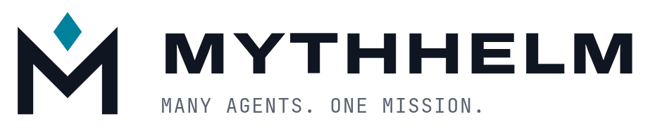

  <picture>
    <source media="(prefers-color-scheme: dark)" srcset="docs/assets/brand/lockup-on-dark.png">
    
  </picture>

**The open-source command deck for native coding agents.**

MYTHHELM orchestrates the coding agents you already use and trust, such as Claude Code, Codex and others, with their native harnesses intact. It gives them a shared mission, safe working boundaries, an honest control plane and a terminal experience worth opening.

> **Status: pre-alpha.** There is no usable release yet. The headless dogfood slice (`run`, `review`, `apply`, `recover`) plus an offline `demo` and a read-only `doctor` are implemented on `main` and covered by a packaged-binary end-to-end suite. Everything else below is a proposed contract, not an implemented or benchmarked capability.

## Dogfood slice status

Supported now:

- Headless `mythhelm run --adapter fake|claudecode` with admission, supervision, verification, review, apply and recovery.
- `mythhelm demo`: a fully offline scripted run in a disposable repository; every screen is labelled `SCRIPTED DEMO`.
- `mythhelm doctor`: read-only prerequisite report; it writes nothing and prints no credential values.
- Linux, macOS and Windows. Native Claude execution is refused on Windows by design (exit 7); the scripted adapter runs everywhere.
- Dogfood billing postures `local-scripted` and `subscription-declared` (user-declared, never verified by MYTHHELM).

Not supported yet:

- Plugins, routing and releases — all still planned.
- `subscription-only`: it always blocks because no native surface qualifies an included-only boundary (G05 not passed).
- The AC-4.7 OAuth-token exception: unwired, refused at both gates (see [ADR 0002](docs/decisions/0002-dogfood-billing-posture.md)).
- macOS MDM preferences and remote cached managed policy as certified trust sources; the settings inventory covers files only.

Try it with no credentials and no network at runtime: `go run ./cmd/mythhelm demo` (the first build needs the Go module cache populated). `go run ./cmd/mythhelm doctor` reports what your machine still needs for a real run.

## TUI status

Supported now (evidence: [G09 record](docs/tui-slice-g09-evidence.md); unrecorded combinations are experimental per I14):

- The focused mission view on a TTY: `mythhelm run` / `demo` / `review` launch the Bubble Tea TUI with responsive layouts (wide, two-pane, single, compact), palette/command navigation and event-driven motion.
- Stable linear output without a TTY, under `TERM=dumb`, with `--plain`, and machine output (`--format jsonl`); `--accessible` emits the ordered screen-reader stream. Covered on Linux, macOS and Windows (x86_64 and ARM) by the packaged-binary end-to-end suite.
- Explicit `--colour` / `--motion` / `--icons` overrides; `NO_COLOR` and `TERM=dumb` suppress.

Recorded interactive combination (full §16.4 row in the G09 record):

- GNOME Terminal 3.52 (VTE 0.76) + zsh 5.9 on Ubuntu 24.04, 190x45.

Experimental until recorded in the G09 record:

- Interactive use in any other terminal/shell: only the combinations with full evidence rows are claimed.
- Screen-reader support: no human session recorded yet, all combinations experimental (AC-5.4).

Known limitations (G09 findings, see the record §5):

- The `q` exit-options dialog renders its rows but key selection is unwired; Esc closes it, Ctrl-C quits.
- Mid-run Ctrl-C cancels the run (exit 130) instead of detaching; the detach path needs a slow-adapter retest.

## Principles

- **Native harnesses preserved.** MYTHHELM drives each agent through its own supported surface. It does not replace or impersonate it.
- **Your subscriptions, no billing surprises.** Work runs against the allowances you already have. Metered spend is never started silently.
- **Honest state.** Estimated, reported, observed and unknown values stay distinguishable everywhere.
- **Safe by default.** Repository text, model output and plugins cannot grant permissions, spend money or publish.
- **Entirely free.** The complete core, built-in adapters, TUI, headless mode, plugin SDK and local routing are free, with no paid tier, feature gate or required account.

## Design

The [master specification](docs/spec/master-spec.md) is the versioned design reference. It covers the architecture, invariants, adapter and billing contracts, the TUI and the staged roadmap. Concise user and contributor guides will be extracted from it as the software becomes real.

## Planned stack

Go core with a [Bubble Tea](https://github.com/charmbracelet/bubbletea) TUI, local SQLite state and a versioned process protocol for plugins.

## Contributing

Contributions are welcome, and you don't need a paid agent subscription to make a useful one. Read [CONTRIBUTING.md](CONTRIBUTING.md) first. All commits must be signed off under the [Developer Certificate of Origin](DCO).

- Questions and ideas: [GitHub Discussions](https://github.com/turbokast/mythhelm/discussions)
- Bugs: [issues](https://github.com/turbokast/mythhelm/issues/new/choose)
- Security vulnerabilities: see [SECURITY.md](SECURITY.md). Don't open a public issue.

## License

[Apache License 2.0](LICENSE). See [NOTICE](NOTICE).

MYTHHELM is an independent project. It is not affiliated with or endorsed by any agent vendor. Product names belong to their respective owners.
