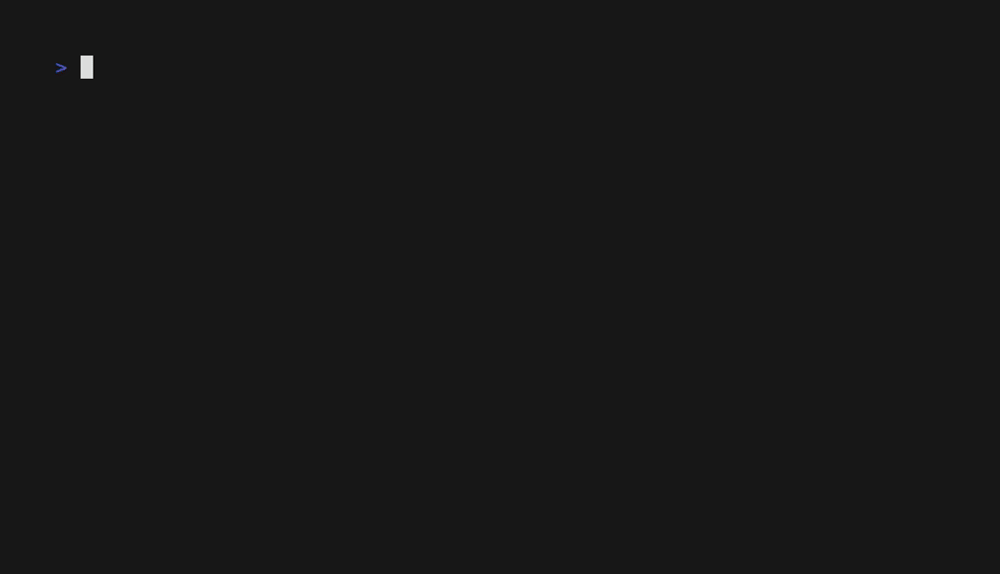
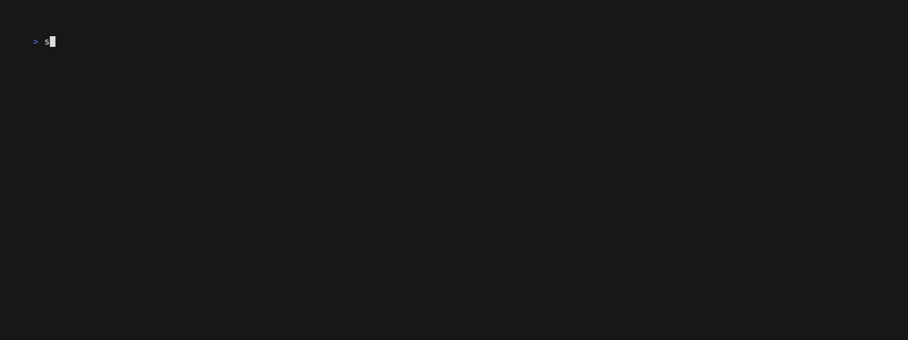

# User guide

MYTHHELM is the open-source command deck for native coding agents. This guide
covers installation and the scripted quickstart. MYTHHELM is
**pre-alpha**: there is no usable release yet, so read
[Limitations]({{ site.baseurl }}/limitations.html) before relying on anything
here.

## Installation

MYTHHELM needs Go 1.27 or newer. `go.mod` pins the toolchain, so with the
default `GOTOOLCHAIN=auto` an older `go` command downloads the right version
the first time it runs. Nothing else is required: no accounts, credentials or
network services.

```sh
git clone https://github.com/turbokast/mythhelm.git
cd mythhelm
go run ./cmd/mythhelm version   # build and run the CLI
```

## Quickstart

The fastest way to see MYTHHELM work is the fully offline scripted demo. It
runs in a disposable repository, needs no credentials and no network at
runtime, and labels every screen `SCRIPTED DEMO`:

```sh
go run ./cmd/mythhelm demo
```


*Honest recording of `mythhelm demo --check pass`, rendered from `docs/demos/demo.tape` — regenerate it with `docs/demos/record.sh`.*


*Honest recording of the TUI driving `mythhelm demo --check pass`, rendered from `docs/demos/tui.tape` — regenerate it with `docs/demos/record.sh` from the pinned revision (`docs/demos/manifest.json`), or with `docs/demos/record.sh --repin` from a clean tree.*

To check what your machine still needs for a real run, use the read-only
prerequisite report. It writes nothing and prints no credential values:

```sh
go run ./cmd/mythhelm doctor
```

## Doctor

`mythhelm doctor` is a read-only prerequisite report: it writes nothing,
creates no state and prints no credential values. Its last section,
`qualification:`, lists one line per harness record in the qualification
registry:

```text
qualification:
claude-code × unknown: blocked (fidelity unknown, entitlement unknown, lifecycle unknown) [evidence 1 revs, latest none; drift clean]
```

Each line reads `<harness> × <surface>: <progress> (fidelity <v>,
entitlement <v>, lifecycle <v>) [evidence <n> revs, latest <ev-id>; drift
<state>]`: the qualification progress (`planned`, `blocked`, `unsupported`
and the other honest labels), the three independent column verdicts
(`proven`, `not-proven` or `unknown`), how many evidence revisions the
record holds, the latest evidence id, and the drift state (`clean`, or the
reason the pinned binary or configuration no longer matches).

When the state directory cannot be read the section says so instead of
guessing — `qualification: unavailable (<reason>)` — and an existing but
still empty registry reads `qualification: (no records)`. With
`--format jsonl` the same records appear under `qualification.records`,
each with its progress, per-column verdicts and evidence ids, evidence
revision count, drift triggers and next test.

## Limitations

The [limitations register]({{ site.baseurl }}/limitations.html) lists what is
supported today: pre-alpha status, narrow adapter coverage, and the shipped
TUI with its known limits. Check it before reporting something as a bug.

## Next steps

- [Contributing]({{ site.baseurl }}/contributing.html): governance, the
  contribution path and DCO sign-off.
- [Source on GitHub](https://github.com/turbokast/mythhelm): issues,
  discussions and the full tree.
