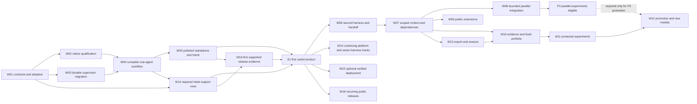

# MYTHHELM implementation plan

Version 1.0 · 5 October 2026 · Derived from [Master Specification v2](MYTHHELM_Master_Spec_v2.md)

This is a dependency-ordered plan, not authorization to implement or run evaluations. The existing application baseline is `d77f2e8e145c3c2d161cf5b4d7164af4ad4dcd8e`. The [decision report](MYTHHELM_Synthesis_Decisions.md#repository) identifies working foundations and gaps. Each slice must be refined into repository lifecycle specs and reviewed tasks when implementation is authorised. Roles below are responsibilities one maintainer and coding agents can fulfill sequentially; they do not require a large staff.

The first useful milestone is one qualified native route completing the entire task → isolated work → independent checks → review candidate → receipt loop, in a polished standalone and Herdr experience with durable ownership. Cross-harness handoffs and adaptive selection are subsequent, concrete milestones. The qualification blocker cannot be bypassed by renaming the existing unverified dogfood billing posture.

## 1. Delivery contract and dependency graph

Use repository `WORKFLOW.md`, isolated task worktrees, required maintainer product approvals, signed-off named-path commits, reviewed PRs and applicable explicit gates when implementation is authorised. This document does not authorize that work, live allowance use, releases, installations, paid experiments or deployment. Do not edit product/orchestration state to imply approval. Existing implementation tests and ADRs are inputs; contradictory/stale status descriptions must be reconciled through normal review.

Each slice ships a usable outcome or removes an explicit release blocker. Owners are responsibilities, not staffing requirements. A maintainer may execute these sequentially with coding-agent help. Do not estimate calendar dates until qualifications and slice size are known. Carry only work required for the next complete outcome; keep the full destination in the [master stages](MYTHHELM_Master_Spec_v2.md#acceptance).

W12 can begin with nonparallel policies before W08; the P3 branch is required only for parallel policy claims. W13 is part of the S2 public contract and must complete before optional learning retention/deletion claims in W10. W14 runs as per-target qualification work; it does not force every adapter/platform to pass before a useful subset ships. W15 is independent of learning. W16 recurs for every release, including the S1 preview; it is not a final step that delays all user value until S6.

| Product milestone | Required slices | Release meaning |
|---|---|---|
| S0 Boundary proof | W01, W02, migration design portion of W03. | At least one credible route proven under explicitly authorised tests; otherwise continue offline development and report the real blocker. |
| S1 First useful product | W03–W05, required W14 target rows, W16. | One complete qualified native workflow, honest supported host/platform subset, no manual internal repairs. |
| S2 Continuity | W06, W07, W13. | Two qualified harnesses, grounded task/session continuity and scoped export/deletion. |
| S3 Bounded construction and extensions | W08, W09. | Two-writer envelope and useful public process/declarative extension system. |
| S4 Evaluated portfolio | W10, W11; W08 for P3. | Consented measured policies and protected experiments; recommendations with uncertainty. |
| S5 Adaptive product | W12 plus scoped qualification/canary evidence. | Useful, reversible adaptation demonstrated; no code self-deployment. |
| S6 Optional production delivery | W15 per destination. | Explicitly authorised deployment with independent health/effect evidence. |

All tests below reference [AT-01–AT-48 and G01–G16](MYTHHELM_Master_Spec_v2.md#acceptance). Offline scripted evidence cannot pass a live-native requirement. Enable a capability only when its safety tests pass, even if its normal milestone is later.

## 2. Concrete vertical slices

### W01 — Adopt one contract vocabulary and evidence register

**User/maintainer outcome:** the next implementation task targets one reviewed design and an honest compatibility matrix. **Owner:** core maintainer, with product/security review. **Stage/dependencies:** S0; no implementation dependency.

Create repository lifecycle specs from the approved v2 contracts, reconcile accepted/proposed ADR status with actual code, and document the service migration decision. Define Go record types and JSON Schemas for Run/TaskRevision/Attempt, routing/design decisions, Verification, artifacts, grants/reservations and event v2. Define config v2 schema/defaults and separate plugin manifest/protocol versions. Assign ownership of every qualification entry. Preserve historical v1 schemas and evidence.

Deliver a machine-checkable transition table/event contract, error/retry codes, golden JSON/TOML fixtures, and a trace from intended APIs to existing packages. Publish whether a matrix row is documented, fixture-tested, blocked or live-qualified; no blanket product support from vendor docs. Unresolved auth/OS facts remain blocked, not filled with guessed flags. Defaults come from master §§4–8 and §15.4 rather than duplicated configuration in this plan.

Validation: malformed/unknown authority keys fail; event IDs/sequences and null measurements round-trip; illegal transitions are rejected; version domains do not collide. Review against AT-02–AT-04, AT-07, AT-35, AT-41. W01 produces contract evidence, not runtime qualification. Existing CLI/config continue until W03 migration is explicitly invoked.

### W02 — Qualify the first included native route through a truthful doctor

**User outcome:** see a precise eligible route or actionable blocker before work starts. **Owner:** native-integration maintainer and security reviewer. **Stage/dependencies:** S0; W01; explicit live-test authority if used.

Extend `internal/adapter` and `admission` with versioned capability/fidelity/entitlement records, effective non-secret configuration digests, model/effort metadata and drift triggers. Reuse current Claude fixtures first where useful; compare another target if it offers a more credible included-only boundary. Native product preference is not a selection criterion. Build a read-only doctor/profile explanation and a disposable direct-native-versus-integrated qualification procedure.

Test instruction/skill/tool/MCP/hook preservation, native permissions, startup before trust, aux/child calls, account/credential precedence, included exhaustion, purchased-credit prevention, sessions, usage counters, stop and soft-denial semantics. Never read secrets or change account settings as a probe. User declarations remain visibly unverified. If the route cannot establish no paid continuation, strict admission continues to block; demo remains useful.

Deliver sanitized fixtures, exact live versions/evidence where authorised, an expiring qualification manifest, support limits and regression tests. Covers AT-02–AT-04, AT-11, AT-13, AT-19 if children enabled, AT-47; G02/G05/G07. Do not make the claim “first useful native product” until at least one route actually passes. Alternative SDK/interactive surfaces add G12 independently.

### W03 — Detach and recover through one durable supervisor

**User outcome:** work survives client closure and recovers without duplicate launch. **Owner:** core/lifecycle maintainer. **Stage/dependencies:** S0 design, S1 delivery; W01. Uses scripted adapters before W02 qualifies a live route.

Implement lazy per-user service, authenticated local IPC, global instance/root lock, controller generation, idempotent control intents and global reservations. Keep worker-owned launches, identity nonces and durable spools; make the service sole SQLite writer. Add additive numbered migrations for v2 projections/tasks and preserve v1 events/IDs. Do not edit `0001_init.sql` or allow simultaneous legacy and new writers.

Deliver explicit migration preview, consistent backup, drain/adopt/quarantine procedure, unsupported-version refusal, user-invoked migration and tested restoration. Preserve legacy declared-billing and unverified candidates as such. Service unavailability stops new launch and effects; workers remain inside their already admitted envelope. Bounded stop/recovery includes a control path usable when DB writes fail.

Fault-inject crashes before/after intent, spawn, ack, result ingest and effect ack; test PID reuse, stale generation, incomplete spool, full disk, WAL recovery, conflicting state roots, restore and downgrade. Covers AT-06–AT-09, AT-41/42; G04/G16. Qualify actual SQLite engine WAL fix. The old per-run owner path ceases to admit work after migration; it is not a permanent second topology.

### W04 — Deliver a complete single-agent verified change

**User outcome:** one task becomes a verified review candidate with safe optional apply. **Owner:** workspace/verification and native-integration maintainers. **Stage/dependencies:** S1; W02/W03.

Extend existing snapshot/check/review/apply flow to TaskRevision, immutable context manifest and attempt policy pins. Implement deterministic P1, strict admission, finite budgets, exact candidate freeze, independent protected evaluator and final receipt. Keep original files/index/refs unchanged. Apply creates a guarded new branch/ref by default, with expected-state checks. Existing no-checks/dogfood results remain unverified instead of inheriting accepted readiness.

Deliver full loop in plain/JSONL and TUI projections: admitted → executing → verifying → ready for review → optional requested apply. Expose insufficient authority, allowance exhaustion, unavailable checks and partial artifacts with typed exit/result. Separate source acceptance from native exit and from requested external effects. Dirty source/config drift/weakening checks block affected operations while preserving work.

Exercise a real small fix on the qualified route plus zero-credential fixtures for failing checks, candidate mutation, malicious test removal, paid auxiliary fallback, cancellation and apply races. AT-01–AT-09, AT-11–AT-13, AT-22–AT-24, AT-35/47; G01–G07 as applicable. No planner model, optional search or learner required.

### W05 — Make standalone and Herdr completion feel like one product

**User outcome:** navigate, intervene, detach, recover and review without knowing internal files. **Owner:** UX/host maintainer with accessibility review. **Stage/dependencies:** S1; W04.

Finish existing TUI quit/detach behavior and truthful stop status; implement stable task/diff/check/route details, keyboard-complete controls and responsive views. Preserve plain/JSONL/accessible output, color/motion/icon overrides and purposeful motion. Add input-lease takeover/reconciliation before enabling native interaction. UI work consumes typed projections, never owns execution.

Implement free Herdr embedded-client path and minimal installed-schema bridge for safe status/attention/control. Test detach and server restart separately. A restored pane attaches to a run, never raw-native resumes it. Unsupported socket methods fall back to embedded TUI; unknown input ownership blocks automation. Host-owned execution remains deferred.

Record terminal/shell/host versions, real user journey evidence and human screen-reader results before making those claims. Measure render/stream/input/resize targets, sanitize hostile filenames/control text, and verify critical approvals remain visible. AT-07/08/10, AT-35–AT-37, AT-48; G09/G11 and the relevant G12 surface. This completes S1 only with W16 public release evidence and honest W14 support rows.

### W06 — Continue one mission across two native harnesses

**User outcome:** switch to an independently qualified harness or resume a useful session without losing requirements. **Owner:** adapter/context maintainer. **Stage/dependencies:** S2; S1, second route passing W02 procedure.

Implement capability-negotiated reconnect versus new-attempt resume, explicit context delta acknowledgements, new-session fallback and grounded cross-harness handoff. Add task/artifact provenance fields and validated handoff schema; use the single ledger. Record exact route/configuration and loss of native continuity; do not copy provider internals or private native state.

Deliver a complete two-harness workflow and a same-harness session recovery workflow. Recheck admission on each switch; respect pinned native preference. Unsupported session operation reconstructs from exact artifacts, or blocks for missing facts when reconstruction is insufficient. A handoff is not acceptance.

Test original constraints, pending design decisions, stale data, unavailable resume, wrong native session, unsupported steering, interrupted handoff and exhausted allowance. AT-02–AT-04, AT-14/15, AT-25; G02/G05/G13. Migrate only new task/artifact metadata; existing runs remain readable and no old session is falsely declared resumable.

### W07 — Retrieve scoped context and invalidate stale dependencies

**User outcome:** useful context follows the task, and obsolete evidence cannot silently ship. **Owner:** context/task-contract maintainer. **Stage/dependencies:** S2; W06.

Implement mandatory context core, exact task/artifact/decision/evidence operations, optional local lexical/FTS5 search, read-only file/CLI projections, and accepted project-memory proposals. Add dependency edges/revisions and reverse invalidation. Native instructions remain native. Do not add an editable parallel wiki or mandatory embedding service. An MCP facade is optional after the shared ACL implementation works.

Deliver a changed-contract continuation showing which tasks need revalidation, grounded handoff lineage and a functioning index-off mode. Deny cross-repository data and metadata before lookup. Summaries retain original evidence references; opaque native compaction remains unknown. Index corruption never promotes a stale hit into truth.

Test mandatory-context overflow, dependency cycles, concurrent contract revision, selective invalidation, stale worker output, metadata/hash leaks and corrupted/absent indexes. AT-14–AT-18; G07/G13. Indexes rebuild from canonical records; task graph/version schema is additive. W13 must complete export/erase promises before S2 release.

### W08 — Build two independent parts and verify their integration

**User outcome:** real parallel construction shortens a suitable critical path without losing integration correctness. **Owner:** scheduler/workspace maintainer. **Stage/dependencies:** S3; W07 and applicable native child/process qualification.

Implement bounded contract DAG scheduling, stable-order atomic resource reservations, foreground/fairness priorities, two-writer limit, shared-file claims and isolated mutable services/ports/test databases/build output. Preserve one writer per workspace. Qualify native-child envelopes or visibly disable the unsupported mode. Expired claims are not reclaimed before owner/effect reconciliation.

Deliver two independent candidate builds, serialized integration against latest base, protected combined verification and bounded repair from preserved candidates. Include an intentionally coupled task that stays sequential and an individually passing pair that fails together. Estimates guide scheduling but do not supply provider hard-cap guarantees.

Test stale contracts, deadlock avoidance, exhausted allowance/repair reserve, escaping children, external-resource reuse, semantic conflicts and cancellation during integration. AT-18–AT-21, AT-26 and latency/resource receipts from §13; G04–G07. Add resource/queue projections in the same DB. Parallel failures degrade to preserved candidates/P1 only after quiescence, not by concurrent fallback launch.

### W09 — Extend workflows safely without a core fork

**User outcome:** install a useful theme/workflow or explicitly trusted process plugin with inspectable scope. **Owner:** extension maintainer. **Stage/dependencies:** S3; W07; two built-in implementations must exercise the interfaces being stabilized. W08 is required only for plugins proposing parallel work.

Ship protocol major 1/manifest version 1, bounded JSON-RPC transport, trust/lock records, local install-inspect-enable flow, version/capability negotiation, revocation, conformance runner and Go reference SDK. Publish deterministic router, fake adapter, theme/layout and verifier examples without credentials. Keep the core as launcher/admission/evidence authority. No bundle install scripts or arbitrary terminal rendering.

Deliver one complete third-party-style deterministic router and declarative workflow journey with reset/uninstall/revocation. Missing dependency/version blocks enablement; crash/hang disables the extension while fixed core behavior continues or a required function blocks safely. Signatures establish provenance, not sandboxing.

Test malformed/flooded frames, denied capability, install archive escapes, prompt pack privilege attempts, active pinning, inaccessible warnings and keymap reset. AT-12, AT-38/39, AT-47; G08/G12 when a plugin creates an alternative native surface. A static optional catalogue can follow; no marketplace or sandbox research blocks this slice.

### W10 — Explain whether the fixed policy actually helps

**User outcome:** comparable receipts reveal accepted quality, elapsed time, intervention and resources; optional estimates inform choices. **Owner:** evaluation owner with core/privacy review. **Stage/dependencies:** S4; W07/W13, W08 for P3 observations.

Add explicit per-repository consent, learning outcome schema, pre-assignment features/action-set recording, assignment provenance, delayed-outcome links, missingness and normalization versions. Implement P1/P2/P4 fixed policies within existing grants/checks; add P3 only after W08. Operational receipts remain available with learning disabled. Collection does not create any new native call.

Deliver an offline evaluation runner, task/candidate/evaluator manifests, direct-native/P1/fixed-policy baselines, heldout separation and a comparison report with all-started denominators. Publish exact task scope, uncertainty and defects rather than a single efficiency score. Add recommendation-only estimates; sparse data retains deterministic choice.

Test cumulative/missing counters, harder-task selection bias, cancels/timeouts/blocked runs, delayed regression correction, opt-in/backfill separation, deletion and learner failure. AT-13, AT-25, AT-27–AT-29, AT-33; G14 data/evaluation portion. Add PolicyVersion/Experiment/outcome tables through normal migrations; no stored historical row is automatically opted into training. No performance superiority claim before a separately authorised live comparison.

### W11 — Run one bounded experiment without harming foreground work

**User outcome:** evaluate a specific policy/context/prompt hypothesis with known allowance use and useful uncertainty. **Owner:** evaluation/scheduler maintainer. **Stage/dependencies:** S4; W10, explicit experiment authority and qualified variants; W08 for parallel variants.

Implement experiment registration (population, sampling unit, splits, variants, assignment, metrics/margins, budget, stopping rule), zero-default exploration, foreground priority, completion reserves and reconciled preemption. Keep evaluator/authority constraints protected. Add context/session/review/parallel ablation support through the same run/attempt machinery; no second experiment executor.

Deliver a complete experiment receipt and a recommendation or “inconclusive/rejected” result. Failure, insufficient sample or exhausted allowance ends within budget and preserves evidence. Native-assisted proposal generation and summaries count in the total; fixed execution stays available. A dev-only gain or broader permission invalidates promotion eligibility.

Test budget zero, worker preemption, contaminated holdout, unsupported overlap, repeated-comparison stopping, fake success and an experiment that loses to P1. AT-26–AT-30, AT-33; G05/G14. First trials can be fully scripted; live claim requires authorised representative tasks and exact route qualification. No automatic policy promotion in this slice.

### W12 — Promote, roll back and replace pipelines with better models

**User outcome:** safely benefit from a demonstrated improvement, including choosing a simpler new single-agent route. **Owner:** evaluation owner and native-integration maintainer. **Stage/dependencies:** S5; W11; W08 for P3; live qualification and scoped promotion authority.

Implement immutable runtime PolicyVersion, deterministic protected promotion gate, cohort-specific active pointer, standing-grant checks, canary monitoring and automatic rollback under registered rules. Pin active attempts; new assignments alone use new policy. Add optional metadata discovery, explicit native install/update boundary, qualification/calibration/canary records and drift-triggered suspension. Prompt optimization creates data policies; executable/evaluator changes use reviewed releases.

Deliver three demonstrations: a misleading policy rejected, a deliberately regressing promoted fixture rolled back, and an authorised live cohort with a useful accepted improvement over its strongest simpler baseline. Compare new models against whole pipelines. If no real winner is found, retain fixed useful execution and label adaptation experimental; do not invent benefit to satisfy a milestone.

Test stale policy pointers, active-attempt pins, revoked grants, qualification drift, ambiguous aliases, absent model availability, rollback during outstanding effects, disabled learner and whole-pipeline P1 replacement. AT-29–AT-34; full G14 for adaptive claims. Policy pointer rollback is reversible data change; downgrading executable/schema versions is separately governed.

### W13 — Export, erase and restore scoped history

**User outcome:** keep control of durable evidence without hidden indefinite learning retention. **Owner:** storage/privacy maintainer. **Stage/dependencies:** S2; W03/W07; complete before W10 claims retention/erase support.

Implement scoped snapshot export, dry-run GC, dependency-aware artifact retention, interrupted-cleanup recovery and explicit erasure maintenance. For append-only history, quiesce writers and rebuild a validated DB excluding authorised terminal data; atomically replace only after integrity checks. Include indexes, optional datasets/derived models and user-selected backups/exports. Do not claim provider/native-history erasure.

Deliver a round-trip sanitized export/import and an erase receipt explaining retained dependencies/copies. Active/ambiguous runs cannot be purged to reclaim space. Failed rewrite leaves the original DB usable; disk pressure blocks new work instead of destroying current evidence. Content-free audit tombstones cannot retain erased prompts/paths.

Test cross-project export denial, active references, interrupted DB swap, insufficient disk, backup restore, derived-index rebuild and policy provenance invalidation. AT-16/41–AT-43; G13/G16. This is explicit maintenance/schema work, not deletion through the normal event API.

### W14 — Expand native and platform coverage with honest evidence

**User outcome:** use the same product on qualified OS/harness combinations and see accurate limits elsewhere. **Owner:** platform and native-integration maintainers. **Stage/dependencies:** S1–S5, W02/W05 procedure; each target independent.

Maintain seven explicit tracks: Claude Code, Codex, OpenCode, Meta Muse Code, Kimi Code CLI, Cursor Agent CLI and Antigravity. Each has native identity/surface, documented candidate mechanism, repository fixture status, entitlement blocker, platform/host dependencies, assigned owner and next qualification test. The initial order follows credible complete-route qualification cost and user need, not model reputation. A blocked target stays visible and can be revisited when vendor controls change.

Native Windows requires a proven process-tree boundary before reliable cancellation claims; test ConPTY/Job Objects or justified equivalent. Test Unix group escape/PID identity and all file/path edge cases. Expand terminal/shell, screen-reader and Herdr matrices independently. Publish exact binary/OS/architecture/native/terminal versions; no unsupported universal parity claim.

Repeat AT-02–AT-04, AT-06–AT-11, AT-19 if enabled, AT-36/40/47 and G12 for each alternative surface. Fixture support can ship before live qualification with explicit experimental/blocked status. No target's blocked state permits a paid/API substitute under its native brand. This track is additive unless protocol/schema compatibility requires a reviewed migration.

### W15 — Deploy an exact verified release under explicit authority

**User outcome:** optionally take a prepared candidate to a specified healthy destination with truthful failure recovery. **Owner:** release operator and effect/publisher maintainer. **Stage/dependencies:** S6; S1, destination-specific authority/qualification; learning unnecessary.

Implement Release/effect state and receipt, protected build artifact identity, destination/grant binding, deploy idempotency/lookup, separate health verification and bounded authorised rollback. Keep production credentials out of ordinary checks/agent work. Reuse the core outbox/effect reconciliation path, not a new deployment controller.

Deliver a release-ready artifact when deployment authority is missing and an honest blocked result for a request to deploy. Where destination lookup is unreliable, uncertain effects require manual resolution. A successful upload is `deployed_unverified`, not completed production. A rollback needs its own authority/evidence and can itself fail.

Use offline fake destinations first. Authorised live tests cover response loss after success, health failure, expired grant, stale build, rollback failure and reconnect. AT-09, AT-12, AT-44/45; G15 plus applicable G05/G07. Release tables are additive. No default first-run deployment/push and no account provisioning bundled into this slice.

### W16 — Release the supported product and maintain it

**User outcome:** obtain a verifiable build with understandable capabilities, limitations and contribution path. **Owner:** maintainer/release operator. **Stage/dependencies:** every public release; first S1 subset from W02–W05/W14.

Publish evidence registry, compatibility/qualification matrix, user journeys, migration and recovery instructions, license/DCO/security policy, changelog, SBOM, provenance/checksums and offline contribution steps. Review name/package/distribution claims without assuming clearance. Reconcile README/ADR status with shipped behavior. Pin CI dependencies/actions, isolate secret-bearing live jobs from untrusted PRs, and provide security reporting/update policy.

Run applicable Go formatting/tidy/shared repository gates for code changes, deterministic lifecycle/plugin/context fixtures, packaged-platform tests and the exact live/human checks required by advertised scope. A release checklist links evidence rather than ticking unsupported “all platforms/all agents” boxes. Release/tag/publish remains an explicit operator action.

AT-01, AT-35–AT-40, AT-46–AT-48 plus all enabled feature gates. S1 needs G01/G02/G03/G04/G05/G06/G07/G09/G10/G11, G08 for its shipped themes, and G12 only for enabled alternative surfaces. Later context, plugin, learning and production claims add G13/G08/G14/G15; storage changes maintain G16. A useful fixed release can precede demonstrated adaptive improvement, with that limit stated clearly.

## 3. Migration, operation and qualification rules across slices

| Change | Compatibility contract | Rollback/degradation |
|---|---|---|
| Per-run owner → per-user service | Explicit exclusive migration; preserve worker identity/spool and stop legacy admissions. | Restore compatible binary/consistent backup only after reconciling effects; unknown owner quarantined. |
| Schema/config/event v1 → v2 | Additive DB migrations; separately decode historical events; preview TOML migration; no secret or consent inference. | Newer schema refuses writes; old views retain accurate unknown/unverified labels. |
| Task/context graph | Stable IDs plus immutable revisions and additive dependency/artifact records. | Old one-task runs remain valid history; exact retrieval works without index. |
| Multiwriter scheduling | Increase only qualified resource envelope; pin task/native-child limits. | Stop/reconcile active parallelism before sequential retry; preserve candidates. |
| Plugin ABI | Manifest/protocol versions distinct; no public promise for internal Go interfaces. | Keep pinned active binaries; disable/revoke incompatible plugin with typed cause. |
| Learning/policies | Separate opt-in/backfill/exploration authority; operational receipts unchanged. | Disable learner, retain fixed qualified policy; erase/rebuild consented derived data as requested. |
| Native model/harness update | New build/config identity triggers affected qualification; metadata alone ineligible. | Preserve current attempt/evidence; block new unsafe route, no API fallback. |
| Publisher/deployment | New independently qualified effect class and destination grants. | Reconcile unknown effects; rollback only within authority; never blind resend. |

Defaults, error codes and budgets are normative in the master. Implementation may propose changed defaults through review with evidence; it must not introduce undocumented parallel definitions. Every PR that adds a capability updates its matrix row, receipt fields, failure behavior and relevant fixtures.

## 4. Capability ownership and implementation completeness

This table supplies the path from significant new capabilities to concrete state/interfaces, migration, tests and useful degraded operation. The linked master sections contain the complete contract.

| Capability/user benefit | Owner, state and interface | Default/failure; delivery and evidence |
|---|---|---|
| Durable ownership without UI dependency | Core; service generation, worker identity, IPC/outbox; [§§3–6](MYTHHELM_Master_Spec_v2.md#architecture). | Single service; reconcile/quarantine, never duplicate. W03 after W01; AT-06–AT-09/41/42; owner/schema migration. |
| Native included-allowance honesty | Adapter/admission; route qualification and usage/reservations; [§7](MYTHHELM_Master_Spec_v2.md#adapters). | Unknown protection blocked. W02/W14; AT-02–AT-04/13/19; additive qualification records. |
| Context continuity and freshness | Context; TaskRevision/Artifact/Manifest/Decision, scoped reads; [§9](MYTHHELM_Master_Spec_v2.md#context). | Required core/exact lookup; no-index fallback. W06/W07/W13; AT-14–AT-18/43; task/artifact migrations. |
| Bounded faster construction | Scheduler; dependency/claim/integration queue; [§10](MYTHHELM_Master_Spec_v2.md#routing). | One writer, first parallel ceiling two; retain conflicts. W08; AT-18–AT-21/26; global reservations. |
| Verifiable useful delivery | Verifier/workspace; frozen candidate/check/Verification; [§11](MYTHHELM_Master_Spec_v2.md#verification). | Review candidate; unavailable checks visibly unverified. W04/W08; AT-05/21–AT-24; legacy evidence semantics preserved. |
| Bounded autonomous progress | Core; standing Grant/EffectIntent/finite envelopes; [§8](MYTHHELM_Master_Spec_v2.md#security). | Proceed inside grant, block dependent missing authority. W02–W04/W15; AT-08/09/12/44/47; grant migration explicit. |
| Useful optional adaptation | Evaluation; outcome rows, PolicyVersion, Experiment; [§§12–13](MYTHHELM_Master_Spec_v2.md#learning). | Off; fixed P1 remains; reject weak evidence. W10–W12 after W13; AT-27–AT-34; separate consent/backfill. |
| New-model pipeline replacement | Adapter/evaluation; registry, qualification and canary/policy pointer; [§12.4](MYTHHELM_Master_Spec_v2.md#learning). | Metadata only until qualified; drift blocks affected route. W12/W14; AT-32/34; active attempts pinned. |
| Understandable native/Herdr control | UX/host; scoped view and input lease; [§§14–15](MYTHHELM_Master_Spec_v2.md#herdr). | Embedded client; unsupported host API degrades view. W05; AT-07/10/35–AT-37/48; IPC/version compatibility. |
| Useful mods/plugins | Extension broker; manifest/protocol/lock/grants; [§16](MYTHHELM_Master_Spec_v2.md#plugins). | Declarative data; explicit host trust for executables. W05/W09; AT-38/39/47; ABI negotiation and pins. |
| Data portability and retention | Storage/privacy; scoped exports, dependency roots, purge maintenance; [§5](MYTHHELM_Master_Spec_v2.md#persistence). | Bounded retention, no active deletion; report remaining copies. W03/W13; AT-41–AT-43; v1 append-only rewrite contract. |
| Cross-platform polished product | Platform/release; qualification matrix and packaged artifacts; [§17](MYTHHELM_Master_Spec_v2.md#operations). | Advertise tested subset; preserve full target list. W05/W14/W16; AT-36/40/46–AT-48; no schema change by default. |
| Optional verified deployment | Release operator; Release/EffectIntent/health receipts; [§11.3](MYTHHELM_Master_Spec_v2.md#verification). | Disabled; prepare candidate then block missing authority. W15; AT-09/44/45; additive effect state. |

## 5. Explicit deferrals and stop criteria

| Deferred mechanism | Reason and trigger for reconsideration |
|---|---|
| Two native adapters before first useful workflow | Delays value without proving the lifecycle/billing loop. Second adapter is committed W06 work, not abandoned. |
| More than two writers and arbitrary recursive native teams | Prove useful two-writer integration/accounting first; wider envelope needs live evidence and resource/security qualification. |
| Mandatory embeddings/vector service | Exact/lexical retrieval is sufficient foundation. Add only if a registered ablation improves accepted outcomes including overhead/privacy. |
| General combinatorial optimizer | Small comparable datasets cannot support enormous action spaces. Add a narrowly justified family only after P1–P4 experiments reveal a missed opportunity. |
| Runtime controller/evaluator code self-deployment | Reject as runtime capability. Improvements can be proposed as normal reviewed PRs and operator-authorized releases. |
| Host-owned native execution | Requires separate owner-transfer/restore/security/billing qualification under G12; no benefit sufficient to burden S1. |
| Distributed multi-host scheduling/shared accounts | Changes authority, quota and recovery model materially; requires separate product decision. Not required for full local adaptive product. |
| Sandboxed arbitrary-code marketplace/WASM | Process/data extensions deliver useful customization first; reconsider for a concrete containment requirement and maintained runtime. |
| Additional SDK languages and package channels | Add when actual contributors/users justify maintenance and conformance coverage. Go SDK and archives first. |
| Automatic remote catalogue/update scans | Off by default; optional W12/W16 behavior with explicit privacy/network consent. |

Stop expanding a slice when its complete journey and applicable gates pass; ship/review that outcome. Stop optional experiments at their registered budget or safety trigger. If no qualified included route exists, report that blocker and continue authorized offline contract work without marketing a usable strict native release. If an adaptive policy does not beat a useful baseline, retain fixed behavior and investigate the recorded uncertainty; do not weaken the evaluator. Do not use a release deadline to bypass authority, source protection or billing gates.
