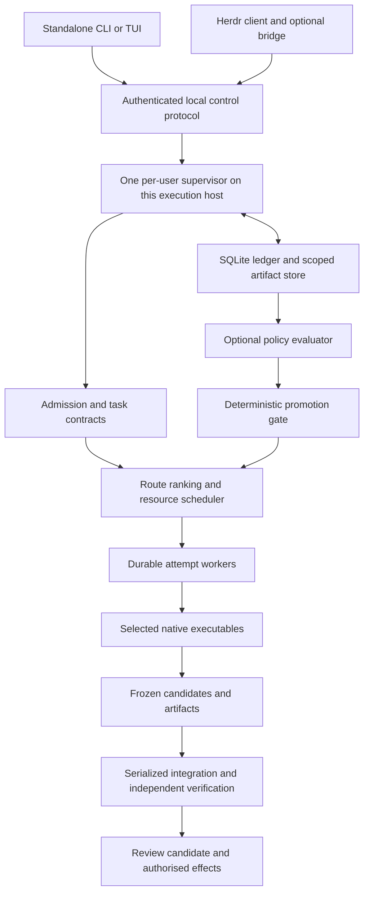

# MYTHHELM Master Specification v2

**Many agents. One mission.**

**The free, open-source command deck for native coding agents.**

Version 2.0 · 5 October 2026 · Integrated product and engineering specification

This is the normative design for the integrated MYTHHELM product. It describes the complete destination and gates delivery in useful increments. It is not a statement that every capability exists, that a native route has been certified, or that performance gains have been demonstrated. The original inputs remain intact; the [specification index](../docs/spec/README.md) and [product adoption map](../docs/spec/synthesis-adoption.md) record adoption through signed product changes and a reviewed PR. This document is self-contained. The [decision report](MYTHHELM_Synthesis_Decisions.md) records provenance and source dispositions; the [implementation plan](MYTHHELM_Implementation_Plan.md) derives work from these contracts.

MUST/MUST NOT are release-blocking for a shipped capability. SHOULD admits an explained, recorded exception; MAY is optional. A deferred capability does not waive the invariants of the capabilities that do ship. Numbers identified as defaults or targets are product decisions, not empirical results.

## Contents

- [1. Product and requirements](#product)
- [2. Invariants](#invariants)
- [3. Architecture and ownership](#architecture)
- [4. Canonical model and contracts](#model)
- [5. Persistence and compatibility](#persistence)
- [6. Execution, cancellation and recovery](#lifecycle)
- [7. Native qualification and billing](#adapters)
- [8. Authority, security and privacy](#security)
- [9. Context and continuity](#context)
- [10. Planning, routing and scheduling](#routing)
- [11. Integration and verified delivery](#verification)
- [12. Adaptive improvement](#learning)
- [13. Evaluation and promotion](#evaluation)
- [14. Herdr](#herdr)
- [15. CLI, TUI and user journeys](#ux)
- [16. Plugins and mods](#plugins)
- [17. Platforms, operations and distribution](#operations)
- [18. Delivery stages and acceptance](#acceptance)
- [19. Governance and risks](#governance)
- [20. Primary sources](#sources)

<a id="product"></a>
## 1. Product and requirements

### 1.1 The destination

MYTHHELM turns a requested software outcome into a reviewable, verified change by coordinating the native agents a developer chooses. It preserves useful native sessions, shares grounded project knowledge, coordinates independent construction, integrates results, and learns which execution policies actually help. It is equally useful as a focused one-agent command deck and as a coordinator of a small fleet. The user can inspect, intervene, continue in a native tool, or turn learning off.

The differentiating promise is dependable continuity and accepted delivery with less coordination burden. Agent count, generated lines, PR count, visible activity and smaller initial prompts are not success measures. The product must justify its overhead against direct native use, a strong single agent, and a fixed policy. It may learn that one newer model replaces an entire specialist pipeline.

The native harness owns its model/tool loop, instructions, useful tools, permissions, sessions and authentication. MYTHHELM owns task-level contracts, admission, scheduling, context references, integration and evidence. It gives agents coherent tasks rather than issuing a replacement read/edit/tool loop. Herdr supplies terminal presentation and host controls; it does not become another scheduler or inference service.

### 1.2 Explicit requirements

| ID | Required outcome |
|---|---|
| UR-01 | Free official core, adapters, TUI, local routing, safety controls, SDK and official mods; public GitHub development; no required MYTHHELM account, paid tier or hosted service. |
| UR-02 | Preserve the selected native harness and useful capabilities; distinguish harness, model/provider, execution surface and entitlement. No silent substitution. |
| UR-03 | Default to authorised included subscription allowance. No silent metered inference, purchased-credit use, paid overages or paid auxiliary calls anywhere in the execution tree. |
| UR-04 | First-class Herdr operation and useful standalone operation, with one lifecycle owner, safe input takeover and truthful reconnect/recovery. |
| UR-05 | Retain support targets Claude Code, Codex, OpenCode, Meta Muse Code, Kimi Code CLI, Cursor Agent CLI and Antigravity. Qualify each surface separately; release supported subsets honestly. |
| UR-06 | A polished, accessible, keyboard-complete and responsive TUI, plain and machine output, and a credible Windows/macOS/Linux product. |
| UR-07 | Useful plugins, declarative mods, portable protocols and contribution without paid credentials. |
| UR-08 | Reliable native continuity, canonical task state, immutable artifacts, selective context, dependency-aware construction, independent verification and bounded autonomy. |
| UR-09 | Substantive, reversible adaptation of routing, context, prompts, review and decomposition, including onboarding new models and choosing simpler workflows. |
| UR-10 | One implementable product with a useful first milestone; later research cannot become a prerequisite for basic delivery. |

Go, Bubble Tea/Lip Gloss, TOML, SQLite and a process-based extension protocol remain the chosen stack. Keep the existing pinned dependencies until a reviewed implementation change establishes a concrete reason to update them. Do not infer the renderer used by the repository from a newer upstream framework release.

The first intended users are individual developers and small trusted teams operating under one OS user per execution host. Mandatory cloud coordination, shared account pools, hostile multi-tenant execution, a replacement IDE, fine-tuning closed models, and unbounded recursive swarms are outside this product contract. Optional authorised deployment belongs to the full vision, with independent effect authority; it is not a default first-release action.

External native services may require the user's subscriptions. A community local-agent route may provide a separately labelled local-only workflow, subject to the same fidelity/authority/evidence contracts; it must not be mislabeled subscription usage or cost-free hardware. Donations and sponsorship cannot unlock official features or buy routing preference. Display third-party extension licenses and costs without promising that every external service is free.

### 1.3 What exists at the inspected baseline

The repository snapshot inspected was `d77f2e8e145c3c2d161cf5b4d7164af4ad4dcd8e`. It already contains the Go headless dogfood workflow, fake and Claude Code seams, managed snapshots, worker spooling, SQLite schema v1, guarded apply, recovery, offline demo, read-only doctor and a Bubble Tea TUI. The TUI evidence records limited interactive coverage and outstanding exit/detach issues. These are assets to extend, not proof of the destination.

The current implementation uses run-scoped CLI supervisors and owner locks; it has no per-user service/IPC, rich Herdr bridge, general router, multi-task scheduler, public plugin ABI or adaptive learner. `subscription-only` always blocks. `subscription-declared` is a separately labelled dogfood posture with unknown paid-continuation protection; it cannot count as qualification. No live adapter qualification or application benchmark was performed for this synthesis. Repository evidence and migration consequences are detailed in the companion reports.

<a id="invariants"></a>
## 2. Invariants

The original I01–I19 identifiers are retained with clarified scope. New requirements extend them without renumbering.

| ID | Normative invariant |
|---|---|
| I01 | The selected native harness executes the work. Prefer its unmodified executable through a qualified surface; runtime SDKs require independent fidelity and entitlement qualification. Disclose configuration differences. |
| I02 | Admission resolves identity, workspace, destination, authority, billing and required capabilities before launch. Unknown mandatory evidence blocks; unknown remaining quota alone need not block a qualified stop-at-exhaustion route. |
| I03 | Repository text, model output, retrieved memory and plugin messages cannot grant authority, spending, publication or deployment. |
| I04 | A change of provider, funding route, execution host or security posture requires applicable user authority and new admission. A standing allowlist may supply that authority; a pinned harness remains pinned. |
| I05 | One active writer owns each managed working directory. Reservations coordinate work; only declared enforcement mechanisms constrain arbitrary writes. |
| I06 | UI exit does not transfer execution ownership. A stop request remains unconfirmed until reconciliation establishes the result. |
| I07 | Native completion is an observation. Acceptance requires independent evidence bound to the exact candidate, contract, check definitions and environment. |
| I08 | Original checkout files, index and existing refs remain untouched by default. Only an explicitly requested, validated apply may create or advance the exact authorised ref; it must preserve unrelated work. |
| I09 | Reported, observed, estimated, user-declared and unknown data remain distinct. Missing is never zero, passed or verified. |
| I10 | A hard limit is advertised only for an established boundary covering in-flight exposure. Reservations and cancellation are not provider caps. |
| I11 | Supported extension APIs cannot bypass admission, evidence, authority or publication rules. Unsandboxed executable extensions require disclosed host trust. |
| I12 | Recovery reconciles effects before retrying. Event replay never replays native tools, prompts or external effects. |
| I13 | Core usefulness requires no MYTHHELM network service, paid router or custom font. Demo and normal contributor tests require no agent credentials. |
| I14 | Every advertised adapter, platform, host or security capability has versioned evidence, or is explicitly experimental/unsupported. |
| I15 | `subscription-only` excludes metered inference, paid auxiliaries, purchased credits and overages. Included entitlement and prevention of paid continuation need evidence independent of sign-in. |
| I16 | Selecting a model in another harness, runtime SDK or remote service is not preserving the chosen native harness. Such a change needs authority, disclosure and re-admission. |
| I17 | Herdr pane state, text and restored layouts cannot certify completion, grant permissions, prove billing or launch another attempt. |
| I18 | Each attempt has one process owner and each native session at most one input writer. Hosts, clients and automated steering cannot compete. |
| I19 | MYTHHELM does not extract, copy or replay native subscription secrets, or disable native authentication methods to manufacture an entitlement. |
| I20 | Task contracts, dependencies, artifacts, policies and evaluation suites have immutable revisions. A material change invalidates affected authority/evidence before reuse. |
| I21 | Every run has finite execution, repair, replan and resource envelopes. Standing permissions permit decisive work inside those envelopes. |
| I22 | Learning cannot change protected acceptance, spending authority, security ceilings or its promotion rules. Executable updates use software-release governance. |
| I23 | A single canonical ledger owns orchestration state. Exports, indexes, Markdown views, host projections and native transcripts are not competing task stores. |
| I24 | Parallel attempts isolate mutable environments and reconcile external-resource ownership before reassignment. A lease timeout is not proof a writer stopped. |
| I25 | Users can pin a qualified route/policy, inspect provenance, pause/stop, export state, disable learning and return to native tools without a MYTHHELM service dependency. |

Priority: authority, privacy and billing constraints; then accepted correctness and recoverability; then useful latency, human effort and resource efficiency. Visual clarity applies throughout. Quality dimensions cannot be traded away by a weighted score.

<a id="architecture"></a>
## 3. Architecture and ownership

### 3.1 One topology



A lazily started per-user, per-execution-host supervisor owns the canonical ledger and global local-host reservations. A private Unix socket or user-restricted Windows named pipe carries control; no default TCP listener. Authenticate peer identity where available, use attempt-scoped capability tokens, and bind requests to an operation ID and expected revision. An alternative `MYTHHELM_HOME` must not silently create another concurrent authority: the per-user runtime lock/endpoint identifies the active root and refuses conflicting roots while active work exists. Offline inspection/export of another root is allowed.

The supervisor holds an OS instance lock for its lifetime. Its boot generation fences control requests; run ownership records are assignments under that one supervisor, not an additional leader-election service. Dedicated workers own native child processes, PTYs if used, stop protocols and bounded durable spools. Workers do not write SQLite. UI, bridge, learner and adapters cannot independently launch admitted work.

Delivery, evidence and improvement are logical responsibilities in the same local core. They do not require three services or databases. A minimal background service is justified by detached scheduling and cross-repository resource coordination. Keep the existing run-owner path only during the explicit migration period in §5; it is not a second default topology.

### 3.2 Responsibilities and failure boundaries

| Owner | State/interface and responsibility | Failure behavior |
|---|---|---|
| Admission/contract manager | Validate goal, task/plan revision, grants, native configuration, billing and risk-based checks; return an immutable admitted bundle. | Block affected launches with reasons; preserve prepared work. |
| Router | Rank only eligible bundles; record `RoutingDecision` and uncertainty. | Timeout/malformed proposal returns to deterministic preference policy. |
| Scheduler | Dependency readiness, critical-path priority, fairness, reservation transaction, finite retries and dispatch. | Persistence failure prevents launch; stale ownership triggers reconciliation. |
| Worker/adapter | Worker launches and owns process; adapter maps native operations and observations. | Stop/quarantine affected attempt; preserve spool and native session reference. |
| Workspace/integration | Snapshot, file/resource ownership, freeze and compose candidates, exact apply preconditions. | Preserve conflicting candidates; issue bounded repair against a new snapshot. |
| Verifier | Execute frozen check contract independently; record scoped `Verification` and check results. | Unavailable checks remain unavailable; no acceptance shortcut. |
| Context module | Authenticated scoped reads, provenance, revision invalidation, handoff validation; optional indexes. | Exact artifact/file references remain usable when search fails. |
| Resource ledger | Reservations, quota coupling, usage normalization and uncertainty. | Prevent new work when bounds fail; never invent allowance. |
| Improvement module | Consented data, estimates, experiments and policy proposals. | Fixed pinned policy continues; optional work yields to foreground. |
| Promotion gate | Compare evidence with registered criteria and standing authority; change policy pointer. | Reject/invalidate candidate or restore the qualified prior policy. |
| Host/plugin brokers | Versioned projections and narrow typed intents, extension trust/health. | Degrade presentation or extension only; no new authority or hidden fallback. |
| CLI/TUI | Honest state, trusted approval UI, receipts and actions. | Detach safely; rendering never owns execution or becomes a backpressure boundary. |

Do not introduce a package merely to match this table. Extend the existing `internal/adapter`, `admission`, `journal`, `workers`, `workspace`, `supervisor` and `tui` seams; split modules when they acquire independent contracts.

<a id="model"></a>
## 4. Canonical model and contracts

### 4.1 One vocabulary

**Mission** is the UI name for a `Run`. A goal is the versioned request/acceptance data within that run, not a separate lifecycle. A native session is a harness-owned conversation, not a run or task. One native session may span several compatible attempts sequentially; an attempt is one admitted execution episode.

| Record | Required identity and contents |
|---|---|
| `Run` | `run_id`, `repo_id`, execution host, goal and goal revision, requested deliverable, source snapshot, plan revision, pinned policy, grants, budgets, lifecycle, reasons. |
| `TaskRevision` | `task_id`, increasing revision, deliverable, acceptance contract, dependency artifact/contract revisions, write scope, risk, resource claims, integration destination; immutable once dispatched. |
| `Attempt` | `attempt_id`, task revision and number, exact route bundle, worker/launch identity, workspace, native-session reference, context manifest, authority and reservation IDs, lifecycle and timestamps. |
| `RoutingDecision` | Eligible set, exclusions, pre-assignment features, selected route/policy, rationale, score components or uncertainty, logged selection probability when randomized, override provenance. |
| `DesignDecision` | Proposed/accepted/superseded disposition, rationale, alternatives, authorised decision owner, effective scope, source references, revision and supersession link. Never confused with route ranking. |
| `Artifact` | Repository-scoped opaque ID, SHA-256 content identity, size/type, producer, snapshot, sensitivity, dependencies, validity and retention roots. Equal bytes across repositories do not imply shared access. |
| `Observation` | Typed controller/tool/native fact, source identity/version, timestamp, value kind and uncertainty. Agent prose remains a claim. |
| `Verification` | Exact candidate/tree and environment, acceptance-contract digest, immutable check definition/version, verifier identity, results and logs; the sole canonical attestation record. |
| `Handoff` / `ContextManifest` | Immutable artifacts referencing original requirements, decisions, inputs, claims, evidence, unresolved work, disclosures and last acknowledged context revision. |
| `Message` | Sender/recipient, kind, causal parent, references, sensitivity, expiry, delivery disposition. |
| `Grant` / `EffectIntent` | User-issued standing or one-use authority; exact bounded effect, target, artifact, expected state, expiry/revocation; unique operation ID and reconciliation result. |
| `Reservation` | Typed resource/billing bucket, scope, owner/generation, quantity or unknown, status, expiry/heartbeat and release evidence. |
| `PolicyVersion` | Immutable data policy with parent, action family, prompts/context/review/decomposition settings, eligible cohorts, evidence, promotion and rollback references. |
| `Experiment` | Registered hypothesis, population/unit, variants, splits, assignment, budgets, metrics/margins, stopping rule, evidence and disposition. |
| `Release` | Optional delivery effect record for a build digest, destination, grant, deployment/health and recovery evidence. It does not redefine task acceptance. |

Git remains authoritative for versioned source and intentionally published project knowledge. The ledger records which exact Git objects were admitted and accepted. It does not create an automatically competing architecture wiki. `Verification` subsumes the proposal's `Attestation`; `RoutingDecision` and `DesignDecision` resolve the sources' incompatible `Decision` meanings.

### 4.2 Identity and schemas

Runtime IDs are opaque, collision-resistant identifiers, preserving existing IDs on migration. Prefixes are display aids, not authority. A task's revision is an integer increasing within its task; content identities also use an algorithm-qualified digest. Git object IDs carry their object format and full value; do not assume SHA-1 length. Demonstration IDs below are synthetic.

Use snake_case JSON/TOML fields and Go exported names mapped with tags. Public configuration and canonical event payloads introduced by this design use `schema_version = 2`. Existing schema v1 remains a separately decoded historical contract. DB migration numbers, plugin protocol major, manifest version and configuration schema version are independent domains; a product release number is none of these.

Capabilities use exactly `supported | unsupported | unknown`, each with evidence, scope and expiry. Qualification progress is separately `planned | documented-candidate | fixture-tested | live-qualified | experimental | blocked | unsupported`. Admission returns `eligible | blocked | unsupported`, with typed reasons. A fixture-tested feature is not live-qualified billing. These are not task states.

Every mutating control request contains `operation_id`, object identity, `expected_revision`, and controller generation where applicable. A repeated operation with identical arguments returns its prior result; reusing the ID with different arguments is a conflict. Unknown keys in authority/configuration contracts fail validation. Optional event extensions are namespaced and bounded; unknown critical events cannot be ignored.

### 4.3 Canonical event example

```json
{
  "schema_version": 2,
  "event_id": "evt_demo_0042",
  "run_id": "run_demo_0001",
  "task_id": "task_demo_0002",
  "attempt_id": "attempt_demo_0003",
  "producer_id": "worker_demo_0003",
  "producer_sequence": 42,
  "run_sequence": 108,
  "generation": 2,
  "caused_by": "evt_demo_0039",
  "observed_at": "2026-10-05T12:00:00Z",
  "type": "message.delivery_changed",
  "payload": {
    "message_id": "msg_demo_0011",
    "delivery": "queued_for_next_turn",
    "reason_code": "capability_unsupported"
  }
}
```

The supervisor allocates `run_sequence` at ingestion. It is not global causal order. Producer sequence is contiguous, unique per producer across generations, and duplicates are idempotent. Stale control generations cannot mutate canonical state; authenticated late observations may be retained as quarantined evidence, never accepted results. Wall time is for audit; monotonic time drives durations and deadlines.

Critical intents, approvals, results and ownership events are durable before acknowledgement. Noncritical display progress may be coalesced or dropped with counters. Default limits: 1 MiB encoded frame, nesting depth 64, and bounded artifact references for larger outputs. Adapters may require a smaller documented limit. Malformed mandatory frames stop the affected integration; no best-effort parsing of approvals.

### 4.4 Adapter and context interfaces

The existing Go `Adapter`/`Launcher` ownership seam remains: probe → capabilities → prepare → worker-owned start. Add negotiated optional interfaces for inspect-liveness, reconnect, native-session resume, steering, approval response, usage and model metadata. `resume` prepares a **new attempt** against an existing compatible native session; `reconnect` attaches transport to the **same launch**. Unsupported methods return `capability_unsupported` before a side effect. Native interruption returns requested/acknowledged/termination evidence separately.

`PreparedAttempt` must bind route identity, binary/configuration digests, task and contract revisions, snapshot/workspace, policy version, context manifest, grant IDs, reservation IDs and a one-use launch token. Preparation cannot grant itself permission. Before start, the worker rechecks executable identity and token validity; the supervisor rechecks admission-sensitive configuration at every known boundary.

Context operations are `get_task`, `get_artifact`, `get_decision`, `search_context`, `get_evidence`, `submit_handoff`, `propose_decision`, `report_blocker`. Reads specify a revision and bounds; the authenticated connection supplies repository/run/attempt scope. Mutations use the same idempotency and expected-revision envelope. There is no arbitrary SQL, host-path reader, `mark_verified`, `grant_permission` or `promote_policy` tool for agents. Local CLI/file projections suffice initially; an MCP facade is optional and uses the same authorization code.

### 4.5 Error contract

Errors carry `code`, `owner`, `operation_id`, relevant object/revision, retry disposition, bounded evidence references and a safe next action. Messages are explanatory; code determines transitions. Retry dispositions are `never`, `after_user_action`, `after_reconciliation`, `after_cooldown`, or `bounded_transient`.

Required codes: `invalid_contract`, `revision_conflict`, `dependency_stale`, `auth_unavailable`, `entitlement_unknown`, `entitlement_ineligible`, `allowance_exhausted`, `capability_unsupported`, `permission_denied`, `provider_throttled`, `protocol_mismatch`, `process_lost`, `ownership_unresolved`, `tool_failed`, `candidate_rejected`, `integration_conflict`, `verification_failed`, `verification_unavailable`, `persistence_unavailable`, `cancel_incomplete`, `external_effect_uncertain`, `budget_exhausted`, `policy_ineligible`, `schema_too_new`. Adapter-specific detail is namespaced; it cannot invent a retry that widens authority.

<a id="persistence"></a>
## 5. Persistence and compatibility

### 5.1 One local authority, isolated repositories

Retain the existing per-user state-root convention: absolute `MYTHHELM_HOME` override; otherwise `$XDG_STATE_HOME/mythhelm` or `$HOME/.local/state/mythhelm` on Linux, `$HOME/Library/Application Support/mythhelm` on macOS, and `%LocalAppData%\mythhelm` on Windows. State must live on a supported local filesystem. A move to another host is an explicit export/import, not mounting the live DB remotely. SQLite WAL requires same-host coordination; the shipped SQLite engine must include the documented WAL-reset fix, verified from the actual binary, not inferred from the Go module name. [SRC-16]

```text
<state-root>/
  mythhelm.db                  canonical ledger, projections and durable outbox
  repositories/<repo-id>/
    artifacts/sha256/<digest>  immutable, scoped content
    snapshots/                source and candidate snapshots
    indexes/                  disposable derived indexes
  runs/<run-id>/
    attempts/<attempt-id>/    worker identity, bounded spool and diagnostics
    exports/                  derived receipts, never authoritative input
  extensions/                 pinned installed code and lock records
  backups/                    consistent, versioned, access-controlled backups
```

Global reservations for processes, disk, account/quota buckets and external resources live in `mythhelm.db`, keyed by execution host and resource identity. Repository records use opaque IDs bound to canonical local repository identity; matching remote URLs alone do not grant cross-checkout access. Relocation is an explicit identity reconciliation. Queries must filter authority before returning content, counts, names or index metadata. Separate repositories cannot discover identical artifact hashes through a shared search endpoint.

The supervisor is the sole logical writer. Transactions validate preconditions, append an event, update projections and enqueue an outbox item together. Readers use bounded projections/snapshots. Worker spools carry observations pending durable ingestion; acknowledging ingestion allows spool truncation only past the committed offset. They do not form a second scheduler state store. Critical rows use WAL and `synchronous=FULL`, short transactions, bounded busy handling and integrity checks. Backups use a consistent SQLite mechanism and include referenced artifacts or an explicit missing-artifact manifest.

### 5.2 Migration from the dogfood slice

Introduce additive numbered DB migrations; never edit the released `0001_init.sql`. Import each legacy run as a one-task run with its original IDs, billing posture and evidence. `subscription-declared` stays unverified; null fields stay unknown. Legacy `ready_for_review/unverified` is displayed as an **unverified candidate**, not promoted to v2 accepted readiness. A migrated projection may be blocked with `verification_unavailable`, while its original events remain immutable.

The service transition acquires an exclusive migration/instance lock, prevents new legacy admissions and drains or quarantines every run-scoped owner. A live legacy worker can be adopted only using its existing launch identity and supported spool schema; otherwise wait for a safe terminal state. No new service writer starts concurrently with legacy writers. Keep pre-migration backup, schema/build identities and a tested restoration procedure. Downgrade refuses a newer schema without writing; rollback restores compatible software plus the consistent backup after reconciling any effects that occurred since it.

Decode historical event v1 separately. Write v2 for new payload contracts; never silently reinterpret an old `Decision` or status. Unknown future schema is inspectable only through a safe read-only error/export path. New CLI automation may request `--schema-version 2`; legacy export remains possible with explicit loss/unrepresentable-field reporting, never by dropping safety facts.

TOML v1 checks/tool rules migrate by preview into v2 with a recorded digest and renewed trust for changed executable configuration. Existing users are not silently opted into a service, learning, a new trust posture or a new billing mode. v2 defaults apply only to newly initialized v2 configuration. Active attempts pin binary, adapter, config, policy and evaluator; data-policy promotion never hot-swaps executing code.

### 5.3 Retention, deletion and integrity

Default routine redacted streaming logs expire after 14 days. Raw capture is off. Optional learning examples expire after 90 days unless a shorter user policy applies. Receipts and reviewable artifacts remain until explicit cleanup or an explicitly configured retention rule; active, pinned, ownership-ambiguous or dependency-referenced objects cannot be garbage-collected. Local storage is bounded, so retention may stop new admission rather than silently destroy work.

`gc --dry-run` shows dependencies, owned resources, reclaimed bytes and consequences. Cleanup is idempotent and crash-recoverable. Export operates on a scoped snapshot and previews sensitive content. Erasure removes eligible run content, artifacts, indexes, optional training rows and derived models that retain that data; promoted aggregate policies are invalidated/rebuilt where their derivation requires it. Other repositories' data is not touched.

The event journal is append-only **during retained history**, not a promise to preserve private data forever. Explicit erasure/retention maintenance quiesces writers, rewrites a consistent DB excluding authorised terminal-run records, validates referential integrity, atomically installs it and records a content-free purge receipt. This requires a new migration/maintenance contract because schema v1 forbids deletes. Identify backups and derived exports still containing the data; allow their explicit purge. SSD overwrite and provider/native-history deletion cannot be guaranteed. Do not claim complete erasure until the locally controlled copies selected for deletion have been handled.

<a id="lifecycle"></a>
## 6. Execution, cancellation and recovery

### 6.1 Run transitions

The following are the only v2 run lifecycle states. Waiting reasons and a scheduler pause flag are fields, not extra states.

| From | Allowed next state | Guard/effect |
|---|---|---|
| `created` | `admission` | Persist goal and initial policy intent. |
| `admission` | `planning`, `executing`, `blocked`, `failed` | Trusted task contract may skip planning; no native launch before admission/reservations. |
| `planning` | `executing`, `blocked`, `failed` | Validate plan revision, DAG, resource and acceptance contracts. Model planning itself is an admitted task. |
| `executing` | `integrating`, `verifying`, `planning`, `blocked`, `failed` | Only a bounded plan revision returns to planning; single candidate may skip composition. |
| `integrating` | `verifying`, `executing`, `blocked`, `failed` | A conflict creates bounded repair; never mutates an active producer. |
| `verifying` | `ready_for_review`, `executing`, `blocked`, `failed` | All required acceptance satisfied for readiness; otherwise repair or explicit blocker/failure. |
| `ready_for_review` | `applying`, `blocked`, `completed`, `cancelled` | Candidate request has succeeded here. Missing requested-effect authority blocks with `applying` saved; granted effects enter `applying`. Only a candidate-only request may complete without its further effects. |
| `applying` | `completed`, `blocked`, `failed`, `interrupted` | Includes requested publication/deployment effect orchestration; complete only after required evidence. |
| `blocked` | Saved eligible phase, `stopping`, `cancelled`, `failed` | Revalidate blocker, authority and revisions; never resume from a remembered enum alone. |
| Any nonterminal active phase | `stopping`, `interrupted` | Persist cause; revoke new dispatch/effect permission as appropriate. |
| `stopping` | `cancelled`, `interrupted` | Cancelled only after owned mutation has stopped and unresolved effects are accounted for. |
| `interrupted` | `recovering` | Acquire ownership and reconcile. |
| `recovering` | Reconciled active phase, `ready_for_review`, `blocked`, `cancelled`, `failed`, `interrupted` | One bounded reconciliation pass per request; preserve uncertainty on failure. |
| `completed`, `cancelled`, `failed` | None | A follow-up request creates a linked run; history is not rewritten. |

`ready_for_review` means the requested candidate and required evidence exist; it implies neither user acceptance, apply, PR nor deployment. `completed` means every effect in the requested deliverable has been verified, or that the user explicitly closed the candidate-only run. A deployment-requested run missing deployment authority may expose a valid review candidate while remaining `blocked` with phase `applying` saved. Do not call its whole request complete.

Do not enter a terminal run state while local mutation ownership is unresolved; use `interrupted` or `blocked`. Cancelled/failed receipts may retain explicitly unresolved external-effect records with a reconciliation owner and next action, but cannot imply reversal or successful delivery. Later effect observations append evidence; they do not rewrite the original outcome or replay the run.

`pause` stops new dispatch and requests checkpoints, leaving lifecycle truthful. Already-running turns continue unless the user also requests stop. Once quiescent, show paused. Revoking authority prevents new turns; immediate enforcement of opaque current turns depends on the qualified stop boundary.

### 6.2 Tasks and attempts

Task-revision transitions are explicit; all others are rejected:

| From | Allowed next | Guard |
|---|---|---|
| `pending` | `ready`, `blocked`, `cancelled`, `superseded` | Required dependency/checkpoint revisions valid. |
| `ready` | `running`, `blocked`, `cancelled`, `superseded` | Admission, reservation and one-writer conditions met. |
| `running` | `candidate`, `ready`, `blocked`, `failed`, `cancelled`, `superseded` | A retry to ready requires old attempt quiescence, unchanged contract and remaining budget. |
| `candidate` | `verifying`, `ready`, `blocked`, `cancelled`, `superseded` | Integration queue included here; repair to ready preserves frozen candidate and consumes budget. |
| `verifying` | `accepted`, `ready`, `blocked`, `failed`, `cancelled`, `superseded` | Required checks pass for acceptance; repair uses a new attempt. |
| `blocked` | Saved eligible task phase, `failed`, `cancelled`, `superseded` | Revalidate dependencies/authority and any active writer before resuming. |
| `accepted` | `superseded` | Only a new material contract revision; retain original acceptance evidence/history. |
| `failed`, `cancelled`, `superseded` | None | Further work needs a new task revision or linked task. |

Local branch tests do not create `accepted`; acceptance points to the actual integration revision and contract. Cancellation/supersession fences acceptance immediately but never releases resources until owned work is reconciled. Task records describe delivery, while their attempts continue any necessary stop protocol. A material contract/plan change creates a new revision, not an in-place rewrite of the admitted contract.

Attempt transitions are likewise explicit:

| From | Allowed next | Guard |
|---|---|---|
| `reserved` | `launch_intent_recorded`, `stopped` | Cancel before launch records `not_launched`. |
| `launch_intent_recorded` | `launching`, `stopped`, `interrupted` | One-use launch identity; stopped only with proof no process was created. |
| `launching` | `running`, `succeeded_native`, `failed_native`, `stop_requested`, `interrupted` | Fast process completion is valid; pre-spawn failure is distinguishable from uncertain launch. |
| `running`, `waiting_native`, `waiting_approval` | Another state in this group, `stop_requested`, `succeeded_native`, `failed_native`, `interrupted` | Typed native/control observations; no duplicate input. |
| `stop_requested` | `stopped`, `succeeded_native`, `failed_native`, `interrupted`, `quarantined` | Completion can race stop; retain both observations and unresolved effects. |
| `interrupted`, `quarantined` | Reconciled `running`/waiting state, `stop_requested`, `stopped`, `succeeded_native`, `failed_native`, `quarantined` | Same launch only; fresh identity/effect evidence and authority. No automatic retry after an unresolved pass. |
| `stopped`, `succeeded_native`, `failed_native` | None | Terminal execution episode; resources released only after process/effect reconciliation. |

`interrupted` and `quarantined` are uncertainty states, not proof that the process ended. No terminal attempt is relaunched. Native resume gets a new attempt ID/number and an exclusive lease on that native session after the previous writer is gone. Reconnect of a provably live launch is not resume and cannot reset its budgets. Reconciliation may record a finished process without advancing task acceptance from stale authority.

The supervisor checks dependency validity and generation again at candidate ingestion. A stale attempt may supply preserved artifacts and diagnostic observations, but cannot update canonical task acceptance. `waiting_for_allowance` and `blocked_billing` are display labels for `allowance_exhausted`/`entitlement_unknown` reasons, not competing state vocabularies.

### 6.3 Launch and side-effect protocol

1. Atomically record admitted bundle, reservations and unique launch intent.
2. Start a durable worker with a one-use token through a nonpersistent handoff channel; do not put credentials or sensitive prompts in argv or the journal.
3. Worker exclusively claims attempt spool identity, records native launch intent, then invokes the exact binary/argv/environment once through its owned launcher.
4. Persist worker/native identities, start-time evidence and session reference. Ingest authenticated worker observations with deduplication.
5. Freeze output only after verified quiescence of owned writers. A zero exit code alone is insufficient.

Process creation, SQLite, Git and remote APIs cannot share one transaction. External effects use intent → execution → observation → reconciliation. Prefer provider idempotency keys; otherwise query exact effect identity before any retry. Ambiguous irreversible effects remain `external_effect_uncertain`. A native tool outside a structured control surface may be unobservable: its effect is unknown, not safely replayable.

### 6.4 Stop and recover

Workers use tested Unix process groups/sessions or Windows Job Objects and appropriate console semantics. These manage lifecycle, not hostile-code containment. Handle detached descendants, background native agents, launched containers and ports explicitly. Match PID **and start identity and nonce**, never PID alone. An expired lease or heartbeat cannot release a resource still used by a possible live process.

Stop: cease descendant scheduling, persist request, request native interruption, escalate through a versioned adapter/platform ladder, observe termination and preserve partial artifacts. The default ladder has a finite deadline; its actual signals and grace periods are qualified per surface. After that deadline, report incomplete cancellation and quarantine; do not repeatedly signal unrelated or ambiguous processes.

Recover: acquire supervisor ownership; examine launch intent, process/session/workspace, unacknowledged spool and outstanding effects; then choose exactly one outcome: reconnect to the same live worker, prepare an admitted native-session continuation as a new attempt after the old writer is gone, expose a partial candidate, or leave ownership quarantined. Three bounded transient transport retries per operation are the default; they do not create new native attempts or reset repair limits. Stop after one unresolved reconciliation pass until fresh evidence or user action exists.

Supervisor loss: workers may complete their currently admitted episode within its pinned envelope, spool results and await reconnection; they cannot start new tasks or approve new effects. A spool/persistence failure triggers a controlled stop. Heartbeats establish liveness only, not model progress. UI/Herdr loss has no execution effect. Host shutdown may kill everything; durable recovery remains the claim, not immortality across power loss.

After restart, the supervisor reconciles a surviving worker's exact launch identity and unacknowledged spool before issuing a new-generation control token. This adopts the same episode without resetting budgets or input ownership. Old-generation evidence is retained for reconciliation, not directly accepted as fresh control or task completion.

<a id="adapters"></a>
## 7. Native qualification and billing

### 7.1 Qualify the whole execution bundle

Qualification key: harness and executable build/digest; adapter/protocol; native surface; OS/architecture; inference provider and endpoint class; observed model/snapshot or explicitly moving alias; effort/speed settings; non-secret auth category and account/entitlement class; instructions/tools/skills/hooks/plugins/MCP digest; sandbox/trust profile; workspace/environment class. Host attachment has its own compatibility record.

The qualification matrix independently records:

1. **Fidelity:** native engine, scaffolding, instruction and skill discovery, hooks, tools, MCP, children, native context behavior and required browser/editor functions; preserved/restricted/unsupported/unobservable differences.
2. **Entitlement:** permitted use of this native surface, included allowance and prevention of paid continuation, covering all model-using auxiliaries and descendants.
3. **Security/lifecycle:** actual permission and sandbox boundary, startup trust, interruption, process ownership, session compatibility and observable results.

Passes in one column never imply the others. A thin control SDK may talk to the selected native executable. A runtime SDK needs its own qualification and explicit enablement. A raw model SDK is ineligible as a substitute; a remote agent is a new execution/data/billing profile. Prefer structured native interfaces where sufficient; qualify a native PTY for capabilities that need it. Never synthesize approvals by screen matching.

Fixtures establish MYTHHELM logic and parsing. Live qualification needs explicit permission to use the user's allowance and disposable fixtures, with current documentation, exact build/platform/account class and sanitized evidence. Never exhaust credits, install agents or alter account settings as a hidden test. Binary or relevant config drift invalidates affected evidence. When vendor identity is opaque, record its limits rather than invent a snapshot or effort setting.

### 7.2 All seven targets

These are candidate directions, not a certified support matrix. Selection of the first route depends on completed evidence, with the existing Claude integration as reusable work rather than a preferred winner.

| Harness | Integration direction | Qualification focus |
|---|---|---|
| Claude Code | Installed unmodified CLI; documented structured programmatic execution; qualified interactive surface if needed. | Non-bare startup can load project hooks/MCP without an interactive trust prompt. Bare mode changes discovered capabilities and does not use subscription login. Review native credential precedence, full effective managed policy, children and extra usage. [SRC-01] [SRC-02] [SRC-03] |
| Codex | Native app-server control; `exec` as an explicitly smaller surface. | Native-managed sign-in, account/provider changes, approvals, thread/session and effort metadata. Local/open-source app-server use must not be extrapolated to hosted services. Purchased-credit consumption is distinct from reload. New partner-auth mechanisms are not automatically equivalent to native auth. [SRC-04] [SRC-05] [SRC-06] |
| OpenCode | Its installed server/CLI, with thin SDK or native ACP where qualified. | Provider-specific entitlement, all small/title/compaction/review routes and native plugins. Operating a Claude model here remains OpenCode. Do not import other harnesses' subscription secrets. [SRC-07] [SRC-08] |
| Meta Muse Code | Installed native CLI and documented headless/session operations. | Native-onboarding subscription credential is distinct from additional metered keys. Qualify effective precedence, observer/child resource use, cooperative cancellation and per-child workspace isolation. [SRC-09] [SRC-10] |
| Kimi Code CLI | Prefer a qualified native ACP or interactive interface when permission interaction is required. | Noninteractive prompt mode uses automatic permission handling with static denies. Preserve skill discovery; qualify the actual membership route and disabled Extra Usage. Current CLI docs deprecate the old server command tree; do not hard-code the source's server illustration. [SRC-11] [SRC-12] |
| Cursor Agent CLI | Resolved native local CLI; headless or session mode as qualified. | Distinguish editor, CLI, SDK and cloud features; actual plan/model inclusion, paid continuation and executable provenance need evidence. No inferred editor parity or cloud handoff. [SRC-13] [SRC-14] |
| Antigravity | Installed native `agy`; structured headless conversation where adequate. | Headless soft denial can coexist with exit zero. Account auth and configured Gemini API route differ; prove effective no-overage setting for the exact CLI/account/model despite differing scope of general plans and CLI pages. SDK remains separately qualified. [SRC-15] [SRC-17] [SRC-18] |

ACP session loading is capability-negotiated native continuity, not cross-harness conversation import. MCP is an optional context/tool interface, not entitlement or isolation evidence. [SRC-19] [SRC-20]

### 7.3 Included allowance and resource admission

`subscription-only` means included plan allowance, including plan-granted credits whose provenance is established, with no separately purchased credit consumption or paid continuation. Promotional/ambiguous balances do not silently qualify. Credential syntax is irrelevant: a native subscription key can qualify, while browser sign-in can lead to metered billing. Core never reads secret contents to classify them.

Admission must establish the effective route through supported non-secret status/configuration, applicable vendor conditions, complete known auxiliary routes and provider/native enforcement. A user declaration is evidence of a user's statement, not machine-verified protection. Unknown remaining quantity is allowed only when exhaustion reliably waits/stops rather than charges. Disabling automatic purchases is insufficient if existing purchased credits can still be consumed. Local reservations cannot protect against consumption by other machines or independently launched clients.

No route can win ranking before these checks. On exhaustion, preserve work and stop admitting new model work on that bucket; schedule a bounded retry at an authoritative reset or use a backoff with unknown timing shown. A preauthorised alternative may be admitted with a grounded handoff; a pinned profile waits. Never rotate identities to evade limits, purchase credits, upgrade an account, or silently change harness/provider.

Treat planner, reviewer, router, summarizer, experiment proposer, challenger, native observer/child and title generation equally. Deterministic UI formatting needs no model. Chargeable tools/MCP/external services also need explicit effect/spend authority. A paid inference plugin cannot hide behind a subscription-funded parent.

An explicitly configured `metered-allowed` mode is optional and never a fallback. It requires currency, amount, enforcement class and authorised profiles/destinations. Use integer minor units or exact decimal strings, not binary floating-point currency. `require_hard_limit` rejects routes without demonstrated in-flight enforcement. A soft threshold reports possible overshoot, including unknown exposure, and stops new work; it never clips observed spending to the budget.

Keep usage with unit, scope, source, timestamp, normalization version and `reported | observed | estimated | user-declared | unknown`. Reconcile cumulative counters by comparable baselines and event identity. Cache reads/reasoning/output may overlap; expose non-overlapping totals only where semantics are established. Native retail estimates are not invoices or actual subscription charges. Do not aggregate unlike allowance buckets into fictitious tokens, currency or hours remaining.

### 7.4 Billing posture versus trust

`subscription-only` protects the admitted native inference routes and approved auxiliaries through documented/provider-native mechanisms. In `trusted-host`, arbitrary same-user code is not adversarially contained. Known enabled paid routes, unqualified inference plugins or configurations defeating the claimed billing boundary block strict admission or must be explicitly removed with a disclosed fidelity change. This does not require scanning unrelated credential stores or claiming no hostile program anywhere can spend.

An adversarial no-egress/no-spend guarantee requires an enforced boundary that excludes ambient credential/network access outside the admitted path. If required by the user, reject a route that cannot provide it. Trust consent cannot turn unknown entitlement into included-only evidence, and billing qualification cannot turn a worktree into a sandbox.

<a id="security"></a>
## 8. Authority, security and privacy

### 8.1 Supported trust profiles

| Profile | Guarantee and permitted use | Failure/default |
|---|---|---|
| `inspect` | Enforced read-only workspace/tools, with explicitly scoped checks if separately admitted. | Refuse when read-only is only a prompt or tool label. |
| `restricted` | A tested native/outer boundary with named filesystem, process, network and credential coverage. Controller state and protected evaluator are outside worker reach. | Default for new configuration; block missing required coverage without dropping to host authority. |
| `trusted-host` | Explicit user trust in native code, approved repository startup/configuration, checks and extensions running with host privileges. Logical policy and native controls still apply. | Useful for trusted local development; no containment claim against malicious same-user code. |

Assign roles within these profiles: inspect/review, implement, integrate, release and improvement. Roles define logical scopes; enforced isolation is a separate field. A same-user directory mode alone cannot protect a ledger from an unrestricted worker. Restricted deployments need a verified OS/container/VM/native boundary covering startup and all relevant subprocesses. Native authentication must remain supported inside that boundary; do not copy whole credential stores to make isolation appear functional. Where native authentication cannot coexist with that boundary, advertise the route's supported trusted profile only.

### 8.2 Standing authority and approvals

Trusted configuration and direct user action may establish standing grants for bounded source edits, isolated tests, defined network destinations, repair limits and specific publishers/deployment environments. Routine work within a valid grant proceeds without repeated questions. Missing authority blocks only dependent work; complete the authorised candidate and preparation first.

A grant binds issuer, action class, repository/host/environment, exact artifact or defined artifact policy, argv/tool scope, destinations, resource and monetary envelope, expiry, revocation and permitted repetition. One-use effect approvals bind exact digests and expected target state. A standing release grant may cover a narrowly defined stream of future verified builds; it must state that explicitly. Revisions outside its bounds need fresh approval. Lease renewal, model text and learner promotion cannot renew grants.

Trust native instructions as instructions, not permission sources. Before launching a noninteractive native mode, inventory effective hooks, plugins, MCP endpoints, helper executables and executable project settings, including applicable managed sources. Resolve configuration before startup executes them. Trust binds the meaningful configuration digest; approved small source edits do not trigger approval spam, but a new endpoint/hook or broader capability does. Preserve native features where authorised; any restriction is a visible fidelity delta. Never overwrite `AGENTS.md` or equivalent files to inject policy silently.

### 8.3 Untrusted content and secrets

Repository text, issue content, handoffs and retrieved artifacts may contain prompt injection. Preserve origin, separate claims from accepted facts, and enforce effects outside model text. Protected checks cannot be selected or rewritten by the candidate under evaluation. A model reviewer is advisory until the authorised acceptance procedure resolves its findings.

Do not read/extract native secret stores, copy subscription credentials, inspect hidden reasoning or capture raw transcripts by default. Other optional service/publisher secrets use OS-backed stores and opaque references; plaintext fallback requires explicit informed setup and restricted access. Redaction cannot prove arbitrary logs are safe. Raw capture/export is separately opted in and previewed.

Use direct argument arrays; no shell interpolation of tasks or plugin proposals. Sanitize terminal control sequences, hyperlinks, bidi/control characters and malicious filenames in trusted views. Validate archives, symlinks/junctions, path traversal, case collisions and unexpected output roots; adversarial filesystem races need actual enforcement beyond path checks. Test/package scripts run under the chosen task profile, with no production credentials for ordinary verification.

### 8.4 Consent and data defaults

| Data/activity | Default | Effect of disabling |
|---|---|---|
| Essential operational state | On while executing: authority, source/route identities, events needed for recovery, candidate/check evidence and receipt. | Cannot be disabled while claiming durable execution; the user may choose direct native use instead. |
| Canonical project/task facts | Keep accepted requirements and task evidence needed for continuity. Durable new project conventions require accepted design decisions. | Optional automatic memory proposals stop when learning is off; existing necessary contracts remain. |
| Optional learning dataset and estimates | Off; opt in per repository and explicit cross-project cohorts. | No historical backfill, estimator updates, experiments or auto-promotion. A previously selected fixed policy may remain pinned. |
| Resource-consuming exploration | Off with zero budget, even when learning collection is on. | No challenger/native calls or background warming. |
| External telemetry/sharing | Off; scoped previewed export only. | Core remains fully functional. |
| Raw native capture, remote catalogue refresh, update checks | Off unless separately enabled. | Exact local artifacts and installed metadata remain available. |

Enabling learning does not authorize new data destinations, native installs, account changes or spending. Historical backfill is a separate consent showing affected records. Revocation cancels queued experiments and stops active experimental work through the normal protocol. Collection is limited to the schema in §12; keystrokes, raw prompts and account identifiers are excluded by default.

Local-first describes state and coordination. Cloud native agents, MCP, plugins, package managers and publishers may send data elsewhere. Show an egress inventory and enforce only the boundaries actually available. Strict offline mode disables all optional network refreshes and rejects cloud routes. It must still run the scripted demo and deterministic contributor suite.

<a id="context"></a>
## 9. Context and continuity

### 9.1 Four distinct kinds of context

Native sessions belong to their harness. Canonical task/project knowledge belongs to the ledger or accepted versioned repository documents. Immutable artifacts hold source snapshots, contracts, outputs, evidence and grounded summaries. Provider prompt caches are opaque optimizations: a cache hit does not establish freshness, authority or completeness.

Every dispatch supplies a mandatory core: original user outcome and constraints; exact task/contract and source revisions; acceptance criteria; authority and stop boundaries; dependency contracts; accepted decisions relevant to the task; unresolved blockers; and an index of available evidence. Include indispensable small dependency facts upfront. Native project instructions remain in their normal supported location and precedence; do not silently remove them to save tokens. Their executable effects still require trust. Large bodies are referenced with bounded retrieval, not repeatedly pasted.

The core has a configurable size target, never permission to truncate requirements silently. If it cannot fit the qualified native context window, propose a grounded decomposition or deliberate session reset; otherwise block with the missing-context explanation. Optional context is selected by task relevance, dependency freshness and evidence quality. An agent can request source detail after receiving a summary. Exact path, symbol, artifact and decision lookup comes first; local lexical/FTS5 search is optional, embeddings are a later optional plugin. An unavailable or corrupt index falls back to exact retrieval and deterministic file search. SQLite FTS5 is a search mechanism, not an authority boundary. [SRC-24]

Project memory records accepted conventions and decisions with scope, provenance and supersession. Agents may propose memory; automatic acceptance requires an applicable standing rule and evidence. Personal preferences remain user-owned. Do not maintain an independently editable generated `ARCHITECTURE.md` alongside the canonical one. File projections are read-only views, or normal proposed changes reviewed into the repository.

### 9.2 Handoffs and session affinity

A handoff includes the original task/contract references, exact base/candidate revisions, changed files and interfaces, decisions with evidence, executed checks with actual results, unresolved work, attempted approaches, risks and suggested next actions clearly labelled as suggestions. Distinguish claim, observation and accepted fact. Validate all references, ownership and freshness before delivery. Summaries link to original evidence; never recursively summarize a summary as the only surviving source.

Prefer continuing a compatible native session when it has useful context, unchanged trust/billing qualification and an appropriate task scope. Supply only acknowledged deltas plus the mandatory core references; record the delivered manifest and native acknowledgement if available. No acknowledgement means delivery is uncertain, not remembered. A task boundary, materially changed contract, excessive irrelevant context, native corruption or user request can justify a fresh session. Record expected information loss and reconstruction sources.

Cross-harness handoff starts a new native session using canonical artifacts and a verified handoff. It does not transfer hidden reasoning, provider caches, private native databases or unsupported internal conversation formats. If native resume is unavailable, disclose that and reconstruct from artifacts. If those are insufficient, seek only the missing decision while independent authorised work continues. Native commands that create checkpoints or resume conversations remain capability-specific; a display label cannot manufacture support.

### 9.3 Dependencies and messages

Each task records which artifact/contract revisions it depends on and which fields form its interface. Maintain reverse dependencies in the same ledger. Changed required facts mark dependents stale, revoke pending acceptance and stop new dispatch. Already running work reaches a safe checkpoint or is stopped if its ongoing effects are unsafe. Outputs from stale work can be preserved as candidates, but need explicit revalidation or a new task revision before integration. A purely documentary change outside the dependency contract need not invalidate unrelated tasks; record the reason.

Messages have types `information`, `question`, `blocker`, `handoff` and `control_intent`. Delivery is `pending`, `delivered`, `acknowledged`, `queued_for_next_turn`, `rejected`, `expired` or `uncertain`. Message delivery is not task acceptance. The supervisor validates recipient scope and serializes native input. An adapter without safe mid-turn steering queues the message; it must not inject characters into a busy shell. Broadcasts exclude secrets and cross-repository data by default. Control intents use grants and fences; they are not interpreted as authority because an agent wrote them.

Measure context across the whole task: initial input, retrieval, native compaction if reported, summaries, repeated reads, handoffs, retries and verification. Retrieval counts and apparent token reduction are diagnostics, not proof of quality. Context policies must pass missing-dependency and stale-evidence evaluations before promotion. Research on repository instructions and trained context compression supports testing specific strategies, not a rule that less context always wins. [SRC-25] [SRC-26]

<a id="routing"></a>
## 10. Planning, routing and scheduling

### 10.1 Ordered decisions

1. **Plan:** turn the outcome into the smallest useful contract graph. A simple fix starts as one task. Native-assisted planning is optional admitted work with its own included allowance and budget.
2. **Admit:** filter exact harness/model/surface/configuration bundles by user selection, entitlement, authority, required tools, platform, context, isolation, availability and budget.
3. **Rank:** compare eligible bundles using explicit user preference first, then qualified task-cohort evidence. Default to a pinned preferred qualified route; ties use a stable configured order. Never rank an ineligible route into use.
4. **Schedule:** release ready tasks within process, workspace, account and external-resource reservations. Rank quality and schedule availability are separate decisions.
5. **Verify:** judge actual output against protected acceptance, independent of the routing score and native completion claim.

Descriptors contain task type, language/domain, repository maturity, change scope, risk, dependency shape, estimated context, required native capabilities and acceptance cost. Estimates have provenance/confidence; they do not become facts by being stored. The routing explanation shows selected native identity, rejected alternatives, evidence scope, unknowns, quota coupling and why another agent would or would not help. An optional model router proposes structured rankings through the same admission filter; timeouts fall back to the deterministic policy, and paid routing is never silently invoked.

Effort levels are native, versioned capabilities with their documented semantics and supported model combinations. There is no universal low/medium/high equivalence or hard-coded vendor-role ranking. A user pin is binding until changed or blocked; do not substitute another harness merely to make progress. Standing permission for a qualified fallback set can authorize an announced switch with re-admission.

### 10.2 Small policy portfolio

The initial policy is **P1: one native session, one writer, protected checks**. Later admit only four understandable policy families:

| Policy | Appropriate consideration | Avoid when |
|---|---|---|
| P1 single session | Local changes, uncertain decomposition, strong new model, limited allowance; always retained as a candidate. | Required specialist capability is absent. |
| P2 single writer plus review | High-impact interfaces/security/data changes, or evidence that independent critique finds missed defects. | Review adds cost without distinct evidence; reviewer would merely repeat the author. |
| P3 contract-bounded parallel work | Two demonstrably separable tasks with stable interfaces, isolated environments and affordable integration. | Shared hot files, unstable contracts, coupled external state or exhausted coordination reserve. |
| P4 investigation then build | Genuine uncertainty whose resolution changes the contract or route; bounded research produces a decision artifact. | The requirement is already clear; an extra planning stage would duplicate native planning. |

A specialist or another model must supply a needed capability or evidence-backed benefit. Homogeneous native children are a legitimate baseline, not an inferior default. A policy may choose fewer stages or remove an unnecessary reviewer when protected risk rules permit it. The learner cannot remove mandatory checks/reviews. Policy families share the same task store and lifecycle; no agent-specific parallel planner state.

### 10.3 Bounded parallelism and integration readiness

Default is one MYTHHELM writer and no unaccounted native children. S3 initially allows at most two writers, even if more subscriptions exist; larger limits require a new qualified workload/platform envelope. Before parallel dispatch, freeze dependency contracts, write scopes, integration order, resource claims and check responsibilities. Every attempt has a distinct snapshot/worktree and mutable environment: build output, temporary directories, ports, test databases, caches with writes and cloud resources. Shared Git metadata and advisory file ownership are not sandboxing. [SRC-23]

The scheduler gives foreground critical-path tasks precedence, uses ageing to prevent starvation, and serializes claims on shared files/resources. Task-local estimates can guide order without pretending to predict exact duration. Acquire a complete required resource set transactionally in a stable order; do not hold partial claims while waiting indefinitely for others. Never reclaim an expired reservation until its previous owner and effects are reconciled.

A task may publish an immutable interface checkpoint with independent validation before its implementation is accepted. Each dependency declares whether it needs that checkpoint/accepted design decision or accepted integrated code. Publishing a contract does not mark the producer implementation accepted. A changed checkpoint revision triggers the same reverse invalidation rules; this permits useful contract-first construction without circular task-completion dependencies.

Native subagents stay native where useful, but their maximum concurrency, shared workspace behavior and usage coverage must be qualified. Reserve their declared resource envelope before launch. If counts or billing cannot be bounded for the chosen mode, disable that mode with a visible fidelity delta or block a task that requires it. A cooperative prompt asking children to stay in scope is not enforcement. Qualification treats parent and children as one funding/execution tree.

Budget for completion, not just drafting: reserve one verification pass and the configured repair envelope before starting optional work. Where provider quota cannot be reserved, show the reserve as a conservative estimate and rely on qualified stop-at-exhaustion protection. Do not advertise a hard token reserve. Default per run: two repair attempts, two material replans, a two-hour execution deadline and three transient transport retries per operation; all are explicit configurable finite ceilings. The deadline begins at first execution, including native-assisted planning; native waiting and throttling consume it. Only quiescent user-paused time is excluded, so a pause request cannot grant unlimited time to a still-running turn. Stop/reconciliation uses its separate finite safety deadline. Task launch count is bounded by the approved plan plus those repair/replan ceilings. Exhaustion preserves candidates and becomes `blocked` with a specific reason; extending a run is a recorded user/standing-grant decision.

Allowance exhaustion suspends further native calls, preserves session and artifacts, and offers wait-until-known-reset or an authorised qualified fallback. It never escalates to purchased credits, a paid summary or a stronger paid repair. Unknown reset remains unknown. Foreground demand preempts optional experiments through the normal stop protocol; reservations are not released until work stops. Native calls made outside MYTHHELM may consume shared allowance, so a local reservation cannot establish provider availability.

<a id="verification"></a>
## 11. Integration and verified delivery

### 11.1 Freeze, compose, verify

Native completion produces a candidate, not accepted work. Freeze a candidate as a content-addressed source tree/commit plus artifact manifest; verify there are no still-active writers. The integration queue serializes composition onto the latest accepted integration base. Recheck task/dependency revisions and expected refs. Apply candidate changes in a disposable integration environment, then run the combined contract's checks on that exact result. A clean textual merge does not establish semantic compatibility.

Conflicting candidates remain available. A repair task receives the current base, both candidates, conflict evidence and original requirements. It gets a new bounded attempt and cannot overwrite either input. If repair fails or exceeds budget, block for a decision with the best reviewable artifacts retained. Upstream changes arriving after verification invalidate that verification for a different combined result.

Accepted task results bind to the final integrated revision and acceptance contract. Component checks are preliminary evidence until their promised integration scope passes. Where a completed run's accepted result later becomes a dependency of another run, do not rewrite historical acceptance; record validity/supersession for the new use.

Non-code deliverables such as an interface decision or investigation report use their own exact artifact/check contract. Their acceptance can precede construction; it does not certify future code. For code, “final” means the declared integration scope of that acceptance. Subsequent composition produces a new revision requiring fresh affected checks before run-level readiness.

### 11.2 Independent acceptance

At admission, define checks, required coverage, risk-specific review and expected evidence. Execute checks from a protected evaluator snapshot or separately protected process/configuration. The candidate cannot weaken tests, turn off failing suites, alter grader prompts, hide exit status or mark itself accepted. A legitimate test/spec change is a separate reviewed contract revision, followed by fresh verification. Advisory model review never substitutes for a necessary executable check or authorised human judgment.

Checks include relevant existing tests, targeted behavioral tests, build/type/static checks where applicable, and bounded security/compatibility review proportional to risk. New tests must exercise outcomes rather than mirror implementation. Nondeterministic checks record seeds/repetition and a declared policy; repeated retries until green are not acceptance. Missing dependencies, unavailable credentials and skipped checks remain explicit gaps.

Verification binds candidate digest, source/dependency revisions, check definitions, toolchain/environment identity, inputs and reviewer evidence. Any material change invalidates reuse. Time-consuming unchanged subchecks can be reused only under a declared cache key covering all relevant inputs and a preserved receipt. A mutable path or “same branch” is not that key.

`ready_for_review` means the requested candidate deliverable has met the declared acceptance contract, with remaining human review made explicit. An unverified preview is available while `blocked` with `verification_unavailable`; it never receives a verified-ready badge. If the user intentionally requests a draft with a weaker contract, label it “draft accepted under limited checks,” preserve that contract, and exclude it from strong accepted-software metrics. No-checks compatibility cannot silently weaken a normal implementation request.

### 11.3 Apply, publish and release

Review exposes the exact diff, native route, known fidelity changes, checks, unresolved findings, resource usage and authority needed for the next action. Default output is an isolated candidate. An explicit apply binds candidate and expected original state; default apply creates a new branch/ref without editing the user's files/index. Existing branch updates or checkout changes require their own scope and race checks. Dirty originals and concurrent changes cause a safe conflict. A reverse change is a new reviewed operation, never a destructive reset.

Push, PR publication, package publication and deployment are separate external effects. Prepare useful artifacts within the existing grant before asking for missing effect authority. Each effect records intent durably before execution, an idempotency key where supported, destination, expected state, result and reconciliation procedure. An unknown response is `external_effect_uncertain`; inspect the destination before retrying. For a non-idempotent destination with no reliable lookup, block for a human decision rather than invent exactly-once delivery.

Optional `Release` states are `release_ready`, `deploying`, `deployed_unverified`, `deployed_healthy`, `blocked`, `failed`, `rollback_pending`, `rolled_back` and `rollback_failed`. Only `release_ready` with an eligible grant enters `deploying`; a successful provider response enters `deployed_unverified` until independent health checks pass. An uncertain effect enters `blocked` pending reconciliation. Failed verification may enter `rollback_pending` only under pre-authorised rollback scope, or remain blocked pending authority. A rollback is itself an effect with health/reconciliation evidence. A reconciled release may resume its known state; never resend a deployment merely because a client reconnected.

A requested deployment without authority leaves the run `blocked` with a verified release-ready candidate. If the request was only to prepare a release, that candidate can satisfy the run. `completed` for a production outcome requires the requested destination's independent health evidence, not just CI green or a successful upload. Production credentials stay out of ordinary build/test/native contexts. Release records reference the run; they do not introduce a second execution controller.

<a id="learning"></a>
## 12. Adaptive improvement

### 12.1 Distinct learning layers

| Layer | Learned object and authority | Update boundary and failure behavior |
|---|---|---|
| Project knowledge | Evidence-backed proposed conventions, decisions and dependency facts. User/standing rules accept canonical changes. | New revision at acceptance; unsupported proposals remain claims. |
| Observational estimates | Scoped outcome/latency/usage distributions for eligible route/policy cohorts. | After outcomes mature; uncertainty or sparse data leaves deterministic routing intact. |
| Controlled experiments | `Experiment` comparing existing eligible policy versions, whole pipelines or context strategies. | Explicit experiment budget and frozen evaluator; stop/reject on guardrail failure. |
| Runtime policy adaptation | Immutable routing/context/review/decomposition data from the small portfolio. | Promote only at a task/run boundary, to a defined cohort; active attempts remain pinned. |
| Prompt optimization | Versioned task templates and reviewer prompts, with native instructions and protected checks unchanged. | Separate development/holdout evaluation; same promotion gate and rollback as policies. |
| Executable improvement | Core, adapter, plugin, migration or evaluator code changes. | Normal reviewed PR, tests and release authorization. Runtime learner cannot install, execute or deploy them. |

These layers share the ledger and artifact model. They do not require a vector database, background model service or general self-modifying controller. A single local improvement command and scheduled opt-in job are sufficient interfaces. No scheduled research runs when exploration is disabled.

### 12.2 Exact observations

Optional learning rows reference an operational outcome and contain: pre-assignment task features/cohort; eligible actions and exclusion reasons; selected route/policy/configuration/evaluator versions; assignment method/probability if randomized; context manifest strategy and counts; required/human interventions; native and tool failures; candidate/check/accepted integration identities; start/end/blocked durations; reported and measured usage with missingness; auxiliary/retry/experimental overhead; and delayed outcomes such as an attributable regression or revert. Store derived features without raw source/task text by default. Cross-repository learning requires explicit cohort consent and privacy boundaries.

Outcomes are `accepted`, `rejected`, `cancelled`, `timed_out`, `blocked`, `unverified` or `pending`. They are evaluation labels, not alternative run states. Include every started assignment; do not drop difficult tasks, failed runs, exhausted allowances or human rescues. A success revised by a later regression creates a correction linked to the original outcome, not a silent overwrite. Record the observation window and censoring. Access counts and token estimates never become causal evidence by themselves.

Selection bias is expected: a stronger route may be assigned harder tasks. Stratify by task/repository/version, record assignments before results, and refuse unsupported comparisons. Logged selection probabilities permit appropriate estimators only when overlap and their other assumptions hold; deterministic logs do not reveal absent counterfactuals. Doubly robust methods are optional tools after those conditions are met, not a license to claim a winner from sparse logs. [SRC-31]

### 12.3 Promotion and rollback

Collection alone may produce recommendations with uncertainty. Resource-consuming experiments need a separate finite allowance/time/run budget and standing authority for all candidate routes. Exploration never borrows foreground verification/repair reserves, uses zero budget by default, and cancels/yields on resource pressure. Model-assisted proposal generation, summarization and evaluation count in its total cost and included-route qualification.

A promotion changes a data-policy pointer after the deterministic gate checks: eligible action set; unchanged authority/protected quality; preregistered task population and metric; uncontaminated holdout; uncertainty and sample adequacy; no forbidden effects; resource budget; and live-canary guardrails. The maintainer/user defines tolerances before seeing results. Automatic promotion additionally requires a standing grant naming the cohort, maximum policy change and rollback rule. Without it, present the concrete evaluated proposal for approval. Keep the prior qualified policy available.

Sparse or contradictory evidence means retain the incumbent, not fabricate confidence. Pool only declared comparable cohorts; cold-start new repositories with the deterministic policy and explicitly limited priors. Pin active attempts to their original policy. Roll back subsequent assignments on a hard invariant breach immediately, or on a registered regression threshold; reconcile any active effects first. A newly detected qualification drift blocks the affected route even if the policy was previously strong. Failure of the learner or its optional store/index does not disable normal fixed-policy execution.

### 12.4 New model and harness lifecycle

Metadata discovery is optional and read-only. A newly listed model is not an installed binary, eligible subscription route or qualified execution configuration. Progress is: discover → explicit native installation/update outside runtime learning → inspect documented capabilities → offline compatibility fixtures → authorised live fidelity/billing/security qualification → calibration on development tasks → bounded held-out evaluation → canary → scoped promotion. A stage may block indefinitely with a recorded reason without erasing the support target.

Record model alias and resolved version where available; unknown mutable provider identity increases uncertainty and can trigger requalification. Compare a new model as P1 against whole incumbent pipelines, not only as a drop-in implementer or reviewer. Revalidate native effort, subagents, tools, session behavior, startup policy and paid-continuation prevention on relevant changes. Native auto-update/version drift is detected at dispatch/reconnect; do not attempt unsafe process patching. Suspend new affected admissions and reconcile active attempts under their pinned evidence. No drift handler uses an API fallback.

<a id="evaluation"></a>
## 13. Evaluation and promotion evidence

### 13.1 Product outcomes and baselines

Primary outcomes are useful accepted integration, defect/regression escape, maintainability under a declared review rubric, time from request to accepted integration, and required human effort. Report planning, queueing, native work, retrieval, handoffs, review, integration, repair and experimental overhead. Show wall time and allowance/cost separately: faster parallel work can consume more resources. Unknown tokens or shared subscription capacity remain unknown. Report observed monetary charges only when available; zero MYTHHELM fees does not establish zero third-party cost.

Compare against direct native use of the same qualified harness/model/configuration, a strong single-agent workflow, fixed P1/P2 policies, and a qualified homogeneous native-child baseline where supported. Include the best simpler workflow after a new model arrives. Match source snapshots, accepted task contracts, tools, environment, budget and human-intervention rules; disclose unavoidable differences. Do not compare an automated pipeline's accepted result with a baseline stopped before review and call it a speedup.

Use representative repair, feature, refactor, investigation, cross-module, stale-contract and integration tasks; small and medium repositories; at least one task where parallelism should lose. Include long-running sessions, quota interruptions and realistic verification cost. Offline scripted tasks test invariants and fault semantics. Live tasks test native fidelity, billing controls, usability and real performance only under separate authorization. Benchmark names alone do not qualify production behavior.

### 13.2 Experiment protocol

Before assignment, register hypothesis, task cohort, independent sampling unit, variants, budget, quality floor, minimum useful improvement, uncertainty method, stopping rule and observation window. Split by repository/task family where leakage is likely, retain protected held-out tasks, and log all starts and exclusions. Randomize paired order and reset environments where feasible; repeated variants of the same task are correlated, not independent samples. Disclose warm caches/native history and contamination risks.

Report paired differences and confidence/credible intervals with stated assumptions, distributions as well as averages, missingness and censored outcomes. Correct for repeated/adaptive comparisons or use a fresh final holdout; do not keep peeking until one metric looks favorable. Sample size follows the registered effect and variability, not an arbitrary universal minimum. If the budget cannot distinguish a useful difference, report inconclusive. No promotion on a development-only win.

Protected correctness/security/authority gates are non-negotiable. Default promotion permits **no registered quality regression**: require the chosen one-sided uncertainty bound for the quality difference to meet the preregistered floor, and evidence of a useful gain in the target objective under the same budget. A cohort may use an explicitly approved different non-safety quality margin, but it is never inferred by the learner. Latency, resource use and human effort stay separately visible; a scalar score cannot buy permission or hide defects. Lack of evidence that a challenger is worse is not evidence it meets the floor.

Targeted ablations remove one intervention at a time: canonical context/handoff versus native alone; retrieval versus upfront loading; session affinity versus fresh session; one versus two writers; independent review; fixed versus learned selection; homogeneous versus heterogeneous agents; prompt change alone. Run only experiments likely to resolve a decision, with explicit budgets. Research results on routing, prompt optimization and multi-agent systems motivate these experiments, not imported performance promises. [SRC-27] [SRC-28] [SRC-29] [SRC-30] [SRC-32]

### 13.3 Evidence registry

Each qualification/evaluation record contains hypothesis or capability, exact versions and execution surface, platform/terminal if relevant, date, task/suite identity, baseline, method, inputs, result, uncertainty, limitations, expiry/drift triggers, and maintainer review. Separate documented mechanisms, offline fixture passes, authorised live results, reported external experience, hypotheses and release decisions. A failing/blocked target remains visible.

An adaptive release must demonstrate that it can discover and safely deploy a useful scoped policy change, and reject/roll back misleading changes. It need not beat every native agent on every task. If no beneficial policy is demonstrated, ship useful fixed orchestration and label adaptive promotion experimental until the evidence exists. Avoid marketing simulated fault-test success as measured productivity improvement. Engineering reports and eval guidance inform this discipline but are not controlled MYTHHELM results. [SRC-33] [SRC-34] [SRC-35]

<a id="herdr"></a>
## 14. First-class Herdr operation

The default Herdr pane runs a MYTHHELM client attached to the same supervisor as the standalone CLI/TUI. MYTHHELM workers own native execution. The optional free bridge sends sanitized, scoped projections and receives authenticated control intents. Herdr socket schema/version is probed from the installed host; do not hard-code a method from a different release or infer a private agent integration from visible terminal text. Capability absence degrades to the full embedded TUI. [SRC-21]

Project run status, selected task, real harness/model, waiting reason, review state and requested attention. Metadata contains opaque IDs and safe labels, not subscription tokens, raw prompts or private paths by default. A host action navigates to a core approval or invokes a permitted typed operation with identity/revision checks. Host focus and pane ownership do not supply a grant. A malicious or obsolete bridge cannot fake a trusted approval surface or bypass the single input lease.

Herdr detach/reconnect does not start or stop a native attempt. Restart is distinct: Herdr documents pane-process teardown and restoration behavior, so worker independence must be tested rather than inferred from restored layout. A restored aggregate pane attaches to the existing MYTHHELM run; it must not replay a native start or invoke Herdr's raw native-session auto-resume for that attempt. Register a qualified MYTHHELM attach command when the installed API supports it; otherwise restore only the client view manually and disclose the limit. Host live handoff is an experimental host feature until specifically qualified. [SRC-22]

A native viewer is read-only by default. User input takeover acquires the sole native-session writer lease, suspends automated steering, and records handover. On return, reconcile native state, changed files/configuration, side effects and context before automation resumes. An unknown owner or unsupported transport leaves automation blocked; opening a second writable terminal is not a recovery procedure. If the harness only supports its own interactive UI, that execution surface needs independent lifecycle/fidelity/billing qualification.

Host-owned native execution is deferred as a separate topology. It would require an explicit owner-transfer protocol, host durability, exact process identity, fences, billing evidence, no duplicate restore and the full G12 suite. It is not a flag that weakens the default model. First-class Herdr value comes from complete task/review/control journeys, reliable lifecycle and useful status integration, not ownership of native processes.

<a id="ux"></a>
## 15. CLI, TUI and actual user journeys

### 15.1 What the user sees

Use a restrained observatory-at-night dark theme and a paper-like light theme, semantic focus/attention colors, readable native identity labels and stable task identifiers. Colors, icons and motion reinforce text. The terminal owns fonts; custom fonts and vendor logos are optional decoration. Provide a real width-safe diff viewer, rendered prose, searchable bounded history and copy/export of full paths. No model calls are made merely to generate interface titles or celebrations.

At ≥140 columns with adequate height show tasks, native lanes and selected details; at 100–139 use two panes; at 80–99 use one focus pane with labelled tabs; below 80 or at short heights use compact status/actions with a linear-mode option. Height is independently tested. Preserve selection, pending approvals and focus on resize. Scrolling or resizing must not move a dangerous action under a held key.

Keyboard-complete navigation uses Tab/Shift-Tab, arrows, Enter, Escape, `/` filtering, `:` searchable commands and `?` context help; optional `j/k` and mouse are additions. Critical approval controls are core-rendered, labelled and stable. Reveal advanced route evidence, context lineage, policy changes and usage accounting on demand; the default view answers what is happening, what needs attention and what will happen next.

Use purposeful, interruptible motion for arrival, route choice, acknowledged dispatch, live activity, handoff delivery, waiting, reservation conflict, actual integration stages, delivery receipt and recovery attention. Short transitions target 80–200 ms without delaying input or output. Activity does not imply progress; a queued handoff does not imply understanding; no invented progress percentages or unknown reset countdowns. No flashing, screen shake, typewriter delays or perpetual animation in every lane. Reduced motion uses static emphasis.

Retain `--plain`, `--format jsonl`, `--accessible`, `--colour auto|always|never` (`--color` alias), `--motion auto|full|reduced|off`, and `--icons auto|unicode|ascii`. Machine/non-TTY/`TERM=dumb` operation uses stable linear output. `NO_COLOR` suppresses color, independently of motion. Best-effort capability detection always has overrides. Accessible output uses ordered meaningful events without spinner chatter or cursor rewriting. Claim screen-reader support only after recorded NVDA, VoiceOver and Orca tests on the relevant combinations. Sanitize untrusted controls before rendering in every mode.

### 15.2 Complete journeys

| Journey | Default path and visible result |
|---|---|
| First launch | Run offline demo, inspect product and read-only doctor, select native installation/profile, see fidelity and billing qualifications separately, choose trust and workspace/check contract. Missing evidence gives a precise blocker. |
| Simple fix | One task/native writer, source snapshot, useful native session, visible checks, frozen candidate, review receipt and optional explicitly requested apply. No speculative agent fleet. |
| Cross-harness continuation | Inspect why a new harness helps, validate handoff/context lineage, re-admit, disclose session loss, continue against exact artifacts. |
| Parallel build | Approve/accept a bounded plan under standing authority, show dependencies and resource waits, isolate writers, serialize integration, inspect combined checks and repair if needed. |
| Allowance interruption | Show qualified funding route and known/unknown remaining allowance, preserve work, wait or choose an eligible authorised alternative. No surprise paid repair. |
| Intervention/recovery | Pause dispatch, inspect native view, take/release input safely, stop with truthful status, detach and later attach, reconcile interrupted runs without relaunch. |
| Learning | Explain collection and separate exploration consent; inspect incumbent/challenger, total resource cost and uncertainty; pin, approve eligible promotion, or roll back. Turning it off preserves normal work. |
| Review/delivery | Open exact diff/check evidence and limitations; apply/publish only within valid authority. A requested deployment lacking authority shows the prepared release and one concrete missing action. |

`q` presents functioning detach/stop/back options. Closing a client unexpectedly detaches; it does not silently transfer execution ownership. Ctrl-C in a foreground run requests controlled cancellation; the UI says “stop requested” until confirmed. An attach client can detach without cancelling the run. Command docs distinguish these contexts. An unresolved stop returns recovery guidance and a non-success result, even if the terminal disappears.

### 15.3 Commands and output contracts

Core verbs are `run`, `plan`, `demo`, `doctor`, `init`, `attach`, `stop`, `recover`, `runs`, `review`, `apply`, `profiles`, `config`, `logs`, `export`, `gc`, `completion`, `version`, `upgrade`. Later scoped groups are `context`, `models`, `learning`, `plugins`, `mods`, `theme` and `release`. No shell initialization is necessary for basic operation. `doctor` is read-only; repair is separate and previewed. `plan` can use deterministic local information; any native-assisted call is admitted and accounted work. CLI examples describe v2 design, not commands already present in the dogfood binary.

JSONL emits the versioned envelope and a final result with requested deliverable, actual disposition, candidate/verification references, known gaps, error/retry disposition and recovery action. It never mixes decorative stdout with records; diagnostics use stderr. Plain mode conveys the same critical facts. Export/schema negotiation follows §5. Completion scripts are optional and never execute untrusted project content.

| Exit code | Meaning |
|---|---|
| 0 | The command's requested deliverable succeeded; result explicitly distinguishes candidate, apply and deployment. |
| 2 | Invalid arguments/configuration. |
| 3 | Admission, budget, authority or policy blocked. |
| 4 | Native execution failed after permitted recovery/repair. |
| 5 | Required verification failed or remained unavailable. |
| 6 | Interrupted, uncertain effect or unresolved ownership/recovery. |
| 7 | Required adapter/platform capability unsupported. |
| 130 | Foreground cancellation confirmed. |

Detached `run` success confirms durable admission/submission only and must say so; it does not claim the software task is complete. A transiently blocked attached command can either wait within its deadline or return the typed result. The structured reason disambiguates cases sharing an exit code.

### 15.4 Unified TOML contract

This self-contained **proposed config v2** example is conservative and syntactically valid TOML. The old parser cannot consume it. New schemas validate each field, forbid unknown authority keys, and document migration. Empty preferred routes mean setup/admission is required; no vendor wins by default. `[[checks]]` uses the existing argv-based shape.

```toml
schema_version = 2

[execution]
trust_profile = "restricted"
max_writers = 1
max_native_children = 0
run_deadline_seconds = 7200
max_repair_attempts = 2
max_replans = 2
max_transport_retries = 3

[billing]
mode = "subscription-only"
allow_metered_inference = false
allow_purchased_credits = false
allow_paid_overages = false

[routing]
policy = "P1"
preferred_routes = []
allow_cross_harness_fallback = false

[context]
strategy = "required-core-with-retrieval"
search = "lexical"

[learning]
collect_outcomes = false
allow_historical_backfill = false
auto_promote = false
retention_days = 90

[exploration]
enabled = false
max_runs = 0
max_native_seconds = 0

[privacy]
external_telemetry = false
raw_capture = false
remote_catalogue_refresh = false
update_checks = false

[retention]
stream_log_days = 14
auto_delete_receipts = false

[ui]
colour = "auto"
motion = "auto"
icons = "auto"

[[checks]]
name = "unit"
argv = ["go", "test", "./..."]
fail_on_output = false
timeout_seconds = 300
```

The sample Go check is a project example, not the automatic check for every language. Production check schemas also bind protected definitions/environment and required status. Legacy `timeout` is migrated explicitly to `timeout_seconds`, not accepted as a silent synonym. Enabling exploration requires positive finite run/time bounds and an eligible included-allowance envelope; zero means no exploration, never unlimited. Increasing writer/child limits beyond the qualified envelope fails validation. A fully empty check set needs an explicitly labelled draft contract or produces an unverified candidate.

Effective configuration resolves built-in defaults, user settings, trusted project preferences and explicit command settings, but permission/billing/egress ceilings combine by intersection. Repository configuration cannot authorize spending, enable trusted host execution, opt into learning or weaken user constraints. Explicit user action changes those ceilings through a recorded grant; flags are not a loophole. Native configuration remains separately native-owned and inspected for admission. `config explain` reports the source and effective value, required trust and redacted native deltas.

<a id="plugins"></a>
## 16. Plugins, mods and contribution surfaces

Declarative mods cover themes, keymaps, layouts, workflow recipes, routing rules and prompt packs without install scripts, imports or shell evaluation. Recipes/prompts are instruction-bearing proposals requiring review; they cannot suppress warnings, required checks or grants. Dependencies are explicit, acyclic and pinned. A documented reset command restores the built-in theme/keymap independently of damaged bindings.

Executable plugins use JSON-RPC 2.0 over dedicated stdin/stdout; bounded stderr is diagnostic. Mandatory handshake negotiates `mythhelm-plugin` protocol major 1 and optional features. Manifest version 1 is distinct from event/config schema 2. Require identity/version, license, supported architectures, executable digests, runtime dependencies, declared execution trust, requested broker capabilities and configuration schema. The installation lock records verified artifact/source identity and actual granted capabilities. A self-declared hash/signature is not a safety claim.

Protocol requirements include unique request IDs, deadlines, cancellation, health, version errors, bounded frames, shutdown and typed errors mapped into the core contract. Plugins return data/proposals, not trusted terminal bytes or interpolated shell commands. Native invocation proposals carry executable identity, argv, environment allowlist and working directory; the worker remains the launcher. If an SDK surface requires a different process arrangement, it is an alternative surface subject to G12.

| Extension | Permitted proposal/result | Authority retained by core |
|---|---|---|
| Adapter | Native identity, prepared invocation, typed observations. | Admission, launch, entitlement and lifecycle. |
| Planner/router | Bounded task DAG or ranking of eligible candidates. | Contract validation, ceilings and final selection. |
| Context provider | Scoped provenance-linked content. | ACL, retention, egress and relevance/freshness checks. |
| Verifier | Check evidence/advisory findings. | Trusted verifier selection and acceptance contract. |
| Publisher/exporter | Receipt for an approved artifact/destination. | Effect grant, idempotency and reconciliation. |
| UI/host panel | Declarative components, status and typed user intents. | Rendering, accessibility, trusted approvals and input ownership. |

Process separation gives fault isolation, not host containment. Unsandboxed native/interpreter plugins require explicit trusted-host approval and may access ambient host resources beyond broker APIs. They must be excluded or contained for guarantees they would defeat. Crash, hang, malformed frames, output flood or revoked permission disables the affected extension without losing run evidence. Router/context failure uses deterministic/exact-reference fallback; failure of a required verifier or adapter blocks that task rather than silently replacing it.

Installation is inspect → verify provenance → review capability/license changes → install → separately enable. Support local paths and explicit repositories; an optional static GitHub catalogue is never required. Reject traversal, symlink escapes, extraction bombs and undeclared executables; execute no bundle install scripts. Pin versions; active attempts retain their pinned executable. Updates requiring new permissions need consent. Distinguish listed, identity-verified, conformance-tested and security-reviewed; none implies universal safety or free third-party usage.

Publish language-neutral JSON Schemas, protocol documentation, golden fixtures, conformance runner and a Go reference SDK. Zero-credential examples include a theme/layout pack, deterministic router, scripted native adapter and advisory-versus-trusted verifier. `plugins test` covers incompatible versions, cancellation, invalid proposals and overload. S1 includes internal seams and declarative themes; S3 publishes the small external API after two built-in consumers exercise it. Sandboxed pure computation/WASM and a dynamic marketplace are deferred; they are not prerequisites for useful mods.

<a id="operations"></a>
## 17. Platforms, observability and distribution

### 17.1 Honest compatibility

Track four independent matrices: core OS/architecture; native harness/surface; shell/terminal; optional Herdr/security features. Full targets are Linux, macOS and Windows on x86-64 and ARM64 where native dependencies support them. Unsupported native targets remain visible; a cross-compiled binary is not process-lifecycle qualification. Windows requires tested Job Object/ConPTY or another demonstrated ownership boundary before advertising reliable native process-tree cancellation. WSL is separately qualified. Unix process groups, PID reuse, escaped children and abrupt terminal loss need explicit tests.

Test paths with spaces/non-ASCII, case sensitivity, long paths, symlinks/junctions, executable bits, file locks, line endings and Git behavior. Launch directly via argv; shell-specific examples/optional completion cover sh/bash/zsh/fish and PowerShell/cmd where applicable. Test Windows Terminal, macOS Terminal/iTerm2 and representative Linux terminals; terminal multiplexers, SSH and Herdr add separate environment rows. Publish exact tested versions and limited results, rather than claiming every combination from one emulator screenshot.

### 17.2 Receipts and bounded operations

Every run has a local receipt: request/contract, source and final revisions, real native route/configuration, grants, tasks/attempts, policy/context lineage, check results, output disposition, failures/interventions, effects, usage source/confidence and unresolved limits. Learning adds a linked receipt for consent, experiment budget, assignment, result, promotion/rejection and rollback. Optional learning rows do not replace essential operational receipts. Redact secret-bearing native output before persistence where possible, and disclose uncertainty of redaction.

Bound queues, frame sizes, rendered history, spools and storage. Keep critical events ahead of coalescible progress. A slow UI cannot block native ingestion indefinitely. On low storage, stop optional work and new admissions; never delete active or ownership-ambiguous evidence. If journal/spool writes fail, stop new effects and request a controlled stop using the pre-established worker control channel even when a new intent cannot be journaled. Existing effects may remain uncertain; persist the failure/reconciliation evidence once storage recovers. Do not pretend that finite disk guarantees lossless output forever.

Initial performance targets on a published reference machine/fixture: p95 warm status <200 ms; first useful TUI frame <500 ms; critical-event visibility after ingestion <150 ms; input response <100 ms; idle core/UI <1% of one CPU core; core plus UI <150 MiB RSS for four displayed lanes and bounded history, excluding native processes. These are design targets requiring measurement, not current results. Virtualize large lists/diffs, render event-driven updates, and animate only while useful. Profile a missed target before changing frameworks; record approved tradeoffs. Burst tests must preserve approvals/results or explicitly stop safely.

Backups, repair, export, retention and deletion follow §5. Read-only doctor reports binary/schema versions, native qualification, permissions and storage without signing in, changing account settings or running billable probes. User-initiated upgrades verify release provenance and compatibility, preserve pinned active attempts, and never migrate the database silently during a status command.

### 17.3 Public distribution

Publish source, changelog, limitations, build instructions, checksums, license notices, SBOM and verifiable release provenance on GitHub. Use signed/attested artifacts where supported; disclose what the signature establishes. Keep reproducible-build instructions and dependency/update review. Package archives are the baseline; additional package managers/installers follow actual platform qualification. Do not require a privileged installer, custom font or hosted account. Optional update/advisory checks respect offline/privacy preferences.

Core CI and contributor fixtures must run without native subscriptions or paid credentials. Public CI uses synthetic/redacted data, pinned actions/dependencies and least privilege; live qualification is a separate explicitly authorised job, with credentials outside untrusted PR execution. Never publish private source, raw account data or transcripts as evidence. Security policy gives private reporting and supported-version/remediation expectations.

The chosen MYTHHELM name is product identity, not a claim of trademark, package-name or domain clearance. The release operator checks relevant publication names before new distribution; no domain purchase or required hosted property is part of the core.

<a id="acceptance"></a>
## 18. Delivery stages, ownership and acceptance

### 18.1 Destination and milestones

| Stage | Complete outcome | Prerequisites and compatibility |
|---|---|---|
| S0 boundary proof | Establish one viable native included route, lifecycle/trust tests, v2 contracts and migration strategy. | Extend current fixtures; no success claim from documentation alone. No live work without authority. |
| S1 first useful product | One qualified native route, durable single-controller execution, isolated one-agent work, protected checks, review/apply/receipt, polished standalone/Herdr journeys. | S0; migrate v1 safely. Learning remains off, but revision/provenance data enables later work. |
| S2 continuity | A second independently qualified harness, grounded handoffs, scoped retrieval, task/dependency revisions and native-session recovery. | S1; additive task/context tables and protocol negotiation. Seven-target qualification continues. |
| S3 bounded construction and extensions | Contract-bounded two-writer execution, isolated resources, serialized integration and useful public plugins/mods. | S2; reservations/native-child qualification and protected integration evaluator. |
| S4 evaluated portfolio | P1–P4, complete measurement, consented outcomes, protected experiments and actionable policy recommendations. | S2; P3 experiments require S3. No automatic promotion or performance claim without evidence. |
| S5 adaptive product | Scoped runtime-policy/prompt promotion and rollback; new-model calibration/canaries, whole-pipeline replacement, demonstrated beneficial adaptation. | S4 and the applicable S3 capabilities; no executable self-update. All seven target statuses and broad platform progress published. |
| S6 optional verified production delivery | Independently authorised release/deployment, health verification, effect reconciliation and bounded rollback. | S1 plus destination-specific qualification; can proceed independently of S4/S5. Disabled by default. |

Stage numbers express capability dependencies, not a rigid calendar. Stable version 1.0 is a maintainer release decision after all gates applicable to its advertised subset pass and operational/security/usability evidence is sufficient. Full adaptive claims additionally require S5. Shipping a useful subset does not erase the seven-harness, cross-platform or adaptive destination. Repeatedly blocked targets get explicit owners, blockers and next tests.

### 18.2 Acceptance cases

**O** means offline/scripted evidence; **L** means authorised native/host/platform evidence; **H** means human UX/security/governance review. O alone never establishes native entitlement or live usability. Each case records exact versions and limitations. These are planned software tests, not results of this document task.

| ID | Required observable result | Evidence; first stage |
|---|---|---|
| AT-01 | Build, demo and contributor checks work offline without MYTHHELM account, paid credentials or mandatory service. | O/H; S1 |
| AT-02 | Each advertised native surface preserves useful tools/instructions/sessions with disclosed deltas in matched direct-native comparisons. | O/L; S0–S5 per target |
| AT-03 | All implementer, planner, reviewer, summary, router, child and experiment routes pass included-only admission; no hidden paid auxiliary. | O/L; S0 and every expansion |
| AT-04 | Missing entitlement/no-overage evidence blocks; paid credentials/credit continuation cannot enter a qualified route; external ambient-code guarantees are scoped honestly. | O/L/H; S0 |
| AT-05 | Dirty source files/index/refs survive default work; apply rejects stale expected state and preserves unrelated work. | O/L; S1 |
| AT-06 | Crash at each launch-intent/ack boundary never duplicates execution; reconnect identifies the same launch. | O/L; S1 |
| AT-07 | Stale controls/results cannot advance acceptance; competing host/user/automation input writers are fenced; takeover reconciles before return. | O/L; S1 |
| AT-08 | Cancel during native tools/approval waits reports partial effects, obeys finite stop bounds and quarantines unresolved children. | O/L; S1 |
| AT-09 | Lost external-effect acknowledgements cause lookup/reconciliation or a blocker, never blind replay. | O/L; S1 for apply/publish; S6 for deploy |
| AT-10 | Herdr detach, reconnect, restart, missing socket and obsolete schema preserve one owner and never native-auto-resume twice. | O/L; S1 |
| AT-11 | Untrusted effective startup hooks/MCP/plugins/managed configuration cannot execute before trust admission; changed configuration invalidates evidence. | O/L; S0 |
| AT-12 | Grants bind effect, revision, scope and expiry; prompt/plugin/learner attempts cannot widen authority or alter protected rules. | O/H; S1 |
| AT-13 | Cumulative/delta/missing counters normalize without double counting; coupled quota and exhaustion preserve work without paid fallback. | O/L; S1 |
| AT-14 | Cross-harness handoff preserves original requirements, decisions, artifact lineage and unresolved work; compatible resume delivers exact deltas. | O/L; S2 |
| AT-15 | Lost/unsupported native session starts a new admitted attempt from artifacts with explicit loss; private native stores are not patched. | O/L; S2 |
| AT-16 | Mandatory context survives budget pressure; cross-project content, names/counts and hash-existence metadata remain inaccessible. | O/H; S2 |
| AT-17 | Failed/stale optional search falls back to exact source artifacts; no hidden network/model dependency appears. | O; S2 |
| AT-18 | Changed task/dependency contract prevents stale acceptance, invalidates affected work and permits explicitly justified revalidation. | O; S2 |
| AT-19 | Native children consume declared reservations and billing coverage; unknown/unbounded modes are restricted or blocked. | O/L; S3, or earlier if enabled |
| AT-20 | Parallel writers have separate mutable environments; shared-file/resource conflicts wait; expired leases never reclaim live owners. | O/L; S3 |
| AT-21 | Textually compatible but semantically conflicting candidates fail combined checks; repair is bounded and original candidates survive. | O; S3 |
| AT-22 | Removed, skipped or weakened protected checks and self-certified results cannot yield accepted software. | O/H; S1 |
| AT-23 | Candidate/base/environment/check changes invalidate verification; cache reuse requires matching complete inputs. | O; S1 |
| AT-24 | Unavailable checks produce an unverified candidate and exit 5; a deliberately limited draft contract is visibly distinct. | O/H; S1 |
| AT-25 | Invalid/slow smart routing returns to eligible deterministic P1; user pins and capability failures are honored. | O/L; S2 |
| AT-26 | Foreground critical-path and completion reserves outrank experiments; preemption reconciles before capacity reuse. | O/L; S3–S4 |
| AT-27 | Collection, historical backfill, exploration and external telemetry require separate scope; revoke stops future work and handles active experiments. | O/H; S4 |
| AT-28 | Assignment/features precede results; failures, missing counters, delayed regressions and censored runs remain in evaluation. | O/H; S4 |
| AT-29 | Development-only gains, leaked holdouts, absent overlap and underpowered comparisons cannot auto-promote. | O/H; S4 |
| AT-30 | A faster challenger using wider authority or weaker tests is rejected before performance comparison. | O/H; S4 |
| AT-31 | Scoped promotion pins active attempts; injected regression rolls back new assignments with an auditable reason. | O/L; S5 |
| AT-32 | New metadata remains ineligible; relevant model/harness drift suspends affected admission pending requalification, without API fallback. | O/L; S5 |
| AT-33 | Disabled, empty or failing learning supports the full fixed-policy workflow without hidden experiments. | O/L; S4 |
| AT-34 | A single-agent challenger can replace an entire pipeline when held-out quality/resource evidence meets registered criteria. | O/L; S5 |
| AT-35 | CLI/plain/JSONL truthfully distinguish submitted, candidate, verified, applied and deployed outcomes with stable errors/exit codes. | O/H; S1 |
| AT-36 | Keyboard, color-free, reduced-motion, Unicode/ASCII and accessible linear journeys work; screen-reader claims have human evidence. | O/L/H; S1 per supported environment |
| AT-37 | Resize/output floods preserve focus/approvals; bounded rendering meets measured targets or a published reviewed limitation. | O/L; S1 |
| AT-38 | Plugin crashes/protocol floods/version errors/invalid proposals cannot bypass core rules; trust and pins are visible. | O/H; S3 |
| AT-39 | Declarative mods cannot execute shell code or hide critical controls; dependency validation and reset work. | O/H; S1 themes, S3 broader mods |
| AT-40 | Advertised OS/architecture/shell/terminal/native combinations pass their own filesystem/process/detach tests. | O/L; S1–S5 |
| AT-41 | v1 migration preserves IDs/evidence/unknowns, excludes simultaneous legacy writers and refuses newer schema/downgrade safely. | O; S1 |
| AT-42 | DB/spool/disk failures stop new effects, use controlled stop and reconcile uncertainty; backup restoration is tested. | O/L; S1 |
| AT-43 | Scoped export/erasure/GC preserve active dependencies, rebuild derived stores and report remaining backup/provider copies honestly. | O/H; S2 |
| AT-44 | A requested deployment without authority retains a verified release-ready candidate and remains blocked for deployment. | O/H; S6 |
| AT-45 | Production completion requires exact build/destination health evidence; uncertain deploy/rollback is reconciled and never blindly repeated. | O/L; S6 |
| AT-46 | Public release has license/DCO/security policy, provenance, changelog, compatibility and zero-credential contribution evidence. | O/H; each release |
| AT-47 | Adversarial tests substantiate each claimed enforced boundary; trusted-host UI never claims protection from malicious same-user code. | O/L/H; S0–S5 |
| AT-48 | A user completes demo → setup → work → intervention/detach → recovery → review/apply without manual internal-state repair. | L/H; S1 |

### 18.3 Release gates

| Gate | Meaning and acceptance set |
|---|---|
| G01 Free baseline | AT-01, AT-46. |
| G02 Native preservation | AT-02, AT-14, AT-15 for enabled surfaces. |
| G03 Source protection | AT-05, AT-23. |
| G04 Lifecycle | AT-06–AT-09, AT-19 where children enabled, AT-40–AT-42. |
| G05 Billing honesty | AT-03, AT-04, AT-13, AT-19, AT-26 where applicable. |
| G06 Integration correctness | AT-18, AT-21–AT-24; parallel cases only when enabled. |
| G07 Trust enforcement | AT-11, AT-12, AT-16, AT-30, AT-47 as applicable. |
| G08 Mod safety | AT-38, AT-39 for advertised extension classes. |
| G09 Terminal usability | AT-35–AT-37, AT-48. |
| G10 Public release | AT-40, AT-46 and published limitations for all advertised capabilities. |
| G11 Herdr | AT-07, AT-10, AT-36, AT-48 in Herdr. |
| G12 Alternative surfaces | Independent AT-02–AT-04, AT-06–AT-12, AT-40, AT-47 for each enabled SDK/native-interactive/host-owned alternative. No automatic parity. |
| G13 Context continuity | AT-14–AT-18, AT-43. |
| G14 Adaptive validity | AT-25–AT-34 plus matched live evidence of a useful scoped change before nonexperimental adaptive claims. |
| G15 Verified production delivery | AT-09, AT-44, AT-45 for each destination. |
| G16 Durable compatibility | AT-41–AT-43 and schema/backup/export compatibility evidence. |

Every shipped capability needs an owner, versioned evidence and failure behavior from §§3–17, a stage above, and a concrete slice in the implementation plan. Safety cases apply as soon as a capability is enabled, even if its usual stage is later. Deferred features cannot be used to excuse an unsafe first slice.

<a id="governance"></a>
## 19. Governance, risks and decision ownership

Apache-2.0 and DCO 1.1 are the accepted repository license/contribution policy. Public development uses reviewed PRs, signed-off commits, applicable CI and documented architecture decisions. Product adoption/changes follow repository maintainer approval; a generated specification is not itself that signed approval. Releases, tags, credentials, repository settings, provider account changes and deployment remain operator actions unless explicitly authorised. No runtime learner bypasses this lifecycle.

Maintain native qualification records, policy/evaluator versions, threat profiles and platform matrices alongside implementation. Contributors need a deterministic fake adapter, sanitized replay fixtures and fault injection without subscriptions. Assign responsibility, not a mandatory headcount: core/lifecycle maintainer, native-integration maintainer, UX/accessibility reviewer, evaluation owner, security reviewer and release operator may be overlapping people with independent review where required. Freeze a small public protocol only after implementations exercise it; keep internals private.

| Risk/unavailable fact | Default and owner | Resolution evidence |
|---|---|---|
| No route yet proves included allowance without paid continuation. | Block strict real execution; native-integration maintainer. Offline demo/dogfood labels stay honest. | Exact native surface/account configuration qualification, including exhaustion and auxiliaries. |
| Host/native update changes lifecycle, startup configuration or billing. | Fence new affected admissions; adapter/host maintainer. | Drift-triggered fixtures and authorised live requalification. |
| Trusted-host workflows cannot enforce adversarial containment. | Offer explicit honest trust; require enforced profile when the user needs it; security owner. | OS/native boundary tests including children, credentials and startup. |
| Small local data cannot establish a useful policy winner. | Fixed P1/approved policy, recommendation-only estimates; evaluation owner. | Preregistered held-out result with adequate uncertainty and a bounded canary. |
| Context compression or parallelism makes correctness worse. | Preserve mandatory context, one writer and protected checks; context/scheduler owners. | Targeted ablations including deliberately coupled tasks. |
| Global service/migration introduces ownership or privacy defects. | One instance lock, staged migration and safe refusal; core maintainer. | Crash, stale-token, cross-project access and restore tests. |
| Platform/accessibility vision exceeds current evidence. | Publish subset and explicit gaps; platform/UX owners. | Versioned native lifecycle and human assistive-technology sessions. |
| Deployment has no reliable reconciliation/rollback semantics. | Destination unsupported or manual resolution after uncertainty; release operator. | Destination-specific effects and health tests before enabling automatic use. |

Reject unbounded autonomous experiments, optimizer-controlled evaluator changes, undocumented credential intermediation, fake native identity, and a central service dependency. Defer general combinatorial policy search, automatic controller-code deployment, fine-tuning, host-owned execution, distributed multi-host scheduling and sandboxed plugin marketplaces until separately justified. The full adaptive destination is the bounded system specified here; these deferred mechanisms are not necessary to make it adaptive.

<a id="sources"></a>
## 20. Primary source register

All URLs below were consulted on **5 October 2026**. Vendor pages are mutable and establish documentation, not MYTHHELM live qualification. Research entries identify versions and their limited evidentiary role. The companion decision report records methods, baselines and limitations; no external result was reproduced in this task. Historical references in the two preserved inputs are not silently promoted into newly checked evidence.

| ID | Primary source and scope |
|---|---|
| SRC-01 | [Claude Code headless](https://code.claude.com/docs/en/headless): print/bare mode, startup and configuration behavior. |
| SRC-02 | [Claude Code authentication](https://code.claude.com/docs/en/authentication): native authentication mechanisms. |
| SRC-03 | [Claude Code legal/compliance](https://code.claude.com/docs/en/legal-and-compliance): documented usage boundaries; not account-specific legal advice. |
| SRC-04 | [Codex app-server](https://learn.chatgpt.com/docs/app-server): native protocol, authentication/session/model capability surfaces. |
| SRC-05 | [Codex authentication](https://learn.chatgpt.com/docs/auth): auth paths and native sign-in distinctions. |
| SRC-06 | [ChatGPT flexible-use credits](https://help.openai.com/en/articles/12642688-using-credits-for-flexible-usage-in-chatgpt-personal-plans): included-limit/credit continuation distinction. |
| SRC-07 | [OpenCode providers](https://opencode.ai/docs/providers/): provider configuration and auxiliary-model scope. |
| SRC-08 | [OpenCode SDK](https://opencode.ai/docs/sdk/): client/server integration surface. |
| SRC-09 | [Muse Code subscriptions](https://dev.meta.ai/docs/muse-code/subscriptions): native subscription and other funding routes. |
| SRC-10 | [Muse Code extending](https://dev.meta.ai/docs/muse-code/extending): native children, background activity and mutable-environment implications. |
| SRC-11 | [Kimi command reference](https://www.kimi.com/code/docs/en/kimi-code-cli/reference/kimi-command.html): print, permissions and session/server options. |
| SRC-12 | [Kimi membership](https://www.kimi.com/code/docs/en/kimi-code/membership.html): allowance and extra-usage continuation. |
| SRC-13 | [Cursor headless CLI](https://cursor.com/docs/cli/headless): native CLI surface. |
| SRC-14 | [Cursor models/pricing](https://cursor.com/docs/models-and-pricing): inclusion versus on-demand distinctions; no price/ranking imported. |
| SRC-15 | [Antigravity headless](https://antigravity.google/docs/cli/headless/): execution and approval-result semantics. |
| SRC-16 | [SQLite WAL](https://www.sqlite.org/wal.html): local coordination, one writer and WAL-reset correction. |
| SRC-17 | [Antigravity CLI installation](https://antigravity.google/docs/cli/install/): authentication/provider configuration. |
| SRC-18 | [Antigravity plans](https://antigravity.google/docs/plans): included allowance and overage settings; CLI scope still needs qualification. |
| SRC-19 | [ACP v1 session setup](https://agentclientprotocol.com/protocol/v1/session-setup): capability/protocol semantics, not common entitlement. |
| SRC-20 | [MCP security, 2025-11-25](https://modelcontextprotocol.io/docs/2025-11-25/tutorials/security/security_best_practices): scoped tool/data boundaries and trust concerns. |
| SRC-21 | [Herdr socket API](https://herdr.dev/docs/socket-api/): installed schema and host controls. |
| SRC-22 | [Herdr session state](https://herdr.dev/docs/session-state/): detach, restart, restore and handoff distinctions. |
| SRC-23 | [Git worktree](https://git-scm.com/docs/git-worktree): shared repository metadata and worktree semantics. |
| SRC-24 | [SQLite FTS5](https://www.sqlite.org/fts5.html): optional local lexical index. |
| SRC-25 | [Evaluating AGENTS.md, arXiv:2602.11988v3](https://arxiv.org/html/2602.11988v3), 29 September 2026: repository instructions, tested systems and context/cost limitations. |
| SRC-26 | [Context as a Tool, arXiv:2512.22087v1](https://arxiv.org/html/2512.22087v1), 26 December 2025: trained compression in a particular coding-agent setup. |
| SRC-27 | [AsynCodeBench, arXiv:2609.32662v1](https://arxiv.org/html/2609.32662v1), September 2026: dependency-aware asynchronous coding benchmark. |
| SRC-28 | [Towards a Science of Scaling Agent Systems, arXiv:2512.08296v3](https://arxiv.org/abs/2512.08296v3), 8 April 2026: task-dependent multi-agent effects; abstract-level qualitative use. |
| SRC-29 | [RouteLLM, arXiv:2406.18665v4](https://arxiv.org/abs/2406.18665v4), 23 February 2025: learned strong/weak model routing; abstract-level qualitative use. |
| SRC-30 | [GEPA, arXiv:2507.19457v2](https://arxiv.org/abs/2507.19457v2), 14 February 2026: reflective prompt optimization; abstract-level qualitative use. |
| SRC-31 | [Doubly Robust Policy Evaluation and Learning, arXiv:1103.4601v2](https://arxiv.org/abs/1103.4601v2), 6 May 2011: partial-feedback evaluation; abstract-level motivation only. |
| SRC-32 | [Rethinking Mixture-of-Agents, arXiv:2502.00674v1](https://arxiv.org/abs/2502.00674v1), 2 February 2025: homogeneous versus heterogeneous aggregation; abstract-level qualitative use. |
| SRC-33 | [Anthropic multi-agent research system](https://www.anthropic.com/engineering/multi-agent-research-system): reported engineering experience, not a matched coding-agent trial. |
| SRC-34 | [Anthropic agent evaluations](https://www.anthropic.com/engineering/demystifying-evals-for-ai-agents): outcome-based grader and evaluation practice. |
| SRC-35 | [OpenAI harness engineering](https://openai.com/index/harness-engineering/), 11 February 2026: engineering experience with repository context and tooling. |
| SRC-36 | [Claude Code sandboxing](https://code.claude.com/docs/en/sandboxing): native boundary scope and platform-dependent guarantees. |

[SRC-01]: https://code.claude.com/docs/en/headless
[SRC-02]: https://code.claude.com/docs/en/authentication
[SRC-03]: https://code.claude.com/docs/en/legal-and-compliance
[SRC-04]: https://learn.chatgpt.com/docs/app-server
[SRC-05]: https://learn.chatgpt.com/docs/auth
[SRC-06]: https://help.openai.com/en/articles/12642688-using-credits-for-flexible-usage-in-chatgpt-personal-plans
[SRC-07]: https://opencode.ai/docs/providers/
[SRC-08]: https://opencode.ai/docs/sdk/
[SRC-09]: https://dev.meta.ai/docs/muse-code/subscriptions
[SRC-10]: https://dev.meta.ai/docs/muse-code/extending
[SRC-11]: https://www.kimi.com/code/docs/en/kimi-code-cli/reference/kimi-command.html
[SRC-12]: https://www.kimi.com/code/docs/en/kimi-code/membership.html
[SRC-13]: https://cursor.com/docs/cli/headless
[SRC-14]: https://cursor.com/docs/models-and-pricing
[SRC-15]: https://antigravity.google/docs/cli/headless/
[SRC-16]: https://www.sqlite.org/wal.html
[SRC-17]: https://antigravity.google/docs/cli/install/
[SRC-18]: https://antigravity.google/docs/plans
[SRC-19]: https://agentclientprotocol.com/protocol/v1/session-setup
[SRC-20]: https://modelcontextprotocol.io/docs/2025-11-25/tutorials/security/security_best_practices
[SRC-21]: https://herdr.dev/docs/socket-api/
[SRC-22]: https://herdr.dev/docs/session-state/
[SRC-23]: https://git-scm.com/docs/git-worktree
[SRC-24]: https://www.sqlite.org/fts5.html
[SRC-25]: https://arxiv.org/html/2602.11988v3
[SRC-26]: https://arxiv.org/html/2512.22087v1
[SRC-27]: https://arxiv.org/html/2609.32662v1
[SRC-28]: https://arxiv.org/abs/2512.08296v3
[SRC-29]: https://arxiv.org/abs/2406.18665v4
[SRC-30]: https://arxiv.org/abs/2507.19457v2
[SRC-31]: https://arxiv.org/abs/1103.4601v2
[SRC-32]: https://arxiv.org/abs/2502.00674v1
[SRC-33]: https://www.anthropic.com/engineering/multi-agent-research-system
[SRC-34]: https://www.anthropic.com/engineering/demystifying-evals-for-ai-agents
[SRC-35]: https://openai.com/index/harness-engineering/
[SRC-36]: https://code.claude.com/docs/en/sandboxing
